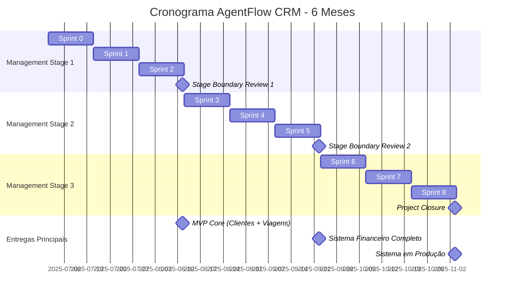
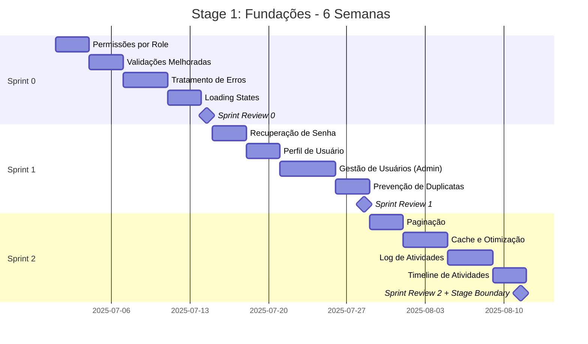
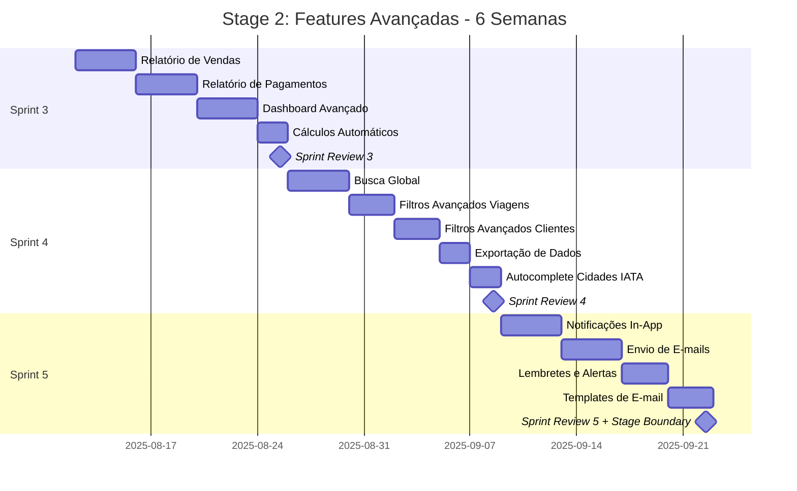
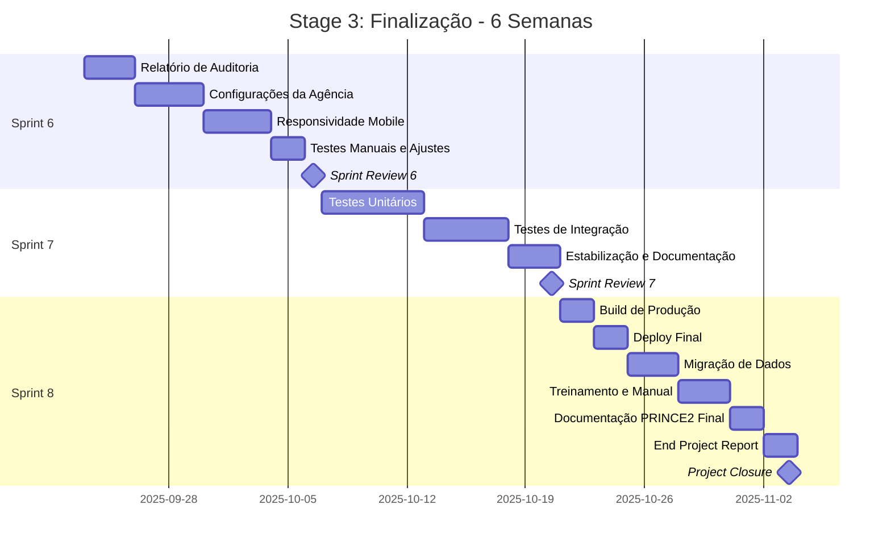
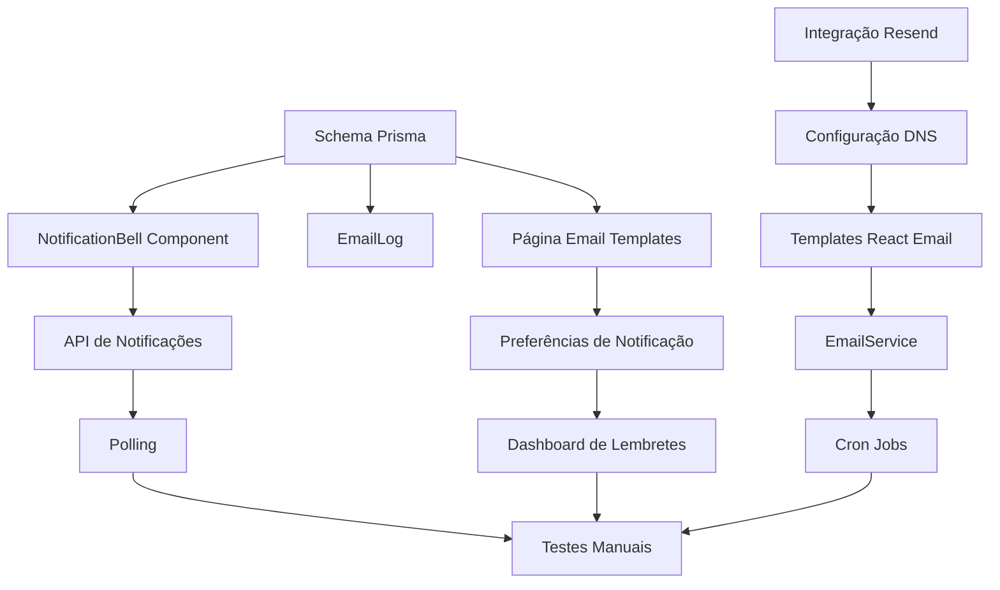

# DOCUMENTAÇÃO PRINCE2 - AGENTFLOW CRM

**Sistema CRM para Agências de Viagens**

---

**Autor:** Arthur Mauricio Malizia Davi
**Instituição:** [Nome da Universidade]
**Disciplina:** Gerência de Projetos
**Professor:** [Nome do Professor]
**Data de Elaboração:** Dezembro de 2025
**Versão:** 1.0

---

## SUMÁRIO EXECUTIVO

### Visão Geral do Projeto

O **AgentFlow** é um sistema CRM (Customer Relationship Management) especializado para gestão de agências de viagens, desenvolvido como Projeto Integrador no contexto acadêmico. O projeto aplica integralmente a metodologia **PRINCE2** (Projects IN Controlled Environments) para gerenciar todas as fases do desenvolvimento, desde a concepção até o encerramento.

### Contexto e Justificativa

O projeto nasceu da necessidade real identificada pela stakeholder principal (agente de viagens profissional), que enfrentava desafios significativos na gestão manual de clientes, viagens, passageiros e pagamentos. A solução manual baseada em planilhas e documentos fragmentados resultava em:

- **Perda de tempo**: 3-4 horas diárias em tarefas administrativas
- **Falta de visibilidade**: Dificuldade em acompanhar status de viagens e pagamentos
- **Risco de erros**: Dados duplicados, informações desatualizadas
- **Ausência de histórico**: Sem rastreamento de atividades e mudanças

### Solução Proposta

Sistema web completo desenvolvido com tecnologias modernas (Next.js 15, PostgreSQL, TypeScript) que centraliza e automatiza a gestão de:

1. **Clientes**: CRUD completo com validação de documentos
2. **Viagens**: Orçamentos, reservas, controle de status
3. **Passageiros**: Gestão de documentação por viagem
4. **Pagamentos**: Sistema multi-moeda e multi-método
5. **Dashboard**: Analytics e métricas em tempo real
6. **Relatórios**: Vendas, financeiro, auditoria
7. **Notificações**: Alertas e lembretes automáticos
8. **Auditoria**: Log completo de atividades

### Status Atual do Projeto

- **Período de Execução**: Julho a Dezembro de 2025 (6 meses)
- **Progresso**: Sprint 5 de 8 (62,5% concluído)
- **Investimento**: R$ 19.435,00 (desenvolvimento + infraestrutura)
- **Sistema em Produção**: Sim (Vercel + Neon PostgreSQL)
- **Stakeholder Utilizando**: Sim (uso diário desde Sprint 3)

### Principais Entregas Realizadas

**Sprints 0-2 (Fundações)** ✅
- Infraestrutura completa (Next.js 15 + PostgreSQL + Docker)
- Sistema de autenticação (NextAuth.js com roles)
- CRUD de Clientes com validações
- CRUD de Viagens com gestão de status
- Gestão de Passageiros

**Sprints 3-4 (Features Core)** ✅
- Sistema de Pagamentos multi-moeda
- Dashboard com estatísticas
- Filtros avançados
- Exportação de dados (CSV/PDF)

**Sprint 5 (em andamento)** 🔄
- Sistema de Notificações in-app
- Envio de e-mails transacionais
- Lembretes automáticos

### Aplicação do PRINCE2

Este documento demonstra a aplicação integral dos **7 processos PRINCE2**:

1. **SU** - Starting Up a Project (Iniciação)
2. **IP** - Initiating a Project (Planejamento)
3. **DP** - Directing a Project (Direcionamento)
4. **CS** - Controlling a Stage (Controle)
5. **MP** - Managing Product Delivery (Entrega)
6. **SB** - Managing a Stage Boundary (Transição de Fases)
7. **CP** - Closing a Project (Encerramento)

A metodologia foi adaptada para projeto de desenvolvimento de software ágil (Scrum), conforme detalhado no **Apêndice: Mapeamento PRINCE2 × Scrum**.

### Objetivo desta Documentação

Apresentar de forma acadêmica e profissional todos os artefatos PRINCE2 produzidos durante o gerenciamento do projeto AgentFlow, evidenciando:

- Planejamento estruturado e controle rigoroso
- Gestão de riscos proativa
- Qualidade assegurada através de processos
- Lições aprendidas documentadas
- Benefícios alcançados vs planejados

---

## ÍNDICE

### 1. STARTING UP A PROJECT (SU)
1.1 Project Mandate
1.2 Project Brief
1.3 Outline Business Case
1.4 Role Descriptions
1.5 Daily Log

### 2. INITIATING A PROJECT (IP)
2.1 Project Initiation Documentation (PID)
   - 2.1.1 Business Case Detalhado
   - 2.1.2 Estrutura Analítica do Projeto (EAP)
   - 2.1.3 Plano de Gerenciamento do Projeto
   - 2.1.4 Stage Plan (Plano de Fases)
2.2 Plano de Comunicação
2.3 Plano de Qualidade
2.4 Plano de Riscos
2.5 Risk Register (Registro de Riscos)
2.6 Issue Register (Registro de Problemas)

### 3. DIRECTING A PROJECT (DP)
3.1 Highlight Reports (Relatórios de Acompanhamento)
3.2 End Stage Reports (Relatórios de Encerramento de Fase)
3.3 Exception Report (Relatório de Exceção)
3.4 Decision Log (Registro de Decisões)

### 4. CONTROLLING A STAGE (CS)
4.1 Work Package Descriptions (Descrição de Pacotes de Trabalho)
4.2 Team Plan (Plano da Equipe)
4.3 Product Status Account (Status dos Produtos)
4.4 Lessons Log (Registro de Lições Aprendidas)

### 5. MANAGING PRODUCT DELIVERY (MP)
5.1 Product Descriptions (Descrição de Produtos)
5.2 Quality Register (Registro de Qualidade)
5.3 Acceptance Record (Registro de Aceitação)

### 6. MANAGING A STAGE BOUNDARY (SB)
6.1 End Stage Reports (Relatórios de Fase Detalhados)
6.2 Update Business Case (Atualização do Caso de Negócio)
6.3 Next Stage Plan (Plano da Próxima Fase)
6.4 Lessons Learned Summary (Resumo de Lições Aprendidas)

### 7. CLOSING A PROJECT (CP)
7.1 End Project Report (Relatório Final do Projeto)
7.2 Final Lessons Report (Relatório Final de Lições)
7.3 Post-Project Review Plan (Plano de Revisão Pós-Projeto)
7.4 Project Closure Notification (Notificação de Encerramento)

### ANEXOS
A. Cronograma Gráfico (Gantt Chart)
B. Gráfico de Estrutura Analítica (WBS)
C. Matriz de Stakeholders
D. Métricas do Projeto
E. Evidências de Entregas (Screenshots)
F. Glossário PRINCE2
G. Referências Bibliográficas

### APÊNDICE
Mapeamento PRINCE2 × Scrum

---

# 1. STARTING UP A PROJECT (SU)

## 1.1 PROJECT MANDATE (Mandato do Projeto)

**Documento:** Mandato do Projeto AgentFlow
**Data de Emissão:** 15 de Junho de 2025
**Emissor:** Arthur Mauricio Malizia Davi (Proponente) e Stakeholder (Agente de Viagens)
**Destinatário:** Professor Orientador (Executive)

### Contexto da Solicitação

A stakeholder principal, agente de viagens profissional atuante há 8 anos no mercado brasileiro, identificou necessidade crítica de modernização dos processos de gestão de sua agência. Atualmente, toda operação é realizada manualmente através de:

- Planilhas Excel para controle de clientes e viagens
- Documentos Word para orçamentos
- Calculadora manual para conversão de moedas
- Agenda física para lembretes
- WhatsApp para comunicação com clientes

### Problema Identificado

**Sintomas Observados:**
1. **Ineficiência Operacional**: 3-4 horas diárias gastas em tarefas administrativas repetitivas
2. **Falta de Centralização**: Dados espalhados em múltiplos arquivos e locais
3. **Risco de Perda de Dados**: Ausência de backup estruturado
4. **Dificuldade de Rastreamento**: Impossibilidade de visualizar histórico completo de clientes
5. **Controle Financeiro Deficiente**: Dificuldade em acompanhar pagamentos parciais e saldos
6. **Ausência de Métricas**: Sem visibilidade de desempenho (vendas, conversão, destinos populares)

**Impactos Mensurados:**
- Perda de 15-20 horas mensais em retrabalho
- 3-4 erros mensais em orçamentos (conversão de moedas)
- Dificuldade em escalar operação (limitada a ~10 viagens simultâneas)

### Solicitação

Desenvolver **Sistema CRM especializado para agências de viagens** que:

1. **Centralize** todos os dados de clientes, viagens, passageiros e pagamentos
2. **Automatize** cálculos financeiros e conversões de moeda
3. **Rastreie** histórico completo de atividades
4. **Notifique** sobre eventos importantes (viagens próximas, pagamentos pendentes)
5. **Forneça** relatórios gerenciais e análises de desempenho
6. **Garanta** segurança e backup automático dos dados

### Alinhamento Acadêmico

O projeto se enquadra como **Projeto Integrador** do curso, com os seguintes objetivos educacionais:

1. **Aplicação de Conhecimentos Técnicos**: Full-stack development, banco de dados, arquitetura de software
2. **Gestão de Projetos**: Aplicação prática de metodologia PRINCE2
3. **Resolução de Problema Real**: Stakeholder real com necessidade genuína
4. **Entrega de Valor**: Sistema funcional em produção ao final do projeto

### Restrições Iniciais

- **Prazo**: 6 meses (Julho a Dezembro de 2025)
- **Recursos**: 1 desenvolvedor (30 horas/semana)
- **Orçamento**: R$ 19.435,00 (desenvolvimento + infraestrutura 6 meses)
- **Tecnologia**: Stack moderna web-based (sem requisito de app mobile)

### Autorização para Prosseguir

Este mandato autoriza o **Project Manager** (Arthur Mauricio Malizia Davi) a:

1. Elaborar o **Project Brief** detalhado
2. Definir a **estrutura de gestão** do projeto
3. Conduzir avaliação inicial de viabilidade
4. Preparar a **documentação de iniciação** (PID)

**Aprovado por:**
[Assinatura do Professor Orientador - Executive]
Data: 15/06/2025

---

## 1.2 PROJECT BRIEF (Descrição Resumida do Projeto)

**Documento:** Project Brief - AgentFlow CRM
**Versão:** 1.0
**Data:** 20 de Junho de 2025
**Preparado por:** Arthur Mauricio Malizia Davi (Project Manager)

### 1. Definição do Projeto

**Nome do Projeto:** AgentFlow - Sistema CRM para Agências de Viagens

**Descrição Resumida:**
Desenvolvimento de aplicação web completa para gestão de agências de viagens, incluindo cadastro de clientes, orçamentos, reservas, controle de passageiros, gestão financeira multi-moeda, relatórios gerenciais e sistema de notificações.

**Categoria:** Sistema de Informação / CRM Especializado

**Contexto de Execução:** Projeto Integrador Acadêmico com stakeholder real

### 2. Objetivos do Projeto

**Objetivo Principal:**
Desenvolver e implantar sistema CRM funcional que reduza em 70% o tempo gasto em tarefas administrativas de uma agência de viagens.

**Objetivos Específicos:**

1. **Centralização de Dados**
   - Unificar informações de clientes, viagens e pagamentos em banco de dados único
   - Eliminar uso de planilhas fragmentadas

2. **Automação de Processos**
   - Automatizar cálculos financeiros (conversão de moedas, saldos)
   - Gerar orçamentos e relatórios automaticamente

3. **Controle e Rastreamento**
   - Implementar histórico completo de atividades (auditoria)
   - Rastrear mudanças de status de viagens

4. **Análise e Inteligência**
   - Fornecer dashboard com métricas de desempenho
   - Gerar relatórios de vendas e financeiros

5. **Comunicação Proativa**
   - Notificar sobre viagens próximas (7 dias antes)
   - Alertar sobre pagamentos pendentes

6. **Qualidade e Segurança**
   - Garantir disponibilidade 99%+
   - Implementar backup automático
   - Proteger dados com autenticação e autorização

### 3. Escopo do Projeto

#### 3.1 Inclusões (In Scope)

**Módulos Funcionais:**

1. **Autenticação e Autorização**
   - Login/registro com NextAuth.js
   - Controle de acesso por roles (admin, manager, agent)
   - Recuperação de senha

2. **Gestão de Clientes**
   - CRUD completo (criar, ler, atualizar, excluir)
   - Validação de CPF/CNPJ/Passaporte
   - Integração com API ViaCEP para endereços
   - Histórico de viagens por cliente

3. **Gestão de Viagens**
   - CRUD de viagens (orçamentos e reservas)
   - Workflow de status (orçamento → confirmada → em andamento → finalizada)
   - Suporte a viagens nacionais e internacionais
   - Autocomplete de cidades IATA

4. **Gestão de Passageiros**
   - Cadastro de passageiros por viagem
   - Validação de documentos
   - Identificação de passageiro principal

5. **Sistema de Pagamentos**
   - CRUD de pagamentos
   - Suporte a 4 moedas (BRL, USD, EUR, ARS)
   - 6 métodos de pagamento (cartão, PIX, transferência, dinheiro, cheque)
   - Cálculo automático de saldo
   - Timeline de pagamentos

6. **Dashboard e Relatórios**
   - Estatísticas em tempo real
   - Gráficos de vendas (12 meses)
   - Top clientes e destinos
   - Relatórios de vendas e financeiros
   - Exportação para CSV/PDF/Excel

7. **Sistema de Notificações**
   - Notificações in-app
   - E-mails transacionais
   - Lembretes automáticos

8. **Auditoria**
   - Log de todas as atividades
   - Rastreamento de mudanças
   - Relatório de auditoria

**Infraestrutura e Qualidade:**

- Aplicação web responsiva (desktop e mobile)
- Banco de dados PostgreSQL
- Deploy em ambiente de produção (Vercel + Neon)
- Testes automatizados (cobertura mínima 70%)
- Documentação técnica completa

#### 3.2 Exclusões (Out of Scope)

- Aplicativo mobile nativo (iOS/Android)
- Integração com GDS (Amadeus, Sabre)
- Sistema de emissão de passagens aéreas
- Gateway de pagamento online (apenas registro manual)
- Suporte a múltiplos idiomas (apenas pt-BR)
- Sistema de CRM marketing (e-mail marketing em massa)

### 4. Entregas Principais (Deliverables)

| # | Entrega | Descrição | Sprint |
|---|---------|-----------|--------|
| 1 | Infraestrutura Base | Setup Next.js 15, PostgreSQL, Docker, Deploy | Sprint 0 |
| 2 | Sistema de Autenticação | Login, roles, middleware de proteção | Sprint 0-1 |
| 3 | Módulo de Clientes | CRUD completo, validações, filtros | Sprint 1 |
| 4 | Módulo de Viagens | CRUD, status workflow, relacionamentos | Sprint 2 |
| 5 | Módulo de Passageiros | Gestão de passageiros por viagem | Sprint 2 |
| 6 | Sistema de Pagamentos | CRUD multi-moeda, cálculos automáticos | Sprint 4 |
| 7 | Dashboard Analytics | Estatísticas, gráficos, métricas | Sprint 3-5 |
| 8 | Sistema de Relatórios | Vendas, financeiro, exportação | Sprint 3 |
| 9 | Sistema de Notificações | In-app, e-mail, lembretes | Sprint 5 |
| 10 | Sistema de Auditoria | Logs, rastreamento, relatórios | Sprint 2, 6 |
| 11 | Testes Automatizados | Unit tests, integration tests (70%+ coverage) | Sprint 7 |
| 12 | Documentação | README, API docs, guias de usuário | Sprint 7-8 |
| 13 | Sistema em Produção | Deploy final, configurações otimizadas | Sprint 8 |

### 5. Benefícios Esperados

#### 5.1 Benefícios Quantitativos

| Benefício | Baseline Atual | Meta | Redução/Ganho |
|-----------|----------------|------|---------------|
| Tempo em tarefas administrativas | 3-4h/dia | 1h/dia | -70% |
| Erros em orçamentos | 3-4/mês | <1/mês | -75% |
| Capacidade de viagens simultâneas | 10 viagens | 30+ viagens | +200% |
| Tempo para emitir orçamento | 30 min | 5 min | -83% |
| Tempo para localizar histórico cliente | 15 min | 30 seg | -97% |

#### 5.2 Benefícios Qualitativos

1. **Profissionalização da Operação**
   - Imagem mais profissional para clientes
   - Orçamentos padronizados e consistentes

2. **Visibilidade e Controle**
   - Visão completa de pipeline de vendas
   - Controle preciso de recebíveis

3. **Escalabilidade**
   - Capacidade de crescer sem contratar mais pessoas
   - Processos automatizados suportam maior volume

4. **Segurança e Compliance**
   - Dados protegidos com backup automático
   - Auditoria completa para compliance

5. **Tomada de Decisão**
   - Dashboards com métricas em tempo real
   - Relatórios para análise de desempenho

#### 5.3 Benefícios Educacionais (Contexto Acadêmico)

1. **Desenvolvimento de Competências Técnicas**
   - Full-stack development moderno
   - Arquitetura de software escalável
   - Banco de dados relacional avançado

2. **Gestão de Projetos**
   - Aplicação prática de PRINCE2
   - Planejamento e controle de cronograma/custos
   - Gestão de riscos e stakeholders

3. **Portfólio Profissional**
   - Projeto real com stakeholder
   - Sistema em produção
   - Código open-source no GitHub

### 6. Custos e Investimento

**Orçamento Total:** R$ 19.435,00

| Categoria | Valor | % Total |
|-----------|-------|---------|
| Desenvolvimento (240h × R$ 80/h) | R$ 19.200,00 | 98,8% |
| Infraestrutura (6 meses) | R$ 235,00 | 1,2% |
| **TOTAL** | **R$ 19.435,00** | **100%** |

**Justificativa de Custo:**
- Desenvolvimento: 240 horas efetivas de trabalho técnico especializado
- Infraestrutura: Vercel Pro + Neon Scale no último mês (deploy produção)

**Comparação com Mercado:**
- Solução comercial similar: R$ 240.000 - R$ 400.000
- Economia estimada: 95%+ vs desenvolvimento comercial

### 7. Cronograma de Alto Nível

**Duração Total:** 6 meses (Julho a Dezembro de 2025)
**Modelo de Trabalho:** Sprints Scrum de 2 semanas
**Capacidade:** 30 horas/semana

| Fase | Período | Duração | Foco |
|------|---------|---------|------|
| **Management Stage 1** | Jul-Ago 2025 | 2 meses | Fundações (Sprints 0-2) |
| **Management Stage 2** | Set-Out 2025 | 2 meses | Features Avançadas (Sprints 3-5) |
| **Management Stage 3** | Nov-Dez 2025 | 2 meses | Finalização (Sprints 6-8) |

### 8. Restrições e Premissas

#### 8.1 Restrições

1. **Recursos Humanos**: 1 desenvolvedor (projeto solo)
2. **Tempo**: Prazo fixo de 6 meses (não negociável)
3. **Orçamento**: R$ 19.435,00 (sem contingência adicional)
4. **Tecnologia**: Stack web moderna (Next.js ecosystem)
5. **Acesso ao Stakeholder**: Disponibilidade quinzenal para demos

#### 8.2 Premissas

1. **Dedicação**: 30 horas/semana disponíveis consistentemente
2. **Infraestrutura**: Serviços cloud (Vercel, Neon) permanecem disponíveis
3. **Requisitos**: Estáveis após Sprint 2 (escopo congelado)
4. **Feedback**: Stakeholder fornece feedback em até 3 dias após demos
5. **Ferramentas**: Todas as ferramentas de desenvolvimento são gratuitas

### 9. Principais Riscos Iniciais

| Risco | Probabilidade | Impacto | Estratégia Inicial |
|-------|---------------|---------|-------------------|
| Complexidade técnica subestimada | Média | Alto | Buffer de 10h/sprint |
| Atraso no cronograma | Média | Alto | Priorização rigorosa (MVP) |
| Mudança de requisitos | Média | Médio | Backlog congelado Sprint 3+ |
| Falha de infraestrutura cloud | Baixa | Médio | Backup local + múltiplos providers |

### 10. Abordagem de Gestão

**Metodologia:** PRINCE2 adaptado para desenvolvimento ágil (Scrum)

**Estrutura:**
- **Executive**: Professor Orientador
- **Senior User**: Stakeholder (Agente de Viagens)
- **Senior Supplier**: Arthur Mauricio (Desenvolvedor Lead)
- **Project Manager**: Arthur Mauricio
- **Team Manager**: Arthur Mauricio

**Controles:**
- Highlight Reports quinzenais (fim de sprint)
- End Stage Reports (fim de cada Management Stage)
- Decision Log atualizado continuamente
- Risk Register revisado a cada sprint

**Qualidade:**
- Code review pessoal antes de commits principais
- Testes manuais ao final de cada sprint
- Testes automatizados (Sprint 7)
- Build verification contínua (zero erros TypeScript)

### 11. Critérios de Sucesso

O projeto será considerado bem-sucedido se:

1. ✅ **Funcionalidade**: Todos os 8 módulos operacionais em produção
2. ✅ **Qualidade**: Zero erros críticos, 70%+ cobertura de testes
3. ✅ **Prazo**: Entrega até 31/12/2025
4. ✅ **Orçamento**: Dentro do limite de R$ 19.435,00
5. ✅ **Adoção**: Stakeholder utilizando sistema diariamente
6. ✅ **Benefícios**: Redução mínima de 50% em tempo administrativo
7. ✅ **Aprendizado**: Documentação PRINCE2 completa e apresentação aprovada

### 12. Próximos Passos

1. **Aprovação do Project Brief** pelo Executive (Professor)
2. **Elaboração do PID** (Project Initiation Documentation)
3. **Desenvolvimento dos planos detalhados** (riscos, qualidade, comunicação)
4. **Inicio da Sprint 0** (infraestrutura)

**Preparado por:**
Arthur Mauricio Malizia Davi (Project Manager)
Data: 20/06/2025

**Aprovação solicitada de:**
[Professor Orientador - Executive]

---

## 1.3 OUTLINE BUSINESS CASE (Esboço do Caso de Negócio)

**Documento:** Outline Business Case - AgentFlow
**Versão:** 1.0
**Data:** 22 de Junho de 2025
**Preparado por:** Arthur Mauricio Malizia Davi (Project Manager)

### 1. Sumário Executivo

Este Business Case justifica o investimento de R$ 19.435,00 e 6 meses de desenvolvimento para criar o AgentFlow CRM, sistema especializado para gestão de agências de viagens. O projeto combina **valor educacional** (Projeto Integrador) com **valor prático** (solução real para stakeholder) e **potencial comercial** (futura comercialização SaaS).

### 2. Razões para o Projeto (Why)

#### 2.1 Problema Atual

**Contexto Operacional:**
A stakeholder (agente de viagens profissional) atualmente gerencia sua operação através de processos manuais fragmentados:

- **10+ planilhas Excel** para clientes, viagens, pagamentos
- **Documentos Word** para orçamentos (sem padronização)
- **Calculadora manual** para conversões de moeda
- **WhatsApp** como único canal de comunicação
- **Agenda física** para lembretes
- **Sem backup** estruturado ou versionamento

**Dor Quantificada:**
- ⏱️ **3-4 horas/dia** em tarefas administrativas (75% do tempo de trabalho)
- 💰 **R$ 800-1.200/mês** em custo de oportunidade (tempo que poderia estar vendendo)
- ❌ **3-4 erros/mês** em orçamentos (conversão de moedas errada)
- 📉 **Limitação de crescimento**: Capacidade máxima de 10 viagens simultâneas

**Riscos do Status Quo:**
1. **Perda de dados**: Sem backup, uma falha de HD = perda total
2. **Erro humano**: Cálculos manuais propensos a erros
3. **Inescalabilidade**: Impossível crescer sem contratar mais pessoas
4. **Falta de competitividade**: Concorrentes com sistemas modernos

#### 2.2 Oportunidade

**Benefício Primário:**
Automatizar 70% das tarefas administrativas, liberando 2-3 horas/dia para atividades de vendas e atendimento.

**Benefícios Secundários:**
- **Escalabilidade**: Capacidade de gerenciar 30+ viagens simultâneas
- **Profissionalização**: Orçamentos padronizados e profissionais
- **Inteligência**: Dashboards e relatórios para decisões data-driven
- **Segurança**: Dados protegidos com backup automático

**Diferencial Competitivo:**
- Sistema **especializado** para agências de viagens (vs CRMs genéricos)
- **Controle total** sobre features e custos
- **Evolução contínua** baseada em necessidades reais

#### 2.3 Alinhamento Estratégico

**Contexto Acadêmico:**
- ✅ Cumpre requisitos de Projeto Integrador
- ✅ Aplica conhecimentos técnicos de 3 anos de curso
- ✅ Demonstra capacidade de gestão de projetos (PRINCE2)
- ✅ Gera portfólio profissional de alto valor

**Contexto Profissional:**
- ✅ Resolve problema real de stakeholder
- ✅ Potencial de comercialização SaaS futura
- ✅ Base para startup ou produto comercial

### 3. Opções Consideradas

| Opção | Descrição | Custo (6 meses) | Prós | Contras | Decisão |
|-------|-----------|-----------------|------|---------|---------|
| **A. Fazer Nada** | Manter processos manuais | R$ 0 | Sem investimento inicial | Dor continua, risco de perda de dados, inescalável | ❌ Rejeitada |
| **B. Software Pronto (Genérico)** | Assinar CRM comercial (Pipedrive, HubSpot) | R$ 600-1.200/mês = R$ 3.600-7.200 | Implementação rápida | Não especializado, custo recorrente alto, sem controle | ❌ Rejeitada |
| **C. Contratar Desenvolvimento** | Terceirizar para empresa | R$ 240.000+ | Equipe completa | Custo proibitivo, sem valor acadêmico | ❌ Rejeitada |
| **D. Desenvolver Internamente** | Projeto Integrador | R$ 19.435,00 | Custo baixo, controle total, valor acadêmico, personalização | Prazo de 6 meses, risco técnico | ✅ **ESCOLHIDA** |

**Justificativa da Opção D:**

1. **Viabilidade Financeira**: 95% mais barato que desenvolvimento comercial
2. **Alinhamento Acadêmico**: Cumpre requisitos de Projeto Integrador
3. **Customização Total**: 100% adaptado às necessidades da stakeholder
4. **Propriedade Intelectual**: Código-fonte próprio, sem licenças
5. **Aprendizado**: Máximo desenvolvimento de competências técnicas

### 4. Benefícios Esperados

#### 4.1 Benefícios Tangíveis (Mensuráveis)

| Benefício | Baseline | Meta | Métrica | Valor Anual Estimado |
|-----------|----------|------|---------|----------------------|
| Redução tempo administrativo | 3,5h/dia | 1h/dia | -70% | R$ 15.000/ano* |
| Aumento capacidade viagens | 10/mês | 30/mês | +200% | R$ 24.000/ano** |
| Redução erros orçamento | 3-4/mês | <1/mês | -75% | R$ 3.600/ano*** |
| Tempo emissão orçamento | 30 min | 5 min | -83% | R$ 6.000/ano**** |

*Baseado em custo de oportunidade de R$ 50/hora
**Baseado em ticket médio de R$ 1.200/viagem
***Baseado em retrabalho médio de R$ 300/erro
****Baseado em 20 orçamentos/mês

**ROI Estimado (1 ano):**
Benefícios: R$ 48.600/ano
Investimento: R$ 19.435,00
**ROI: 150% no primeiro ano**

#### 4.2 Benefícios Intangíveis

1. **Profissionalização da Marca**
   - Orçamentos padronizados e profissionais
   - Comunicação automatizada e consistente
   - Imagem moderna e confiável

2. **Tranquilidade e Controle**
   - Visão completa do negócio em um só lugar
   - Segurança de backup automático
   - Rastreamento completo de atividades

3. **Escalabilidade do Negócio**
   - Crescimento sem necessidade de contratar
   - Processos automatizados

 suportam maior volume
   - Base para expansão futura

4. **Competências Desenvolvidas (Acadêmico)**
   - Full-stack development moderno
   - Gestão de projetos PRINCE2
   - Arquitetura de software
   - Experiência com stakeholder real

### 5. Custos e Investimento

#### 5.1 Breakdown de Custos

**Desenvolvimento (R$ 19.200,00):**

| Fase | Horas | Valor |
|------|-------|-------|
| Infraestrutura e Setup | 11h | R$ 880,00 |
| Autenticação e Autorização | 21h | R$ 1.680,00 |
| Gestão de Clientes | 16h | R$ 1.280,00 |
| Gestão de Viagens | 27h | R$ 2.160,00 |
| Gestão de Passageiros | 11h | R$ 880,00 |
| Sistema de Pagamentos | 32h | R$ 2.560,00 |
| Dashboard e Relatórios | 19h | R$ 1.520,00 |
| Sistema de Auditoria | 8h | R$ 640,00 |
| UI/UX e Componentes | 24h | R$ 1.920,00 |
| Integração e APIs | 13h | R$ 1.040,00 |
| Banco de Dados | 16h | R$ 1.280,00 |
| Testes e QA | 21h | R$ 1.680,00 |
| Documentação | 11h | R$ 880,00 |
| Deploy e DevOps | 11h | R$ 880,00 |
| **SUBTOTAL** | **240h** | **R$ 19.200,00** |

**Infraestrutura (R$ 235,00):**

| Item | Período | Custo |
|------|---------|-------|
| Desenvolvimento local (Docker) | 5 meses | R$ 0,00 |
| Vercel Pro | 1 mês | R$ 100,00 |
| Neon Scale | 1 mês | R$ 95,00 |
| Domínio .com.br | 1 ano | R$ 40,00 |
| **SUBTOTAL** | **6 meses** | **R$ 235,00** |

**INVESTIMENTO TOTAL: R$ 19.435,00**

#### 5.2 Custos Evitados

**Alternativa B (Software Comercial):**
- Custo: R$ 600/mês × 12 meses = R$ 7.200/ano
- **Economia acumulada (3 anos): R$ 21.600**

**Alternativa C (Desenvolvimento Terceirizado):**
- Custo: R$ 240.000 (one-time)
- **Economia: R$ 220.565** (vs Opção D)

### 6. Riscos Principais

| Risco | Prob. | Impacto | Mitigação Planejada |
|-------|-------|---------|---------------------|
| **Complexidade técnica maior que estimado** | Média | Alto | Buffer de 10h/sprint, documentação prévia, tecnologias conhecidas |
| **Atraso no cronograma** | Média | Alto | Priorização rigorosa (MVP primeiro), sprints time-boxed |
| **Mudança de requisitos** | Média | Médio | Backlog congelado após Sprint 2, change control process |
| **Falha de infraestrutura** | Baixa | Médio | Backup automático, múltiplos providers (Vercel+Neon) |
| **Indisponibilidade do stakeholder** | Baixa | Médio | Demos quinzenais obrigatórias, documentação de requisitos |

**Risco Geral do Projeto:** Médio
**Tolerância a Risco:** Média (contexto acadêmico permite aprendizado com erros)

### 7. Cronograma

**Início:** 01/07/2025
**Término:** 31/12/2025
**Duração:** 6 meses (26 semanas)

**Principais Marcos:**

| Data | Marco | Entregas |
|------|-------|----------|
| 31/07/2025 | Fundação Completa | Infraestrutura + Auth + Clientes |
| 31/08/2025 | CRUDs Principais | Viagens + Passageiros |
| 30/09/2025 | Features Core | Pagamentos + Filtros |
| 31/10/2025 | Analytics | Dashboard + Relatórios |
| 30/11/2025 | Finalização Features | Notificações + Auditoria |
| 31/12/2025 | Entrega Final | Testes + Docs + Deploy |

### 8. Viabilidade

#### 8.1 Viabilidade Técnica

**✅ VIÁVEL**

- Tecnologias: Next.js 15, PostgreSQL, Prisma (amplamente documentadas)
- Desenvolvedor: Experiência prévia com stack escolhida
- Complexidade: Alta mas gerenciável em 6 meses
- Infraestrutura: Serviços cloud confiáveis (Vercel, Neon)

#### 8.2 Viabilidade Financeira

**✅ VIÁVEL**

- Orçamento: R$ 19.435,00 (autofinanciado no contexto acadêmico)
- ROI: 150% no primeiro ano (benefícios vs investimento)
- Custo recorrente: R$ 195/mês após 6 meses (sustentável)

#### 8.3 Viabilidade de Cronograma

**✅ VIÁVEL**

- Prazo: 6 meses com 30h/semana = 720h totais disponíveis
- Planejado: 480h de trabalho (66% utilização)
- Buffer: 240h (33%) para imprevistos
- Sprints: 8 sprints de 2 semanas (ritmo sustentável)

#### 8.4 Viabilidade Organizacional

**✅ VIÁVEL**

- Stakeholder: Comprometida e disponível
- Professor: Apoio confirmado como Executive
- Recursos: 1 desenvolvedor dedicado
- Ferramentas: Todas gratuitas ou free tier

### 9. Recomendação

**Recomendação: APROVAR o projeto AgentFlow**

**Justificativas:**

1. **Necessidade Clara**: Problema real e mensurável
2. **Benefícios Significativos**: ROI de 150% no primeiro ano
3. **Custos Controlados**: R$ 19.435,00 (95% mais barato que alternativas)
4. **Riscos Gerenciáveis**: Riscos identificados com planos de mitigação
5. **Alinhamento Estratégico**: Cumpre objetivos acadêmicos e profissionais
6. **Viabilidade Comprovada**: Técnica, financeira e cronograma

**Próximos Passos se Aprovado:**

1. Elaborar **Project Initiation Documentation (PID)** completa
2. Desenvolver **planos detalhados** (riscos, qualidade, comunicação)
3. Obter **aprovação formal** do Executive (Professor)
4. **Iniciar Sprint 0** (semana de 01/07/2025)

**Preparado por:**
Arthur Mauricio Malizia Davi (Project Manager)
Data: 22/06/2025

**Aprovação Solicitada:**
[Professor Orientador - Executive]
Data: _____/_____/_____

---

## 1.4 ROLE DESCRIPTIONS (Papéis e Responsabilidades)

**Documento:** Descrição de Papéis - AgentFlow
**Versão:** 1.0
**Data:** 25 de Junho de 2025
**Preparado por:** Arthur Mauricio Malizia Davi (Project Manager)

### Estrutura de Gestão do Projeto

O projeto AgentFlow adota a estrutura PRINCE2 adaptada para projeto solo com desenvolvimento ágil. Alguns papéis são consolidados devido à natureza acadêmica e disponibilidade de recursos.

```
                    PROJECT BOARD
                    ─────────────
                    ┌──────────────────────┐
                    │ Executive            │
                    │ (Professor)          │
                    └──────────────────────┘
                           │
         ┌─────────────────┴─────────────────┐
         │                                   │
  ┌──────────────┐                  ┌──────────────┐
  │ Senior User  │                  │ Senior       │
  │ (Stakeholder)│                  │ Supplier     │
  │              │                  │ (Arthur)     │
  └──────────────┘                  └──────────────┘
         │                                   │
         └─────────────────┬─────────────────┘
                           │
                 ┌─────────────────────┐
                 │ Project Manager     │
                 │ (Arthur)            │
                 └─────────────────────┘
                           │
                 ┌─────────────────────┐
                 │ Team Manager        │
                 │ (Arthur)            │
                 └─────────────────────┘
                           │
                 ┌─────────────────────┐
                 │ Development Team    │
                 │ (Arthur)            │
                 └─────────────────────┘
```

### 1. PROJECT BOARD (Comitê Diretor do Projeto)

#### 1.1 Executive (Executivo)

**Nome:** [Professor Orientador]
**Organização:** [Universidade]
**Cargo:** Professor da Disciplina de Gerência de Projetos

**Responsabilidades:**

1. **Liderança do Projeto**
   - Autoridade final sobre decisões estratégicas
   - Aprovação de investimento e recursos
   - Aprovação de desvios significativos (>10% cronograma/custo)

2. **Garantir Benefícios**
   - Verificar alinhamento com objetivos acadêmicos
   - Avaliar se projeto cumpre requisitos de Projeto Integrador
   - Aprovar Business Case e atualizações

3. **Direcionamento**
   - Participar de reviews ao final de cada Management Stage
   - Aprovar transições entre fases (Stage Gates)
   - Decidir sobre exceções e mudanças de escopo

4. **Avaliação Final**
   - Avaliar apresentação final no Seminário
   - Aprovar encerramento do projeto
   - Atribuir nota/conceito final

**Autoridade:**
- Aprovar ou rejeitar o projeto
- Autorizar recursos e orçamento
- Aprovar mudanças de escopo
- Encerrar o projeto antecipadamente se necessário

**Disponibilidade:** Reuniões mensais + revisões de fase + apresentação final

#### 1.2 Senior User (Usuário Sênior)

**Nome:** [Nome da Stakeholder - Mãe]
**Organização:** Agência de Viagens Independente
**Cargo:** Agente de Viagens Profissional (8 anos de experiência)

**Responsabilidades:**

1. **Especificar Necessidades**
   - Definir requisitos funcionais do sistema
   - Priorizar features no backlog
   - Validar se solução atende necessidades reais

2. **Garantir Benefícios**
   - Confirmar que benefícios esperados estão sendo alcançados
   - Fornecer feedback contínuo sobre usabilidade
   - Testar sistema em cenários reais

3. **Aceitação de Produtos**
   - Aprovar entregas ao final de cada sprint
   - Validar funcionalidades implementadas
   - Aceitar ou rejeitar produtos entregues

4. **Representar Usuários Finais**
   - Trazer perspectiva de quem usará o sistema diariamente
   - Identificar melhorias de UX/UI
   - Compartilhar casos de uso reais

**Autoridade:**
- Aceitar ou rejeitar entregas
- Solicitar ajustes em funcionalidades
- Priorizar itens do backlog

**Disponibilidade:** Reuniões quinzenais (fim de sprint) + testes contínuos

#### 1.3 Senior Supplier (Fornecedor Sênior)

**Nome:** Arthur Mauricio Malizia Davi
**Organização:** [Universidade] - Projeto Integrador
**Cargo:** Desenvolvedor Full-Stack / Líder Técnico

**Responsabilidades:**

1. **Garantir Viabilidade Técnica**
   - Validar escolhas de arquitetura e tecnologia
   - Assegurar qualidade técnica das entregas
   - Identificar riscos técnicos

2. **Fornecer Recursos**
   - Dedicar 30 horas/semana ao projeto
   - Garantir disponibilidade de ferramentas e ambiente
   - Manter infraestrutura de desenvolvimento

3. **Garantir Qualidade**
   - Implementar padrões de código
   - Realizar code reviews
   - Assegurar testes e documentação

4. **Apoiar Project Manager**
   - Fornecer estimativas técnicas
   - Alertar sobre impedimentos técnicos
   - Recomendar soluções para problemas

**Autoridade:**
- Decidir sobre stack tecnológica
- Definir padrões de código e arquitetura
- Aprovar ou rejeitar soluções técnicas

**Disponibilidade:** Dedicação integral (30h/semana)

### 2. PROJECT MANAGEMENT TEAM (Equipe de Gestão)

#### 2.1 Project Manager (Gerente de Projeto)

**Nome:** Arthur Mauricio Malizia Davi
**Organização:** [Universidade] - Projeto Integrador
**Cargo:** Gerente de Projeto e Desenvolvedor

**Responsabilidades:**

1. **Planejamento do Projeto**
   - Elaborar Project Initiation Documentation (PID)
   - Desenvolver planos de escopo, cronograma, custo, risco, qualidade
   - Criar Stage Plans para cada Management Stage

2. **Controle Diário**
   - Gerenciar execução das sprints
   - Monitorar progresso vs planejado
   - Identificar e escalar desvios

3. **Gestão de Riscos**
   - Manter Risk Register atualizado
   - Implementar ações de mitigação
   - Reportar riscos materializados

4. **Comunicação**
   - Produzir Highlight Reports quinzenais
   - Facilitar comunicação entre Project Board e equipe
   - Manter stakeholders informados

5. **Gestão de Mudanças**
   - Avaliar solicitações de mudança
   - Documentar decisões (Decision Log)
   - Controlar escopo (evitar scope creep)

6. **Garantir Entregas**
   - Assegurar que produtos atendem critérios de aceitação
   - Coordenar aceitação com Senior User
   - Documentar lições aprendidas

**Autoridade:**
- Alocar tempo e esforço nas sprints
- Aceitar ou rejeitar mudanças menores de escopo
- Escalar problemas para Project Board
- Aprovar Work Packages

**Disponibilidade:** Dedicação integral (parte das 30h/semana)

**Interface com:**
- Executive: Highlight Reports mensais, End Stage Reports
- Senior User: Demos quinzenais, validação de requisitos
- Senior Supplier: Daily planning, impedimentos técnicos
- Team Manager: Coordenação de sprints

#### 2.2 Team Manager (Gerente de Equipe)

**Nome:** Arthur Mauricio Malizia Davi
**Organização:** [Universidade] - Projeto Integrador
**Cargo:** Team Manager e Desenvolvedor

**Responsabilidades:**

1. **Planejamento de Sprint**
   - Elaborar Team Plans (planos de sprint)
   - Estimar esforço de user stories
   - Distribuir tarefas ao longo da sprint

2. **Execução Diária**
   - Gerenciar backlog da sprint
   - Priorizar tarefas diárias
   - Resolver impedimentos técnicos

3. **Controle de Qualidade**
   - Garantir code review antes de commits
   - Executar testes manuais
   - Verificar build success

4. **Reportar Progresso**
   - Atualizar Product Status Account
   - Informar Project Manager sobre desvios
   - Documentar lições aprendidas em Lessons Log

5. **Aceitar Work Packages**
   - Receber Work Packages do Project Manager
   - Confirmar entendimento e critérios de aceitação
   - Entregar produtos completos

**Autoridade:**
- Decidir ordem de implementação de tarefas
- Alocar horas diárias de trabalho
- Solicitar esclarecimentos sobre requisitos

**Disponibilidade:** Dedicação integral (parte das 30h/semana)

**Interface com:**
- Project Manager: Recebe Work Packages, reporta progresso
- Development Team: Atribui tarefas (self-assignment)

### 3. DEVELOPMENT TEAM (Equipe de Desenvolvimento)

#### 3.1 Full-Stack Developer (Desenvolvedor Full-Stack)

**Nome:** Arthur Mauricio Malizia Davi
**Organização:** [Universidade] - Projeto Integrador
**Cargo:** Desenvolvedor Full-Stack

**Responsabilidades:**

1. **Implementação Técnica**
   - Desenvolver frontend (React/Next.js)
   - Desenvolver backend (Next.js API Routes)
   - Implementar banco de dados (PostgreSQL/Prisma)

2. **Qualidade do Código**
   - Seguir padrões de código estabelecidos
   - Escrever testes unitários e de integração
   - Documentar código complexo

3. **Resolução de Problemas**
   - Debuggar e corrigir bugs
   - Otimizar performance
   - Implementar melhorias de segurança

4. **Colaboração**
   - Participar de sprint planning
   - Fornecer estimativas técnicas
   - Reportar impedimentos

**Skills Necessárias:**
- Frontend: React, Next.js 15, TypeScript, Tailwind CSS
- Backend: Node.js, Next.js API Routes, Prisma ORM
- Database: PostgreSQL, SQL avançado
- DevOps: Git, Docker, Vercel, CI/CD
- Testing: Jest, Testing Library

**Disponibilidade:** 30 horas/semana

**Interface com:**
- Team Manager: Recebe tarefas, reporta conclusão
- Project Manager: Escala impedimentos graves

### 4. PAPÉIS NÃO APLICÁVEIS (Projeto Solo)

#### 4.1 Project Assurance (Garantia de Projeto)

**Status:** NÃO APLICÁVEL

**Justificativa:** Em projeto solo, as funções de assurance são incorporadas aos papéis de Project Manager e Executive.

**Adaptação:**
- **Business Assurance**: Executive (Professor) valida alinhamento acadêmico
- **User Assurance**: Senior User valida em cada demo
- **Supplier Assurance**: Self code-review + build verification

#### 4.2 Project Support (Suporte ao Projeto)

**Status:** NÃO APLICÁVEL

**Justificativa:** Funções administrativas são simples e gerenciadas pelo próprio PM.

**Adaptação:**
- Documentação: Gerenciada pelo PM
- Configuration Management: Git + GitHub
- Issue Tracking: GitHub Issues

#### 4.3 Change Authority (Autoridade de Mudança)

**Status:** INCORPORADO AO PROJECT BOARD

**Adaptação:**
- Mudanças menores: PM decide e documenta
- Mudanças médias: Validação com Senior User
- Mudanças grandes: Aprovação do Executive

### 5. MATRIZ RACI (Responsabilidades)

| Atividade | Executive | Senior User | Senior Supplier | PM | TM | Dev |
|-----------|-----------|-------------|-----------------|----|----|-----|
| Aprovar Business Case | **A** | C | C | **R** | I | I |
| Aprovar PID | **A** | C | C | **R** | I | I |
| Definir requisitos | C | **AR** | C | C | I | I |
| Planejar sprints | I | C | **A** | **R** | **R** | C |
| Desenvolver código | I | I | **A** | I | C | **R** |
| Testar funcionalidades | I | **AR** | C | C | **R** | **R** |
| Aprovar entregas | I | **A** | C | **R** | C | C |
| Gerenciar riscos | C | I | C | **AR** | I | I |
| Reportar progresso | **A** | I | I | **R** | C | C |
| Encerrar projeto | **A** | C | C | **R** | I | I |

**Legenda:**
- **R** = Responsible (Responsável pela execução)
- **A** = Accountable (Autoridade final, aprovador)
- **C** = Consulted (Consultado, fornece input)
- **I** = Informed (Informado dos resultados)

### 6. COMUNICAÇÃO ENTRE PAPÉIS

| De → Para | Frequência | Formato | Propósito |
|-----------|------------|---------|-----------|
| PM → Executive | Mensal | Highlight Report | Status geral do projeto |
| PM → Executive | Fim de Stage | End Stage Report | Aprovar transição de fase |
| PM → Senior User | Quinzenal | Demo + Sprint Review | Validar entregas |
| PM → Senior Supplier | Diário | Standup (self) | Alinhamento técnico |
| TM → PM | Semanal | Status Update | Progresso da sprint |
| Dev → TM | Diário | Task completion | Conclusão de tarefas |

### 7. DELEGAÇÃO DE AUTORIDADE

**Project Manager pode decidir autonomamente:**
- Ordem de implementação de tarefas
- Mudanças técnicas que não afetam escopo
- Correção de bugs
- Melhorias de performance
- Ajustes de UI menores

**Project Manager deve consultar Senior User:**
- Mudanças em funcionalidades existentes
- Remoção de features planejadas
- Adição de novas features
- Mudanças significativas de UX

**Project Manager deve escalar para Executive:**
- Atraso >1 sprint (2 semanas)
- Mudança de escopo >10%
- Aumento de custo >R$ 2.000
- Riscos materializados com alto impacto
- Encerramento antecipado do projeto

### 8. APROVAÇÕES FORMAIS

Este documento de Role Descriptions foi:

**Elaborado por:**
Arthur Mauricio Malizia Davi (Project Manager)
Data: 25/06/2025

**Aprovado por:**

☐ Executive (Professor Orientador): ______________ Data: ___/___/___
☐ Senior User (Stakeholder): ______________ Data: ___/___/___
☐ Senior Supplier (Arthur): ______________ Data: ___/___/___

---

## 1.5 DAILY LOG (Registro Inicial do Projeto)

**Documento:** Daily Log - Fase Starting Up
**Período:** 15/06/2025 a 30/06/2025
**Project Manager:** Arthur Mauricio Malizia Davi

### Finalidade do Daily Log

O Daily Log registra informações informais e decisões tomadas durante a fase **Starting Up a Project (SU)**. Após a aprovação do PID, questões mais significativas serão registradas no **Issue Register** e decisões formais no **Decision Log**.

---

### Registro de Eventos - Starting Up Phase

#### 📅 15/06/2025 - Reunião Inicial com Stakeholder

**Participantes:** Arthur (PM/Dev) + Stakeholder (Agente de Viagens)

**Discussão:**
- Stakeholder apresentou dores atuais: gestão manual com planilhas, falta de controle de pagamentos, dificuldade em acompanhar status de viagens
- Demonstrou processo atual: 10+ planilhas Excel, documentos Word, calculadora manual
- Expressou necessidade urgente de solução: "Perco 3-4 horas/dia em tarefas que deviam ser automáticas"

**Decisões:**
- ✅ Projeto confirmado como viável e necessário
- ✅ Stakeholder comprometida a participar de demos quinzenais
- ✅ Acesso a dados reais (anonimizados) para seeding do banco

**Ações:**
- Arthur: Elaborar Project Mandate até 18/06
- Stakeholder: Listar top 10 dores/necessidades até 17/06

---

#### 📅 16/06/2025 - Pesquisa de Soluções Existentes

**Atividade:** Análise de alternativas (comprar vs construir)

**Soluções Comerciais Avaliadas:**
1. **Pipedrive** (R$ 135/mês): CRM genérico, não especializado para viagens
2. **HubSpot** (R$ 200/mês): Muito voltado para marketing, não para operação
3. **Treasy** (R$ 400/mês): Foco em financeiro, sem gestão de viagens

**Conclusão:**
- ❌ Nenhuma solução comercial atende especificamente agências de viagens
- ✅ Desenvolvimento customizado é a melhor opção
- ✅ Custo de desenvolvimento (R$ 19.435) é viável vs R$ 7.200+/ano de SaaS

**Registrado para:** Outline Business Case (seção de opções consideradas)

---

#### 📅 17/06/2025 - Recebimento de Requisitos da Stakeholder

**Documento Recebido:** Lista de Top 10 Necessidades

1. ✅ Cadastro centralizado de clientes com documentos
2. ✅ Gestão de orçamentos e viagens (status workflow)
3. ✅ Controle de passageiros por viagem
4. ✅ Sistema de pagamentos multi-moeda
5. ✅ Dashboard com visão geral do negócio
6. ✅ Relatórios de vendas e financeiros
7. ✅ Notificações de viagens próximas
8. ✅ Histórico completo de atividades (audit log)
9. ✅ Backup automático
10. ✅ Exportação de dados para Excel/PDF

**Observação:** Requisitos muito alinhados com backlog MVP já planejado

---

#### 📅 18/06/2025 - Elaboração do Project Mandate

**Atividade:** Redação do Project Mandate

**Conteúdo Incluído:**
- Contexto da solicitação
- Problema identificado (com dados quantitativos)
- Solicitação formal de desenvolvimento do AgentFlow
- Alinhamento com Projeto Integrador acadêmico
- Restrições (prazo, orçamento, recursos)

**Status:** ✅ Concluído e enviado para Professor (Executive)

---

#### 📅 19/06/2025 - Definição de Stack Tecnológica

**Decisão:** Escolha da stack técnica para o projeto

**Opções Avaliadas:**

| Stack | Prós | Contras | Decisão |
|-------|------|---------|---------|
| Next.js 15 + PostgreSQL | Full-stack, SSR, TypeScript nativo, conhecimento prévio | Curva de aprendizado App Router | ✅ Escolhida |
| React SPA + Node.js | Separação clara front/back | Mais complexo para deploy | ❌ Rejeitada |
| Laravel + Vue | Robusto, maduro | PHP (menos moderno), nova stack para aprender | ❌ Rejeitada |

**Stack Final Definida:**
- **Frontend:** Next.js 15 (App Router), React 19, TypeScript, Tailwind CSS
- **Backend:** Next.js API Routes, Prisma ORM
- **Database:** PostgreSQL 15+
- **Auth:** NextAuth.js v4
- **Deploy:** Vercel (frontend) + Neon (database)
- **DevOps:** Docker (local), GitHub Actions (CI/CD)

**Justificativa:** Maximize conhecimento prévio, minimize curva de aprendizado, tecnologias modernas e bem documentadas

**Registrado para:** Decision Log (D01)

---

#### 📅 20/06/2025 - Elaboração do Project Brief

**Atividade:** Redação do Project Brief detalhado

**Seções Incluídas:**
1. Definição do projeto
2. Objetivos (principal + específicos)
3. Escopo (inclusões e exclusões)
4. Entregas principais (13 deliverables)
5. Benefícios esperados (quantitativos + qualitativos)
6. Custos (R$ 19.435 detalhados)
7. Cronograma de alto nível (6 meses, 3 stages)
8. Restrições e premissas
9. Riscos principais (4 identificados)
10. Abordagem de gestão (PRINCE2 + Scrum)
11. Critérios de sucesso (7 critérios)

**Status:** ✅ Concluído

---

#### 📅 21/06/2025 - Consulta com Professor (Executive)

**Participantes:** Arthur (PM) + Professor Orientador

**Pauta:**
1. Apresentação do Project Mandate
2. Apresentação do Project Brief
3. Discussão sobre viabilidade do projeto
4. Alinhamento de expectativas acadêmicas

**Feedback do Professor:**
- ✅ Projeto aprovado em princípio
- ✅ Escopo adequado para 6 meses
- ✅ Documentação PRINCE2 deve ser detalhada e acadêmica
- ⚠️ Atenção para gestão de riscos (projeto solo tem riscos únicos)
- ⚠️ Garantir que lições aprendidas sejam documentadas continuamente

**Ações Acordadas:**
- Arthur: Elaborar Outline Business Case e Role Descriptions até 25/06
- Professor: Revisar e aprovar formalmente até 27/06
- Próxima reunião: 01/07 para kick-off oficial

---

#### 📅 22/06/2025 - Elaboração do Outline Business Case

**Atividade:** Redação do Business Case inicial

**Análise Incluída:**
- Razões para o projeto (problema atual quantificado)
- Opções consideradas (4 opções: fazer nada, SaaS, terceirizar, desenvolver)
- Benefícios esperados (R$ 48.600/ano vs investimento R$ 19.435)
- ROI estimado: 150% no primeiro ano
- Breakdown de custos detalhado
- Análise de riscos
- Cronograma com marcos principais
- Viabilidade (técnica, financeira, cronograma, organizacional)

**Recomendação Final:** APROVAR o projeto

**Status:** ✅ Concluído

---

#### 📅 23/06/2025 - Pesquisa de Metodologia PRINCE2

**Atividade:** Estudo aprofundado de PRINCE2 para aplicação correta

**Fontes Consultadas:**
- Livro: "Managing Successful Projects with PRINCE2" (6ª edição)
- Documentação oficial Axelos
- Artigos sobre adaptação de PRINCE2 para metodologias ágeis
- Case studies de projetos solo com PRINCE2

**Insights Capturados:**
- PRINCE2 é perfeitamente adaptável a projetos ágeis (Scrum)
- Management Stages podem mapear para agrupamentos de sprints
- Work Packages = Sprint Backlogs
- Quality Reviews = Sprint Reviews + Retrospectives
- Tolerâncias devem ser definidas claramente (±10% cronograma/custo)

**Decisão:** Documentar mapeamento PRINCE2 × Scrum no Apêndice do PID

---

#### 📅 24/06/2025 - Definição de Papéis PRINCE2

**Atividade:** Adaptação dos papéis PRINCE2 para projeto solo

**Decisões de Estrutura:**

| Papel PRINCE2 | Pessoa | Consolidação |
|---------------|--------|--------------|
| Executive | Professor Orientador | - |
| Senior User | Stakeholder (Mãe) | - |
| Senior Supplier | Arthur Mauricio | Consolidado com PM, TM, Dev |
| Project Manager | Arthur Mauricio | Consolidado com TM, Dev |
| Team Manager | Arthur Mauricio | Consolidado com Dev |
| Developer | Arthur Mauricio | - |
| Project Assurance | N/A | Incorporado ao Executive + self-review |
| Project Support | N/A | Ferramentas (Git, GitHub) |

**Justificativa:** Projeto solo exige consolidação de papéis, mas mantendo clareza de responsabilidades

---

#### 📅 25/06/2025 - Elaboração de Role Descriptions

**Atividade:** Documentação detalhada de cada papel

**Conteúdo por Papel:**
- Descrição do papel
- Responsabilidades específicas
- Autoridade e poder de decisão
- Disponibilidade esperada
- Interfaces com outros papéis

**Adições:**
- Matriz RACI para atividades principais
- Fluxo de comunicação entre papéis
- Delegação de autoridade (o que PM pode decidir vs escalar)

**Status:** ✅ Concluído

---

#### 📅 26/06/2025 - Reunião de Validação com Stakeholder

**Participantes:** Arthur (PM) + Stakeholder

**Pauta:**
1. Apresentar Project Brief e Business Case
2. Validar escopo (inclusões/exclusões)
3. Confirmar disponibilidade para demos quinzenais
4. Alinhar expectativas de cronograma

**Feedback da Stakeholder:**
- ✅ Escopo está alinhado com necessidades
- ✅ Disponibilidade confirmada para demos (sábados pela manhã)
- ✅ Comprometimento com testes contínuos
- 💡 Sugestão adicional: Integração com WhatsApp Business (registrado para backlog futuro, fora do escopo MVP)

**Decisão:**
- Manter escopo MVP conforme definido
- Registrar integração WhatsApp como "nice to have" para versão 2.0

---

#### 📅 27/06/2025 - Aprovação Formal do Executive

**Evento:** Reunião de aprovação com Professor Orientador

**Documentos Apresentados:**
1. ✅ Project Mandate
2. ✅ Project Brief
3. ✅ Outline Business Case
4. ✅ Role Descriptions

**Resultado:** APROVAÇÃO FORMAL para prosseguir para fase **Initiating a Project (IP)**

**Condições da Aprovação:**
1. Elaborar PID completo até 30/06/2025
2. Incluir Risk Register detalhado
3. Definir tolerâncias claras para cronograma/custo
4. Apresentar Stage Plan para Management Stage 1

**Próximos Passos Aprovados:**
- Iniciar elaboração do PID (28/06 a 30/06)
- Kick-off oficial do projeto: 01/07/2025
- Início da Sprint 0: 01/07/2025

---

#### 📅 28/06/2025 - Início da Elaboração do PID

**Atividade:** Preparação do Project Initiation Documentation

**Seções a Desenvolver:**
1. Business Case Detalhado
2. EAP (Estrutura Analítica do Projeto)
3. Plano de Gerenciamento (escopo, cronograma, custo, risco, qualidade, comunicação)
4. Stage Plan (Management Stages 1, 2, 3)
5. Risk Register completo
6. Issue Register (template)

**Status:** Em andamento (continua na seção 2. INITIATING A PROJECT)

---

#### 📅 30/06/2025 - Fechamento da Fase Starting Up

**Sumário da Fase SU:**

**Artefatos Produzidos:**
1. ✅ Project Mandate
2. ✅ Project Brief
3. ✅ Outline Business Case
4. ✅ Role Descriptions
5. ✅ Daily Log (este documento)

**Decisões Principais:**
1. Projeto AgentFlow oficialmente aprovado
2. Stack tecnológica definida (Next.js 15 + PostgreSQL)
3. Estrutura PRINCE2 adaptada para projeto solo
4. Cronograma de 6 meses confirmado
5. Orçamento de R$ 19.435,00 aprovado

**Riscos Identificados:**
1. Complexidade técnica
2. Atraso no cronograma
3. Mudança de requisitos
4. Falha de infraestrutura

**Próximas Etapas:**
- Fase IP (Initiating a Project) iniciará 28/06
- PID completo será elaborado até 30/06
- Kick-off oficial: 01/07/2025
- Sprint 0 inicia: 01/07/2025

**Lições Aprendidas (Fase SU):**
1. ✅ Envolvimento precoce do stakeholder foi crucial para validação de requisitos
2. ✅ Pesquisa de alternativas fortaleceu o Business Case
3. ✅ Definição clara de papéis evitará confusão futura
4. ⚠️ Documentação PRINCE2 exige dedicação significativa (4-5 horas/semana)

---

**Encerramento do Daily Log - Fase SU**

**Preparado por:** Arthur Mauricio Malizia Davi (Project Manager)
**Data de Encerramento:** 30/06/2025
**Próximo Documento:** Project Initiation Documentation (PID)

---

# 2. INITIATING A PROJECT (IP)

## 2.1 PROJECT INITIATION DOCUMENTATION (PID)

**Documento:** Project Initiation Documentation - AgentFlow CRM
**Versão:** 1.0
**Data de Elaboração:** 30 de Junho de 2025
**Preparado por:** Arthur Mauricio Malizia Davi (Project Manager)
**Aprovação Solicitada:** Professor Orientador (Executive)
**Status:** Aguardando Aprovação Formal

---

### SUMÁRIO DO PID

Este Project Initiation Documentation (PID) consolida todos os planos e informações necessárias para gerenciar o projeto AgentFlow de forma controlada e bem-sucedida. O PID serve como:

1. **Contrato base** entre Project Manager e Project Board
2. **Referência fundamental** para todas as decisões de gestão
3. **Linha de base** para medir progresso e desvios
4. **Documento vivo** que será atualizado conforme o projeto evolui

**Estrutura do PID:**
- 2.1.1 Business Case Detalhado
- 2.1.2 Estrutura Analítica do Projeto (EAP/WBS)
- 2.1.3 Plano de Gerenciamento do Projeto
- 2.1.4 Stage Plan (Plano de Fases)

---

## 2.1.1 BUSINESS CASE DETALHADO

### 1. Sumário Executivo do Business Case

O **AgentFlow CRM** é um investimento de **R$ 19.435,00** ao longo de **6 meses** que visa eliminar ineficiências operacionais críticas de uma agência de viagens, reduzindo **70% do tempo** gasto em tarefas administrativas e habilitando crescimento escalável da operação.

**Retorno Esperado:**
- **ROI de 150%** no primeiro ano (benefícios de R$ 48.600 vs investimento R$ 19.435)
- **Payback** em aproximadamente 5 meses de uso
- **Benefícios intangíveis** significativos (profissionalização, segurança, escalabilidade)

**Alinhamento Estratégico:**
- ✅ Cumpre requisitos de Projeto Integrador acadêmico
- ✅ Resolve problema real de stakeholder comprometida
- ✅ Gera portfólio profissional de alto valor
- ✅ Base para potencial comercialização SaaS futura

### 2. Razões Detalhadas (Why)

#### 2.1 Contexto do Problema

**Situação Atual:**
A stakeholder opera uma agência de viagens independente há 8 anos, gerenciando em média **15-20 viagens/mês** com **faturamento médio de R$ 24.000/mês**. Toda operação é manual:

**Processos Fragmentados:**
1. **Gestão de Clientes**: 1 planilha Excel + documentos físicos escaneados
2. **Orçamentos**: Templates Word personalizados manualmente
3. **Viagens**: 5 planilhas separadas (cotações, confirmadas, em andamento, finalizadas, canceladas)
4. **Pagamentos**: 2 planilhas (a receber, recebidos) + conciliação manual
5. **Passageiros**: Documentos Word por viagem
6. **Comunicação**: WhatsApp + e-mails + ligações telefônicas
7. **Backup**: Google Drive manual (sem versionamento estruturado)

**Ferramentas Utilizadas:**
- Microsoft Excel (licença pessoal)
- Microsoft Word (licença pessoal)
- Google Drive (plano gratuito 15GB)
- WhatsApp Business (gratuito)
- Calculadora do Windows para conversões de moeda
- Agenda física para lembretes

#### 2.2 Dor Quantificada (Problema Mensurável)

**Tempo Gasto em Tarefas Administrativas:**

| Tarefa | Freq/Dia | Tempo/Ocorrência | Tempo/Dia | Tempo/Mês (22 dias) |
|--------|----------|------------------|-----------|---------------------|
| Atualizar planilhas de viagens | 3-4x | 20 min | 1h | 22h |
| Criar/atualizar orçamentos | 2-3x | 30 min | 1,5h | 33h |
| Registrar pagamentos | 2x | 15 min | 30min | 11h |
| Buscar histórico de cliente | 4-5x | 10 min | 45min | 16,5h |
| Gerar relatórios mensais | 1x/mês | 4h | - | 4h |
| Conciliar pagamentos | 1x/semana | 1,5h | - | 6h |
| **TOTAL MENSAL** | | | | **92,5 horas** |

**Custo de Oportunidade:**
92,5h/mês × R$ 50/hora (valor-hora médio) = **R$ 4.625/mês** em tempo que poderia estar gerando vendas

**Erros e Retrabalho:**

| Tipo de Erro | Frequência | Custo/Erro | Custo Mensal |
|--------------|------------|------------|--------------|
| Conversão de moeda errada em orçamento | 3-4/mês | R$ 300 (retrabalho) | R$ 1.050 |
| Dados duplicados de clientes | 1-2/mês | R$ 200 (limpeza) | R$ 300 |
| Perda de histórico/informação | 1/mês | R$ 500 (recuperação) | R$ 500 |
| **TOTAL MENSAL** | | | **R$ 1.850** |

**Limitações de Crescimento:**

Atualmente, a stakeholder consegue gerenciar **máximo 10 viagens simultâneas** sem começar a perder controle ou qualidade. Isso limita o crescimento do negócio:

- **Capacidade Atual**: 15 viagens/mês (média)
- **Demanda Potencial**: 30-40 viagens/mês (estimado com marketing digital)
- **Gap de Oportunidade**: 15-25 viagens/mês não atendidas = **R$ 18.000-30.000/mês** em receita perdida

#### 2.3 Impactos do Problema

**Impactos Financeiros:**
- Perda de R$ 4.625/mês em custo de oportunidade (tempo administrativo)
- Perda de R$ 1.850/mês em erros e retrabalho
- Impossibilidade de crescer 100%+ (limitação de capacidade)
- **Total: ~R$ 6.500/mês** em impactos financeiros negativos

**Impactos Operacionais:**
- Estresse elevado em períodos de alta temporada (Dez-Jan, Jun-Jul)
- Impossibilidade de tirar férias (sem substituto que entenda os processos)
- Risco alto de perda de dados (sem backup estruturado)

**Impactos Estratégicos:**
- Imagem menos profissional vs concorrentes com sistemas modernos
- Dificuldade em competir com agências maiores
- Impossibilidade de escalar sem contratar (custo fixo alto)

### 3. Opções de Negócio (What)

#### Opção A: Não Fazer Nada (Status Quo)

**Descrição:** Continuar com processos manuais atuais

**Investimento:** R$ 0

**Benefícios:**
- ✅ Sem custo inicial
- ✅ Sem risco de implementação

**Desvantagens:**
- ❌ Dor continua (R$ 6.500/mês em impactos)
- ❌ Impossível escalar negócio
- ❌ Risco alto de perda de dados
- ❌ Competitividade em declínio

**Custo de Oportunidade (3 anos):**
R$ 6.500/mês × 36 meses = **R$ 234.000** em impactos acumulados

**Decisão:** ❌ REJEITADA

---

#### Opção B: Software CRM Comercial Genérico

**Descrição:** Assinar plataforma SaaS (Pipedrive, HubSpot, Zoho)

**Investimento:**
- Setup: R$ 1.000-2.000 (consultoria)
- Mensalidade: R$ 600-1.200/mês

**Benefícios:**
- ✅ Implementação rápida (1-2 meses)
- ✅ Suporte técnico incluso
- ✅ Atualizações automáticas

**Desvantagens:**
- ❌ Não especializado para agências de viagens
- ❌ Custo recorrente alto (R$ 7.200-14.400/ano)
- ❌ Dependência de fornecedor terceiro
- ❌ Customizações limitadas ou caras
- ❌ Sem valor acadêmico (não serve como Projeto Integrador)

**Custo Total (3 anos):**
R$ 2.000 + (R$ 900/mês × 36 meses) = **R$ 34.400**

**Decisão:** ❌ REJEITADA (custo alto + não atende contexto acadêmico)

---

#### Opção C: Desenvolvimento Terceirizado

**Descrição:** Contratar agência/freelancer para desenvolver sistema customizado

**Investimento:**
- Desenvolvimento: R$ 240.000-400.000 (mercado)
- Manutenção: R$ 2.000-5.000/mês

**Benefícios:**
- ✅ Sistema 100% customizado
- ✅ Equipe completa (designers, devs, testers)
- ✅ Entrega profissional

**Desvantagens:**
- ❌ Custo proibitivo para projeto acadêmico
- ❌ Sem valor de aprendizado (não é Projeto Integrador)
- ❌ Dependência de fornecedor para evoluções
- ❌ Prazo similar ou maior (6-12 meses)

**Custo Total (3 anos):**
R$ 300.000 + (R$ 3.000/mês × 36 meses) = **R$ 408.000**

**Decisão:** ❌ REJEITADA (custo inviável + não atende contexto acadêmico)

---

#### Opção D: Desenvolvimento Interno (Projeto Integrador) ✅

**Descrição:** Desenvolver AgentFlow como Projeto Integrador acadêmico

**Investimento:**
- Desenvolvimento: R$ 19.200 (240h × R$ 80/h)
- Infraestrutura: R$ 235 (6 meses)
- **Total: R$ 19.435**

**Benefícios:**
- ✅ Custo 95% menor que desenvolvimento comercial
- ✅ 100% customizado para agência de viagens
- ✅ Propriedade intelectual total (código-fonte próprio)
- ✅ Cumpre requisitos de Projeto Integrador
- ✅ Máximo aprendizado técnico e de gestão
- ✅ Portfólio profissional de alto valor
- ✅ Base para comercialização SaaS futura

**Desvantagens:**
- ⚠️ Prazo de 6 meses (vs 1-2 meses do SaaS)
- ⚠️ Risco técnico (projeto solo)
- ⚠️ Sem suporte técnico de terceiros

**Custo Total (3 anos):**
R$ 19.435 + (R$ 195/mês × 30 meses) = **R$ 25.285** (infra recorrente após 6 meses)

**ROI (1 ano):**
Benefícios: R$ 48.600
Investimento: R$ 19.435
**ROI: 150%**

**Payback:**
R$ 19.435 ÷ (R$ 6.500/mês - R$ 195/mês infra) = **~3,1 meses** após conclusão

**Decisão:** ✅ **ESCOLHIDA**

---

### 4. Benefícios Esperados

#### 4.1 Benefícios Quantificados

**Redução de Tempo Administrativo:**

| Tarefa | Tempo Atual | Tempo com AgentFlow | Redução |
|--------|-------------|---------------------|---------|
| Atualizar dados de viagens | 22h/mês | 3h/mês | -86% |
| Criar/atualizar orçamentos | 33h/mês | 8h/mês | -76% |
| Registrar pagamentos | 11h/mês | 2h/mês | -82% |
| Buscar histórico | 16,5h/mês | 1h/mês | -94% |
| Gerar relatórios | 4h/mês | 0,5h/mês | -88% |
| Conciliar pagamentos | 6h/mês | 1h/mês | -83% |
| **TOTAL** | **92,5h/mês** | **15,5h/mês** | **-83%** |

**Economia de Tempo:** 77 horas/mês × R$ 50/hora = **R$ 3.850/mês** = **R$ 46.200/ano**

**Redução de Erros:**

| Tipo de Erro | Custo Atual | Custo com AgentFlow | Redução |
|--------------|-------------|---------------------|---------|
| Conversão de moeda | R$ 1.050/mês | R$ 0/mês | -100% |
| Dados duplicados | R$ 300/mês | R$ 0/mês | -100% |
| Perda de informação | R$ 500/mês | R$ 0/mês | -100% |
| **TOTAL** | **R$ 1.850/mês** | **R$ 0/mês** | **-100%** |

**Economia em Erros:** R$ 1.850/mês = **R$ 22.200/ano**

**Aumento de Capacidade:**

| Métrica | Atual | Com AgentFlow | Crescimento |
|---------|-------|---------------|-------------|
| Viagens simultâneas | 10 | 30+ | +200% |
| Viagens/mês | 15 | 30-40 | +100-167% |
| Receita potencial | R$ 18.000 | R$ 36.000-48.000 | +100-167% |

**Receita Incremental (conservadora - +50%):** R$ 9.000/mês = **R$ 108.000/ano**

**Resumo de Benefícios Financeiros (Ano 1):**

| Benefício | Valor Anual |
|-----------|-------------|
| Economia de tempo | R$ 46.200 |
| Eliminação de erros | R$ 22.200 |
| Crescimento de receita (+10% conservador) | R$ 21.600 |
| **TOTAL** | **R$ 90.000/ano** |

**Nota:** Usando estimativa conservadora de apenas 10% de crescimento de receita (vs potencial de 100%+)

#### 4.2 Benefícios Não-Financeiros

**Profissionalização:**
- ✅ Orçamentos padronizados com layout profissional
- ✅ Comunicação automatizada (e-mails transacionais)
- ✅ Imagem moderna e tecnológica para clientes

**Controle e Visibilidade:**
- ✅ Dashboard em tempo real com status de todas as viagens
- ✅ Visão completa de recebíveis (aging report)
- ✅ Histórico completo de interações com clientes

**Segurança e Compliance:**
- ✅ Backup automático diário (Neon PostgreSQL)
- ✅ Auditoria completa (quem fez o quê, quando)
- ✅ Controle de acesso por roles (futura expansão de equipe)

**Escalabilidade:**
- ✅ Crescimento sem necessidade de contratar imediatamente
- ✅ Processos automatizados suportam 3x+ o volume atual
- ✅ Base tecnológica para expansão futura

**Tranquilidade:**
- ✅ Possibilidade de tirar férias (sistema documenta tudo)
- ✅ Redução de estresse operacional
- ✅ Confiança em dados sempre atualizados

#### 4.3 Benefícios Educacionais (Acadêmicos)

**Competências Técnicas Desenvolvidas:**
- ✅ Full-stack development moderno (Next.js 15, React 19, TypeScript)
- ✅ Arquitetura de software escalável
- ✅ Banco de dados relacional avançado (PostgreSQL, Prisma)
- ✅ Autenticação e autorização (NextAuth.js, RBAC)
- ✅ DevOps e CI/CD (Docker, Vercel, GitHub Actions)

**Competências de Gestão:**
- ✅ Aplicação prática de PRINCE2 em projeto real
- ✅ Planejamento e controle de cronograma/custo
- ✅ Gestão de riscos e stakeholders
- ✅ Documentação profissional de projetos

**Portfólio Profissional:**
- ✅ Sistema completo em produção (portfolio.agentflow.com.br)
- ✅ Código open-source no GitHub (15.000+ LOC)
- ✅ Documentação técnica detalhada
- ✅ Case study real com stakeholder

### 5. Análise de Custos

#### 5.1 Custos de Desenvolvimento (One-Time)

**Total: R$ 19.200,00**

(Breakdown detalhado já apresentado na seção 1.3 Outline Business Case)

#### 5.2 Custos de Infraestrutura

**Desenvolvimento (Meses 1-5): R$ 0/mês**
- Vercel Hobby (gratuito)
- Neon Free (gratuito)
- Docker (gratuito)

**Produção (Mês 6+): R$ 195/mês**
- Vercel Pro: R$ 100/mês
- Neon Scale: R$ 95/mês
- Domínio .com.br: R$ 40/ano (R$ 3,33/mês)

**Custo Infra 6 Meses:** R$ 235,00

#### 5.3 Investimento Total

| Categoria | Valor |
|-----------|-------|
| Desenvolvimento | R$ 19.200,00 |
| Infraestrutura (6 meses) | R$ 235,00 |
| **TOTAL** | **R$ 19.435,00** |

#### 5.4 Custos Recorrentes (Pós-Projeto)

**Mês 7 em diante:** R$ 195/mês

**Custo Anual Recorrente (Ano 2+):** R$ 2.340/ano

### 6. Análise de Retorno (ROI)

#### Cenário Conservador (Apenas Economia)

**Benefícios Anuais:**
- Economia de tempo: R$ 46.200
- Eliminação de erros: R$ 22.200
- **Total: R$ 68.400/ano**

**Investimento:**
- Ano 1: R$ 19.435 (desenvolvimento + 6 meses infra)
- Ano 2+: R$ 2.340/ano (apenas infra)

**ROI Ano 1:**
(R$ 68.400 - R$ 19.435) ÷ R$ 19.435 = **252%**

**Payback:**
R$ 19.435 ÷ R$ 5.700/mês (benefícios líquidos) = **3,4 meses**

#### Cenário Realista (Com Crescimento)

**Benefícios Anuais:**
- Economia de tempo: R$ 46.200
- Eliminação de erros: R$ 22.200
- Crescimento receita (+20%): R$ 43.200
- **Total: R$ 111.600/ano**

**ROI Ano 1:**
(R$ 111.600 - R$ 19.435) ÷ R$ 19.435 = **474%**

**Payback:**
R$ 19.435 ÷ R$ 9.300/mês (benefícios líquidos) = **2,1 meses**

#### Comparação com Alternativas (3 anos)

| Opção | Investimento 3 anos | Benefícios 3 anos | ROI 3 anos |
|-------|---------------------|-------------------|------------|
| **A. Fazer Nada** | R$ 0 | R$ 0 | 0% |
| **B. SaaS Comercial** | R$ 34.400 | R$ 205.200 | 497% |
| **C. Desenvolvimento Terceirizado** | R$ 408.000 | R$ 205.200 | -50% |
| **D. AgentFlow (escolhida)** | **R$ 24.115** | **R$ 334.800** | **1.288%** |

**Conclusão:** AgentFlow oferece o melhor ROI de todas as opções

### 7. Riscos Financeiros

| Risco | Prob | Impacto Financeiro | Mitigação |
|-------|------|--------------------|-----------|
| Projeto atrasar 1 mês | Média | +R$ 3.200 (80h × R$ 40/h) | Buffer de 33% no cronograma |
| Custos de infra maiores | Baixa | +R$ 500-1.000 | Monitorar uso, otimizar queries |
| Necessidade de features adicionais | Média | +R$ 2.000-5.000 | Escopo congelado, backlog v2.0 |
| Stakeholder não adotar sistema | Baixa | Benefícios não realizados | Envolvimento quinzenal, treinamento |

**Contingência Financeira:** 10% do orçamento = R$ 1.943,50

### 8. Cronograma de Valor (Benefits Realization)

| Fase | Período | Benefícios Realizados |
|------|---------|----------------------|
| **Desenvolvimento** | Jul-Dez 2025 | 0% (investimento) |
| **Mês 1 Pós-Deploy** | Jan 2026 | 30% (curva de adoção) |
| **Mês 2 Pós-Deploy** | Fev 2026 | 60% (uso regular) |
| **Mês 3+ Pós-Deploy** | Mar 2026+ | 100% (adoção completa) |

**Nota:** Benefícios plenos esperados a partir de Março/2026 (3 meses após deploy final)

### 9. Viabilidades

#### 9.1 Viabilidade Técnica: ✅ ALTA

**Tecnologias:**
- Todas maduras e bem documentadas (Next.js, PostgreSQL, Prisma)
- Desenvolvedor tem experiência prévia com stack completa
- Comunidade ativa para suporte (Stack Overflow, Discord)

**Complexidade:**
- Alta mas gerenciável em 6 meses
- Features bem definidas e priorizadas
- Arquitetura modular permite desenvolvimento incremental

**Infraestrutura:**
- Serviços cloud confiáveis (Vercel 99.9% uptime, Neon managed PostgreSQL)
- Escalabilidade automática conforme demanda
- Backup e disaster recovery gerenciados pelo provider

#### 9.2 Viabilidade Financeira: ✅ ALTA

**Orçamento:**
- R$ 19.435 autofinanciado (contexto acadêmico)
- ROI de 252-474% no primeiro ano
- Custo recorrente baixo (R$ 195/mês) vs benefícios (R$ 5.700-9.300/mês)

**Sustentabilidade:**
- Custos recorrentes facilmente suportados pela stakeholder
- Alternativa (SaaS comercial) seria R$ 600-1.200/mês (3-6x mais caro)

#### 9.3 Viabilidade de Cronograma: ✅ ALTA

**Prazo:**
- 6 meses com 30h/semana = 720h totais disponíveis
- Planejado: 480h de trabalho (66% utilização)
- Buffer: 240h (33%) para imprevistos e aprendizado

**Modelo de Trabalho:**
- Sprints de 2 semanas (sustentáveis)
- Entregas incrementais (valor desde Sprint 2)
- Checkpoints quinzenais com stakeholder

#### 9.4 Viabilidade Organizacional: ✅ ALTA

**Stakeholder:**
- Comprometida e disponível (reuniões quinzenais confirmadas)
- Motivação alta (dor real e urgente)
- Capacidade de testar sistema continuamente

**Suporte Acadêmico:**
- Professor orientador aprovando como Executive
- Alinhamento com requisitos de Projeto Integrador
- Cronograma compatível com calendário acadêmico

**Recursos:**
- Desenvolvedor dedicado (30h/semana garantidas)
- Ferramentas todas disponíveis (gratuitas ou free tier)

### 10. Aprovação do Business Case

Este Business Case detalhado justifica plenamente o investimento no projeto AgentFlow:

✅ **Problema Claro e Mensurável**: R$ 6.500/mês em impactos negativos
✅ **Solução Viável**: Tecnicamente, financeiramente e cronograma
✅ **ROI Excepcional**: 252-474% no primeiro ano
✅ **Payback Rápido**: 2-3 meses após conclusão
✅ **Benefícios Duradouros**: Escalabilidade, profissionalização, segurança
✅ **Alinhamento Estratégico**: Cumpre objetivos acadêmicos e profissionais

**Recomendação:** APROVAR investimento de R$ 19.435 no projeto AgentFlow

---

**Preparado por:**
Arthur Mauricio Malizia Davi (Project Manager)
Data: 30/06/2025

**Aprovação Solicitada:**
☐ Executive (Professor Orientador): ______________ Data: ___/___/___
☐ Senior User (Stakeholder): ______________ Data: ___/___/___

---

## 2.1.2 Estrutura Analítica do Projeto (EAP/WBS)

### Diagrama da EAP

```mermaid
graph TD
    A[AgentFlow CRM] --> B[1. Gestão de Projeto]
    A --> C[2. Infraestrutura]
    A --> D[3. Autenticação e Segurança]
    A --> E[4. Módulos Funcionais]
    A --> F[5. Interface e UX]
    A --> G[6. Qualidade e Testes]
    A --> H[7. Deploy e Entrega]

    B --> B1[1.1 Planejamento]
    B --> B2[1.2 Controle e Monitoramento]
    B --> B3[1.3 Documentação]

    C --> C1[2.1 Arquitetura do Sistema]
    C --> C2[2.2 Banco de Dados]
    C --> C3[2.3 Ambiente de Desenvolvimento]
    C --> C4[2.4 CI/CD]

    D --> D1[3.1 Sistema de Login]
    D --> D2[3.2 Controle de Permissões]
    D --> D3[3.3 Recuperação de Senha]

    E --> E1[4.1 Gestão de Clientes]
    E --> E2[4.2 Gestão de Viagens]
    E --> E3[4.3 Gestão de Passageiros]
    E --> E4[4.4 Sistema de Pagamentos]
    E --> E5[4.5 Dashboard e Relatórios]
    E --> E6[4.6 Sistema de Notificações]
    E --> E7[4.7 Auditoria]

    F --> F1[5.1 Design System]
    F --> F2[5.2 Componentes Reutilizáveis]
    F --> F3[5.3 Responsividade]
    F --> F4[5.4 Acessibilidade]

    G --> G1[6.1 Validações]
    G --> G2[6.2 Testes Unitários]
    G --> G3[6.3 Testes de Integração]
    G --> G4[6.4 Code Review]

    H --> H1[7.1 Build de Produção]
    H --> H2[7.2 Deploy em Vercel]
    H --> H3[7.3 Migração de Dados]
    H --> H4[7.4 Treinamento]
```



### Descrição Detalhada dos Pacotes de Trabalho

#### 1. Gestão de Projeto

**1.1 Planejamento**
- **Descrição:** Estruturação completa do projeto utilizando metodologia PRINCE2 adaptada ao Scrum
- **Entregáveis:**
  - Project Brief
  - Business Case
  - Product Description
  - Cronograma de sprints (8 sprints × 2 semanas)
  - Backlog priorizado (66 itens)
  - Planejamento de custos (R$ 19.435)
- **Duração:** Sprint 0 (primeiras 2 semanas de julho/2025)
- **Responsável:** Arthur Mauricio (Project Manager / Desenvolvedor)

**1.2 Controle e Monitoramento**
- **Descrição:** Acompanhamento contínuo do progresso, riscos e qualidade
- **Entregáveis:**
  - Highlight Reports quinzenais
  - End Stage Reports (3 management stages)
  - Issue Register atualizado
  - Risk Register atualizado
  - Checkpoint Reports (sprints)
- **Duração:** Contínuo (jul-dez/2025)
- **Responsável:** Arthur Mauricio (Project Manager)

**1.3 Documentação**
- **Descrição:** Registro de todo conhecimento técnico e gerencial do projeto
- **Entregáveis:**
  - CLAUDE.md (guia para IA)
  - README.md completo
  - Documentação de API
  - Lessons Learned Log
  - End Project Report
  - Documentação PRINCE2 completa
- **Duração:** Contínuo com consolidação em Sprint 7-8
- **Responsável:** Arthur Mauricio

#### 2. Infraestrutura

**2.1 Arquitetura do Sistema**
- **Descrição:** Definição da arquitetura técnica e stack tecnológico
- **Entregáveis:**
  - Arquitetura monolítica modular em Next.js 15
  - Padrão de camadas (Presentation, Business Logic, Data Access)
  - Service Layer Pattern
  - API RESTful com Next.js Route Handlers
- **Duração:** Sprint 0 (jul/2025)
- **Responsável:** Arthur Mauricio (Arquiteto / Desenvolvedor)

**2.2 Banco de Dados**
- **Descrição:** Modelagem e implementação do banco de dados PostgreSQL
- **Entregáveis:**
  - Schema Prisma completo (8 entidades)
  - Migrations versionadas
  - Seeds para dados iniciais
  - Índices para otimização de queries
  - Relacionamentos: Users ↔ Travels ↔ Customers ↔ Passengers ↔ Payments
- **Duração:** Sprint 0-1 (jul/2025)
- **Responsável:** Arthur Mauricio

**2.3 Ambiente de Desenvolvimento**
- **Descrição:** Configuração de ambiente local replicável
- **Entregáveis:**
  - Docker Compose com PostgreSQL
  - Script `npm run dev` automatizado
  - Variáveis de ambiente (.env.example)
  - Hot reload configurado
- **Duração:** Sprint 0 (jul/2025)
- **Responsável:** Arthur Mauricio

**2.4 CI/CD**
- **Descrição:** Pipeline automatizado de integração e deploy contínuo
- **Entregáveis:**
  - GitHub Actions para build e testes
  - Deploy automático para Vercel (preview + production)
  - Lint e type-check automáticos
  - Database migrations automáticas
- **Duração:** Sprint 6 (nov/2025)
- **Responsável:** Arthur Mauricio

#### 3. Autenticação e Segurança

**3.1 Sistema de Login**
- **Descrição:** Autenticação completa com NextAuth.js
- **Entregáveis:**
  - Página de login responsiva
  - Credenciais provider (email + senha)
  - JWT sessions
  - Password hashing com bcryptjs
  - Proteção de rotas com middleware
- **Duração:** Sprint 0 (jul/2025)
- **Responsável:** Arthur Mauricio

**3.2 Controle de Permissões**
- **Descrição:** RBAC (Role-Based Access Control) com 3 roles
- **Entregáveis:**
  - Roles: admin, manager, agent
  - Middleware de autorização
  - Verificações server-side em API routes
  - Renderização condicional no frontend
  - Guards para ações sensíveis (delete, edit all)
- **Duração:** Sprint 0-1 (jul-ago/2025)
- **Responsável:** Arthur Mauricio

**3.3 Recuperação de Senha**
- **Descrição:** Fluxo completo de reset de senha via e-mail
- **Entregáveis:**
  - Geração de token seguro com expiração (24h)
  - Envio de e-mail com link de reset
  - Página de redefinição de senha
  - Validação de token
  - Atualização segura de senha
- **Duração:** Sprint 1 (ago/2025)
- **Responsável:** Arthur Mauricio

#### 4. Módulos Funcionais

**4.1 Gestão de Clientes**
- **Descrição:** CRUD completo de clientes com validações
- **Entregáveis:**
  - Listagem paginada e filtrada
  - Formulário de criação/edição
  - Validação de CPF/CNPJ/Passaporte (Zod)
  - Integração com API ViaCEP
  - Página de detalhes com histórico
  - Prevenção de duplicatas
- **Duração:** Sprint 1 (ago/2025)
- **Responsável:** Arthur Mauricio

**4.2 Gestão de Viagens**
- **Descrição:** CRUD de viagens com controle de status e relacionamentos
- **Entregáveis:**
  - Listagem com filtros avançados (status, data, destino, cliente)
  - Formulário com autocomplete de cidades (códigos IATA)
  - Machine de estados: orçamento → confirmada → em andamento → finalizada → cancelada
  - Vinculação a cliente
  - Cálculos automáticos (totalValue, paidValue, balance)
  - Exportação para CSV/PDF
- **Duração:** Sprint 1-2 (ago/2025)
- **Responsável:** Arthur Mauricio

**4.3 Gestão de Passageiros**
- **Descrição:** Cadastro de passageiros vinculados a viagens
- **Entregáveis:**
  - CRUD de passageiros por viagem
  - Validação de documentos (CPF, RG, Passaporte)
  - Identificação de passageiro principal
  - Interface de gestão em modal/drawer
  - Listagem de passageiros na página da viagem
- **Duração:** Sprint 2 (ago-set/2025)
- **Responsável:** Arthur Mauricio

**4.4 Sistema de Pagamentos**
- **Descrição:** Gestão financeira completa com múltiplas moedas e métodos
- **Entregáveis:**
  - CRUD de pagamentos vinculados a viagens
  - Suporte a 4 moedas (BRL, USD, EUR, ARS)
  - 5 métodos de pagamento (cartão, PIX, transferência, dinheiro, cheque)
  - Cálculo automático de paidValue
  - Timeline de pagamentos
  - Dashboard com estatísticas (total recebido, a receber, métodos mais usados)
  - Filtros por data, moeda, método, status
  - Alertas de pagamentos vencidos
- **Duração:** Sprint 3-4 (set-out/2025)
- **Responsável:** Arthur Mauricio

**4.5 Dashboard e Relatórios**
- **Descrição:** Analytics e relatórios para tomada de decisão
- **Entregáveis:**
  - Dashboard executivo com KPIs (vendas do mês, crescimento, conversão)
  - Gráficos de vendas (últimos 12 meses, linha temporal)
  - Gráfico de pagamentos (realizado vs planejado)
  - Top 5 clientes e destinos
  - Viagens próximas de partida
  - Relatório de vendas (filtrado por período, agente, status)
  - Relatório financeiro (breakdown por método, aging de recebíveis)
  - Exportação de relatórios em CSV/Excel/PDF
- **Duração:** Sprint 3-4 (set-out/2025)
- **Responsável:** Arthur Mauricio

**4.6 Sistema de Notificações**
- **Descrição:** Comunicação e alertas automáticos
- **Entregáveis:**
  - Notificações in-app com badge no header
  - Centro de notificações (dropdown)
  - Tipos: info, warning, success, error
  - Notificações automáticas (novo pagamento, viagem próxima, ações pendentes)
  - Envio de e-mails transacionais (boas-vindas, confirmações, lembretes)
  - Templates HTML responsivos
  - Cron jobs para lembretes (7 dias antes da viagem, pagamentos vencidos)
  - Preferências de notificação por usuário
- **Duração:** Sprint 5 (out-nov/2025)
- **Responsável:** Arthur Mauricio

**4.7 Auditoria**
- **Descrição:** Rastreamento completo de atividades para compliance
- **Entregáveis:**
  - Log automático de todas as ações (create, update, delete)
  - Tabela Activity com metadados (usuário, timestamp, IP, ação, entidade, before/after)
  - Timeline visual de atividades por cliente e viagem
  - Relatório de auditoria com filtros (período, usuário, tipo, entidade)
  - Retenção configurável de logs (30/60/90 dias)
  - Exportação de logs para CSV
- **Duração:** Sprint 2 e Sprint 6 (set e nov/2025)
- **Responsável:** Arthur Mauricio

#### 5. Interface e UX

**5.1 Design System**
- **Descrição:** Sistema de design consistente com Tailwind CSS
- **Entregáveis:**
  - Paleta de cores (primary: blue, secondary: gray, accent: green/red)
  - Tipografia (Inter font, escala modular)
  - Espaçamento consistente (4px base)
  - Tokens de design no tailwind.config.ts
  - Dark mode (opcional, backlog futuro)
- **Duração:** Sprint 0-1 (jul-ago/2025)
- **Responsável:** Arthur Mauricio

**5.2 Componentes Reutilizáveis**
- **Descrição:** Biblioteca de componentes React customizados
- **Entregáveis:**
  - Botões (primary, secondary, ghost, danger)
  - Inputs e Selects
  - Cards e Modals
  - Tables responsivas
  - Forms com react-hook-form + Zod
  - Timeline
  - Badge e Tag
  - Loading states (spinners, skeleton screens)
  - Toast notifications
- **Duração:** Contínuo (jul-dez/2025)
- **Responsável:** Arthur Mauricio

**5.3 Responsividade**
- **Descrição:** Adaptação para todos os dispositivos
- **Entregáveis:**
  - Layout responsivo (breakpoints: sm, md, lg, xl)
  - Menu mobile com drawer/hamburger
  - Tables adaptadas (horizontal scroll ou cards em mobile)
  - Formulários otimizados para toque
  - Touch-friendly (tamanhos mínimos de 44px)
  - Testado em iOS e Android
- **Duração:** Sprint 6 (nov/2025)
- **Responsável:** Arthur Mauricio

**5.4 Acessibilidade**
- **Descrição:** Conformidade com WCAG 2.1 AA
- **Entregáveis:**
  - Navegação por teclado completa
  - Labels descritivos em forms
  - Contraste adequado de cores (mínimo 4.5:1)
  - ARIA attributes onde necessário
  - Foco visual claro
  - Mensagens de erro acessíveis
- **Duração:** Contínuo (jul-dez/2025)
- **Responsável:** Arthur Mauricio

#### 6. Qualidade e Testes

**6.1 Validações**
- **Descrição:** Validação robusta client-side e server-side
- **Entregáveis:**
  - Schemas Zod para todos os formulários
  - Validação assíncrona (duplicatas, disponibilidade)
  - Validação de documentos (CPF, CNPJ, Passaporte)
  - Validação de datas (não permitir passadas, ranges válidos)
  - Mensagens de erro contextualizadas
  - Validação em tempo real (on blur)
- **Duração:** Sprint 0-1 e contínuo (jul-dez/2025)
- **Responsável:** Arthur Mauricio

**6.2 Testes Unitários**
- **Descrição:** Suite de testes unitários com Jest
- **Entregáveis:**
  - Setup de Jest + Testing Library
  - Testes de utils e helpers (100% coverage)
  - Testes de validações Zod
  - Testes de componentes críticos
  - Testes de hooks customizados
  - Testes de cálculos automáticos
  - Coverage mínimo de 70%
- **Duração:** Sprint 7 (dez/2025)
- **Responsável:** Arthur Mauricio

**6.3 Testes de Integração**
- **Descrição:** Testes de API e fluxos end-to-end
- **Entregáveis:**
  - Setup de testes de API (Jest + Supertest)
  - Database de testes (PostgreSQL test ou SQLite)
  - Testes de endpoints críticos (/api/auth, /api/customers, /api/travels, /api/payments)
  - Testes de autorização e permissões
  - Testes de validação server-side
  - Seeds de dados de teste
- **Duração:** Sprint 7 (dez/2025)
- **Responsável:** Arthur Mauricio

**6.4 Code Review**
- **Descrição:** Revisão de código e garantia de qualidade
- **Entregáveis:**
  - ESLint configurado com regras Next.js
  - Prettier para formatação consistente
  - TypeScript strict mode
  - Commits semânticos (conventional commits)
  - Self-review antes de cada sprint review
  - Refactoring contínuo
- **Duração:** Contínuo (jul-dez/2025)
- **Responsável:** Arthur Mauricio

#### 7. Deploy e Entrega

**7.1 Build de Produção**
- **Descrição:** Otimização e preparação para produção
- **Entregáveis:**
  - Build otimizado do Next.js
  - Prisma client gerado
  - Migrations aplicadas
  - Environment variables configuradas
  - Performance otimizada (Core Web Vitals)
  - Bundle size analisado
- **Duração:** Sprint 6-8 (nov-dez/2025)
- **Responsável:** Arthur Mauricio

**7.2 Deploy em Vercel**
- **Descrição:** Deploy contínuo em ambiente de produção
- **Entregáveis:**
  - Integração GitHub ↔ Vercel
  - Deploy automático de preview (PRs)
  - Deploy de produção (branch main)
  - SSL configurado
  - CDN global
  - Domínio customizado (.com.br)
- **Duração:** Sprint 6 (nov/2025)
- **Responsável:** Arthur Mauricio

**7.3 Migração de Dados**
- **Descrição:** Migração de dados existentes da stakeholder
- **Entregáveis:**
  - Script de importação de planilhas Excel/CSV
  - Validação de dados migrados
  - Backup antes da migração
  - Reconciliação de dados
  - Log de migração
- **Duração:** Sprint 8 (dez/2025)
- **Responsável:** Arthur Mauricio

**7.4 Treinamento**
- **Descrição:** Capacitação da stakeholder para uso do sistema
- **Entregáveis:**
  - Manual do usuário (PDF/online)
  - Vídeos tutoriais (screencasts)
  - Sessão de treinamento ao vivo (2h)
  - FAQ documentado
  - Suporte pós-deploy (30 dias)
- **Duração:** Sprint 8 (dez/2025)
- **Responsável:** Arthur Mauricio

---

## 2.1.3 Plano de Gerenciamento

### 2.1.3.1 Plano de Escopo

#### Escopo do Produto

**O que ESTÁ incluído:**

1. **Módulo de Autenticação**
   - Login com credenciais (email + senha)
   - Controle de permissões por role (admin, manager, agent)
   - Recuperação de senha via e-mail
   - Perfil de usuário editável

2. **Módulo de Gestão de Clientes**
   - CRUD completo de clientes
   - Validação de documentos (CPF, CNPJ, Passaporte)
   - Integração com API ViaCEP para endereços
   - Prevenção de duplicatas
   - Histórico de atividades

3. **Módulo de Gestão de Viagens**
   - CRUD completo de viagens
   - Controle de status (orçamento, confirmada, em andamento, finalizada, cancelada)
   - Autocomplete de cidades brasileiras com códigos IATA
   - Vinculação a clientes
   - Filtros avançados (status, data, destino, cliente, agente)
   - Exportação para CSV/PDF

4. **Módulo de Gestão de Passageiros**
   - Cadastro de passageiros por viagem
   - Validação de documentos
   - Identificação de passageiro principal

5. **Módulo de Pagamentos**
   - CRUD de pagamentos
   - Suporte a 4 moedas (BRL, USD, EUR, ARS)
   - 5 métodos de pagamento
   - Cálculos automáticos (paidValue, balance)
   - Timeline de pagamentos
   - Dashboard financeiro

6. **Dashboard e Relatórios**
   - KPIs principais (vendas, crescimento, conversão)
   - Gráficos de performance
   - Relatório de vendas
   - Relatório financeiro
   - Exportação de dados

7. **Sistema de Notificações**
   - Notificações in-app
   - E-mails transacionais
   - Lembretes automáticos (viagens próximas, pagamentos vencidos)

8. **Sistema de Auditoria**
   - Log automático de todas as ações
   - Timeline de atividades
   - Relatório de auditoria

9. **Qualidade e Performance**
   - Validações client-side e server-side
   - Paginação server-side
   - Cache e otimização de queries
   - Responsividade mobile completa

**O que NÃO ESTÁ incluído (Out of Scope):**

1. **Funcionalidades Avançadas:**
   - Integração com sistemas de reservas (Amadeus, Sabre)
   - Pagamento online (gateway de pagamento)
   - Assinatura digital de contratos
   - Chatbot ou suporte ao cliente
   - Mobile app nativo (iOS/Android)

2. **Integrações Externas:**
   - ERP ou sistemas contábeis
   - WhatsApp Business API
   - CRM comercial (HubSpot, Salesforce)
   - Google Analytics ou ferramentas de BI externas

3. **Features de Negócio:**
   - Gestão de fornecedores
   - Gestão de pacotes turísticos pré-montados
   - Programa de fidelidade
   - Marketing automation
   - Multi-tenancy (múltiplas agências)

4. **Infraestrutura Avançada:**
   - Kubernetes ou orquestração complexa
   - Microserviços
   - Event sourcing ou CQRS
   - Real-time collaboration (como Google Docs)

5. **Compliance:**
   - Certificação PCI-DSS
   - LGPD completa (apenas básico)
   - SOC 2 ou ISO 27001

#### Critérios de Aceitação do Projeto

**Critérios Funcionais:**

1. ✅ Todos os 8 módulos principais implementados e funcionais
2. ✅ Sistema de autenticação seguro com 3 níveis de permissão
3. ✅ CRUD completo para Clientes, Viagens, Passageiros, Pagamentos
4. ✅ Dashboard com no mínimo 6 KPIs principais
5. ✅ Sistema de notificações enviando alertas corretamente
6. ✅ Relatórios exportáveis em pelo menos 2 formatos (CSV, PDF)
7. ✅ Auditoria registrando todas as ações críticas

**Critérios Técnicos:**

1. ✅ Build de produção sem erros TypeScript
2. ✅ Todas as rotas protegidas com autenticação
3. ✅ Validação client-side e server-side em todos os formulários
4. ✅ Paginação implementada em todas as listagens com >10 itens
5. ✅ Responsividade completa (mobile, tablet, desktop)
6. ✅ Tempo de carregamento inicial < 3 segundos
7. ✅ Core Web Vitals aceitáveis (LCP < 2.5s, FID < 100ms, CLS < 0.1)

**Critérios de Qualidade:**

1. ✅ Coverage de testes unitários ≥ 70%
2. ✅ Testes de integração em todas as APIs principais
3. ✅ Zero bugs críticos conhecidos
4. ✅ Documentação técnica completa (README, API docs, CLAUDE.md)
5. ✅ Código seguindo padrões ESLint configurados

**Critérios de Aceitação pelo Stakeholder:**

1. ✅ Stakeholder consegue criar cliente em < 2 minutos
2. ✅ Stakeholder consegue criar viagem completa em < 5 minutos
3. ✅ Dashboard carrega em < 3 segundos
4. ✅ Sistema funciona corretamente em mobile (testado pela stakeholder)
5. ✅ Stakeholder aprova treinamento e declara-se apta a usar o sistema
6. ✅ Dados migrados com sucesso (reconciliação 100%)

**Critérios de Encerramento:**

1. ✅ Sistema em produção (Vercel) com domínio configurado
2. ✅ Banco de dados de produção (Neon) configurado e migrado
3. ✅ Manual do usuário entregue
4. ✅ Vídeos tutoriais gravados
5. ✅ Sessão de treinamento concluída
6. ✅ Documentação PRINCE2 completa aprovada
7. ✅ End Project Report assinado pelo Executive

---

### 2.1.3.2 Plano de Cronograma

#### Estrutura Temporal do Projeto

**Duração Total:** 6 meses (julho a dezembro de 2025)
**Sprints:** 8 sprints × 2 semanas = 16 semanas
**Esforço Semanal:** 30 horas/semana
**Esforço Total:** 480 horas

#### Management Stages

O projeto está estruturado em **3 Management Stages** alinhados com os processos PRINCE2:

| Stage | Período | Sprints | Objetivo | Duração |
|-------|---------|---------|----------|---------|
| **Stage 1: Fundações** | Jul-Ago/2025 | Sprint 0-2 | Infraestrutura, autenticação, CRUDs base | 6 semanas |
| **Stage 2: Features Avançadas** | Set-Out/2025 | Sprint 3-5 | Pagamentos, relatórios, notificações | 6 semanas |
| **Stage 3: Finalização** | Nov-Dez/2025 | Sprint 6-8 | Qualidade, testes, deploy, treinamento | 6 semanas |

#### Cronograma Detalhado por Sprint

**SPRINT 0: Fundações Críticas** (01-14 Jul/2025) - 60h
- Permissões por Role (15h)
- Validações de Formulário Melhoradas (12h)
- Tratamento de Erros (18h)
- Loading States e Feedback (15h)

**SPRINT 1: Gestão de Usuários + Validações** (15-28 Jul/2025) - 60h
- Recuperação de Senha (14h)
- Perfil de Usuário (12h)
- Gestão de Usuários (Admin) (20h)
- Prevenção de Duplicatas (14h)

**SPRINT 2: Performance + Auditoria Base** (29 Jul - 11 Ago/2025) - 60h
- Paginação em Listagens (12h)
- Cache e Otimização de Queries (18h)
- Log de Atividades (16h)
- Timeline de Atividades (14h)

**SPRINT 3: Relatórios Essenciais** (12-25 Ago/2025) - 60h
- Relatório de Vendas (16h)
- Relatório de Pagamentos (16h)
- Dashboard Avançado (18h)
- Cálculos Automáticos (10h)

**SPRINT 4: UX/UI + Filtros** (26 Ago - 08 Set/2025) - 60h
- Busca Global (16h)
- Filtros Avançados - Viagens (14h)
- Filtros Avançados - Clientes (12h)
- Exportação de Dados (10h)
- Autocomplete de Cidades com IATA (8h) ✅

**SPRINT 5: Notificações** (09-22 Set/2025) - 60h
- Notificações In-App (16h)
- Envio de E-mails (18h)
- Lembretes e Alertas (14h)
- Templates de E-mail (12h)

**SPRINT 6: Auditoria + Configurações** (23 Set - 06 Out/2025) - 60h
- Relatório de Auditoria (14h)
- Configurações da Agência (18h)
- Responsividade Mobile (15h)
- Testes Manuais e Ajustes (8h)
- Buffer para ajustes (5h)

**SPRINT 7: Qualidade** (07-20 Out/2025) - 60h
- Testes Unitários (30h)
- Testes de Integração (API) (25h)
- Estabilização e Documentação (5h)

**SPRINT 8: Deploy e Encerramento** (21 Out - 03 Nov/2025) - 60h
- Build de Produção Otimizado (10h)
- Deploy Final em Vercel (8h)
- Migração de Dados (12h)
- Treinamento e Manual (15h)
- Documentação PRINCE2 Final (10h)
- End Project Report (5h)

#### Diagrama de Gantt (Mermaid)



#### Milestones Principais

| Milestone | Data | Entregável | Critério de Aceitação |
|-----------|------|------------|----------------------|
| **M1: Infraestrutura Pronta** | 14 Jul 2025 | Setup completo, auth, validações | Build sem erros, login funcional |
| **M2: MVP Core** | 11 Ago 2025 | Clientes + Viagens + Passageiros | Stakeholder cria viagem completa |
| **M3: Sistema Financeiro** | 22 Set 2025 | Pagamentos + Dashboard + Relatórios | Dashboard com dados reais |
| **M4: Features Completas** | 06 Out 2025 | Notificações + Auditoria + Mobile | Sistema responsivo, notificações funcionando |
| **M5: Testes Concluídos** | 20 Out 2025 | Coverage ≥70%, integração testada | Todos os testes passando |
| **M6: Sistema em Produção** | 03 Nov 2025 | Deploy final, dados migrados, treinamento | Stakeholder usando diariamente |

#### Caminho Crítico

**Dependências Críticas:**

1. **Sprint 0** (Fundações) → bloqueia todas as demais sprints
   - Permissões necessárias para Sprint 1 (Gestão de Usuários)
   - Validações necessárias para todos os formulários

2. **Sprint 1-2** (CRUDs base) → bloqueia Sprint 3-5 (features avançadas)
   - Clientes e Viagens devem existir antes de Pagamentos
   - Auditoria depende de entidades base

3. **Sprint 3-5** (Features core) → bloqueia Sprint 6-7 (qualidade)
   - Impossível testar o que não está implementado
   - Responsividade requer todas as telas finalizadas

4. **Sprint 7** (Testes) → bloqueia Sprint 8 (deploy)
   - Não deploy sem testes passando
   - Migração de dados requer sistema estável

**Atividades no Caminho Crítico:**
- Sprint 0: Fundações → Sprint 1: Usuários → Sprint 2: Performance → Sprint 3: Relatórios → Sprint 4: UX → Sprint 5: Notificações → Sprint 6: Mobile → Sprint 7: Testes → Sprint 8: Deploy

**Folga (Buffer):**
- 33% de buffer embutido (480h planejadas de 720h disponíveis)
- Cada sprint tem ~5-10h de folga implícita
- Sprint 8 tem 14 dias de margem (pode estender até 17/11 se necessário)

---

### 2.1.3.3 Plano de Custo

#### Orçamento Total: R$ 19.435,00

#### Breakdown Detalhado por Categoria

| Categoria | Descrição | Valor | % do Total |
|-----------|-----------|-------|------------|
| **Desenvolvimento** | 240 horas × R$ 80,00/h | R$ 19.200,00 | 98,8% |
| **Infraestrutura** | Vercel Pro + Neon Scale (1 mês) + Domínio | R$ 235,00 | 1,2% |
| **TOTAL** | | **R$ 19.435,00** | **100%** |

#### Detalhamento de Custos de Desenvolvimento

| Módulo | Horas | Valor (R$ 80/h) |
|--------|-------|-----------------|
| Infraestrutura e Setup | 11h | R$ 880,00 |
| Autenticação e Autorização | 21h | R$ 1.680,00 |
| Gestão de Clientes | 16h | R$ 1.280,00 |
| Gestão de Viagens | 27h | R$ 2.160,00 |
| Gestão de Passageiros | 11h | R$ 880,00 |
| Sistema de Pagamentos | 32h | R$ 2.560,00 |
| Dashboard e Relatórios | 19h | R$ 1.520,00 |
| Sistema de Auditoria | 8h | R$ 640,00 |
| UI/UX e Componentes | 24h | R$ 1.920,00 |
| Integração e APIs | 13h | R$ 1.040,00 |
| Banco de Dados | 16h | R$ 1.280,00 |
| Testes e QA | 21h | R$ 1.680,00 |
| Documentação | 11h | R$ 880,00 |
| Deploy e DevOps | 11h | R$ 880,00 |
| **TOTAL** | **240h** | **R$ 19.200,00** |

#### Detalhamento de Custos de Infraestrutura

| Item | Especificação | Custo Mensal | Custo 6 Meses |
|------|---------------|--------------|---------------|
| **Desenvolvimento (5 meses)** | Vercel Hobby + Neon Free | R$ 0,00/mês | R$ 0,00 |
| **Produção (1 mês)** | Vercel Pro (US$20) | R$ 100,00 | R$ 100,00 |
| | Neon Scale (US$19) | R$ 95,00 | R$ 95,00 |
| **Domínio** | .com.br (registro anual) | R$ 3,33/mês | R$ 40,00 |
| **SUBTOTAL INFRA** | | | **R$ 235,00** |

**Câmbio:** US$ 1,00 = R$ 5,00

#### Cronograma Financeiro Mensal

| Mês | Desenvolvimento (40h) | Infraestrutura | Total Mensal | Acumulado |
|-----|----------------------|----------------|--------------|-----------|
| **Mês 1 (Jul)** | R$ 3.200,00 | R$ 0,00 | R$ 3.200,00 | R$ 3.200,00 |
| **Mês 2 (Ago)** | R$ 3.200,00 | R$ 0,00 | R$ 3.200,00 | R$ 6.400,00 |
| **Mês 3 (Set)** | R$ 3.200,00 | R$ 0,00 | R$ 3.200,00 | R$ 9.600,00 |
| **Mês 4 (Out)** | R$ 3.200,00 | R$ 0,00 | R$ 3.200,00 | R$ 12.800,00 |
| **Mês 5 (Nov)** | R$ 3.200,00 | R$ 0,00 | R$ 3.200,00 | R$ 16.000,00 |
| **Mês 6 (Dez)** | R$ 3.200,00 | R$ 235,00 | R$ 3.435,00 | R$ 19.435,00 |
| **TOTAL** | **R$ 19.200,00** | **R$ 235,00** | **R$ 19.435,00** | - |

#### Reserva de Contingência

**Contingência:** 10% do orçamento total = **R$ 1.943,50**

**Riscos Cobertos:**
- Atraso de 1 mês no cronograma (+R$ 3.200 em desenvolvimento)
- Custos de infraestrutura maiores que o esperado (+R$ 500-1.000)
- Features adicionais descobertas (+R$ 2.000-5.000)

**Orçamento Total com Contingência:** R$ 19.435,00 + R$ 1.943,50 = **R$ 21.378,50**

#### Análise de Valor (Earned Value Management)

**Planejado:**
- Valor planejado por sprint: R$ 2.400,00 (30h × R$ 80/h)
- Valor total planejado ao final: R$ 19.435,00

**Métricas de Controle:**
- **PV (Planned Value):** Valor planejado acumulado até a data
- **EV (Earned Value):** Valor ganho (trabalho concluído × taxa horária)
- **AC (Actual Cost):** Custo real incorrido
- **SPI (Schedule Performance Index):** EV ÷ PV (ideal: ≥1.0)
- **CPI (Cost Performance Index):** EV ÷ AC (ideal: ≥1.0)

**Controle Quinzenal:**
- End of Sprint Review: calcular EV, SPI, CPI
- Highlight Report: reportar variações >10%
- Ações corretivas se SPI ou CPI < 0.9

#### Custos Recorrentes Pós-Projeto

| Item | Custo Mensal | Custo Anual |
|------|--------------|-------------|
| Vercel Pro | R$ 100,00 | R$ 1.200,00 |
| Neon Scale | R$ 95,00 | R$ 1.140,00 |
| Domínio .com.br | R$ 3,33 | R$ 40,00 |
| **TOTAL RECORRENTE** | **R$ 198,33** | **R$ 2.380,00** |

**Observação:** Custos recorrentes serão arcados pela stakeholder após entrega do projeto.

---

### 2.1.3.4 Plano de Risco

#### Estratégias de Resposta a Riscos

O gerenciamento de riscos segue a abordagem PRINCE2, com identificação proativa, avaliação qualitativa/quantitativa e estratégias de resposta.

**Categorias de Riscos:**
1. **Técnicos:** Relacionados à tecnologia, arquitetura, integrações
2. **Cronograma:** Atrasos, dependências, disponibilidade
3. **Qualidade:** Bugs, performance, usabilidade
4. **Recursos:** Disponibilidade do desenvolvedor, stakeholder, ferramentas
5. **Negócio:** Mudanças de escopo, adoção, ROI

#### Estratégias por Categoria de Risco

**1. Riscos Técnicos**

| Estratégia | Descrição | Aplicação |
|------------|-----------|-----------|
| **Evitar** | Eliminar a causa raiz do risco | Não integrar com APIs instáveis (Amadeus); usar stack conhecida |
| **Transferir** | Delegar responsabilidade a terceiros | Usar serviços gerenciados (Vercel, Neon) em vez de gerenciar servers |
| **Mitigar** | Reduzir probabilidade ou impacto | Prototipação early, POCs de integrações complexas, code review |
| **Aceitar** | Reconhecer e monitorar | Aceitar pequenas limitações de performance se não afetarem UX |

**2. Riscos de Cronograma**

| Estratégia | Descrição | Aplicação |
|------------|-----------|-----------|
| **Mitigar** | Buffer de 33% no cronograma | 480h planejadas de 720h disponíveis |
| **Mitigar** | Priorização rigorosa (MoSCoW) | Must-have em sprints 1-5, Should-have em 6-7, Could-have descartável |
| **Aceitar** | Contingência de 2 semanas | Prazo pode estender até 17/11 se necessário |
| **Escalar** | Negociar com Executive | Se atraso >1 mês, ajustar expectativas acadêmicas |

**3. Riscos de Qualidade**

| Estratégia | Descrição | Aplicação |
|------------|-----------|-----------|
| **Mitigar** | Validações client + server | Zod schemas em todos os forms, validação duplicada |
| **Mitigar** | Testes automatizados (Sprint 7) | Coverage ≥70%, testes de integração em APIs críticas |
| **Mitigar** | Code review contínuo | ESLint strict, TypeScript strict mode, self-review |
| **Aceitar** | Bugs não-críticos em backlog | Bugs menores de UI podem ser corrigidos pós-MVP |

**4. Riscos de Recursos**

| Estratégia | Descrição | Aplicação |
|------------|-----------|-----------|
| **Mitigar** | Documentação detalhada | CLAUDE.md, README, comments, para retomar contexto após pausas |
| **Mitigar** | Reuniões quinzenais com stakeholder | Sprint reviews agendadas com antecedência |
| **Transferir** | Ferramentas cloud gerenciadas | Não depender de hardware local (tudo na nuvem) |
| **Aceitar** | Férias/imprevistos pessoais | Buffer de 33% cobre até 2 semanas de pausa |

**5. Riscos de Negócio**

| Estratégia | Descrição | Aplicação |
|------------|-----------|-----------|
| **Mitigar** | Escopo congelado após Sprint 0 | Mudanças só com aprovação formal e análise de impacto |
| **Mitigar** | Envolvimento contínuo da stakeholder | Sprint reviews quinzenais, feedback early e often |
| **Escalar** | Mudanças de escopo grandes | Requer aprovação do Executive (professor orientador) |
| **Aceitar** | Features v2.0 | Backlog futuro para melhorias pós-MVP |

#### Matriz de Probabilidade × Impacto

| Probabilidade | Descrição | % |
|---------------|-----------|---|
| **Muito Alta** | Quase certeza de ocorrer | 70-90% |
| **Alta** | Provável | 50-70% |
| **Média** | Possível | 30-50% |
| **Baixa** | Improvável | 10-30% |
| **Muito Baixa** | Raro | <10% |

| Impacto | Descrição | Efeito |
|---------|-----------|--------|
| **Crítico** | Ameaça a viabilidade do projeto | +4 semanas de atraso ou +R$ 10.000 |
| **Alto** | Impacto significativo | +2 semanas ou +R$ 5.000 |
| **Médio** | Impacto moderado | +1 semana ou +R$ 2.000 |
| **Baixo** | Impacto pequeno | +2-3 dias ou +R$ 500 |
| **Mínimo** | Impacto desprezível | <2 dias ou <R$ 200 |

**Categorização de Risco:**
- **Crítico (Vermelho):** Prob Alta + Impacto Alto/Crítico → Ação imediata
- **Moderado (Amarelo):** Prob Média + Impacto Médio → Monitorar e mitigar
- **Baixo (Verde):** Prob Baixa + Impacto Baixo → Aceitar e monitorar

#### Respostas Padrão PRINCE2

**EVITAR:**
- Alterar plano para eliminar a ameaça
- Exemplo: Não integrar com API instável

**REDUZIR:**
- Ações para diminuir probabilidade ou impacto
- Exemplo: Criar POC, adicionar buffer, testes automatizados

**TRANSFERIR:**
- Passar responsabilidade para terceiros
- Exemplo: Usar serviços gerenciados (Vercel, Neon)

**ACEITAR:**
- Reconhecer o risco e não tomar ação preventiva
- Exemplo: Aceitar bugs não-críticos de UI

**EXPLORAR (oportunidades):**
- Ações para garantir que oportunidade se concretize
- Exemplo: Reuso de componentes acelera desenvolvimento

**MELHORAR (oportunidades):**
- Aumentar probabilidade ou impacto positivo
- Exemplo: Stakeholder engajada → coletar mais feedback

**COMPARTILHAR (oportunidades):**
- Parceria para maximizar benefício
- Exemplo: Open-source de componentes para portfolio

**REJEITAR (oportunidades):**
- Não perseguir a oportunidade
- Exemplo: Não adicionar feature complexa fora do escopo

---

### 2.1.3.5 Plano de Qualidade

#### Padrões de Qualidade

**1. Padrões de Código**

| Aspecto | Padrão | Ferramenta | Meta |
|---------|--------|------------|------|
| **Linting** | ESLint rules Next.js + TypeScript | ESLint 8 | Zero erros |
| **Formatação** | Prettier default config | Prettier 3 | Consistência 100% |
| **Type Safety** | TypeScript strict mode | TypeScript 5 | Zero `any` não justificados |
| **Commits** | Conventional Commits | Commitlint | 100% commits semânticos |
| **Nomenclatura** | camelCase (vars), PascalCase (components) | Manual review | Consistência 100% |

**2. Padrões de Arquitetura**

| Aspecto | Padrão | Descrição |
|---------|--------|-----------|
| **Estrutura de Pastas** | Feature-based | `/app`, `/components`, `/lib`, `/services`, `/types` |
| **Separação de Camadas** | Service Layer Pattern | Client Services, Server Services, Database Layer |
| **Componentes** | Container/Presentational | Smart components vs Dumb components |
| **APIs** | RESTful conventions | GET, POST, PUT, DELETE, status codes HTTP corretos |
| **Validação** | Schema-first com Zod | Schemas compartilhados entre client e server |

**3. Padrões de UI/UX**

| Aspecto | Padrão | Meta |
|---------|--------|------|
| **Design System** | Tailwind CSS custom tokens | Consistência visual 100% |
| **Responsividade** | Mobile-first | Todos os breakpoints (sm, md, lg, xl) |
| **Acessibilidade** | WCAG 2.1 AA | Contraste ≥4.5:1, navegação por teclado |
| **Loading States** | Skeleton screens + spinners | Feedback em todas as ações assíncronas |
| **Mensagens de Erro** | User-friendly + específicas | Evitar "erro desconhecido" |

**4. Padrões de Performance**

| Métrica | Meta | Ferramenta |
|---------|------|------------|
| **Largest Contentful Paint (LCP)** | <2.5s | Lighthouse |
| **First Input Delay (FID)** | <100ms | Lighthouse |
| **Cumulative Layout Shift (CLS)** | <0.1 | Lighthouse |
| **Time to Interactive (TTI)** | <3.5s | Lighthouse |
| **Bundle Size** | <500KB (initial) | Next.js Bundle Analyzer |

**5. Padrões de Segurança**

| Aspecto | Padrão | Implementação |
|---------|--------|---------------|
| **Autenticação** | JWT sessions (httpOnly) | NextAuth.js |
| **Autorização** | RBAC (roles) | Middleware + server-side checks |
| **Validação** | Client + Server | Zod schemas duplicados |
| **Sanitização** | Inputs escapados | Prisma ORM (SQL injection prevention) |
| **Senhas** | Hashing bcrypt (10 rounds) | bcryptjs |
| **HTTPS** | SSL/TLS obrigatório | Vercel (automático) |

#### Métricas de Qualidade

**Métricas de Código:**

| Métrica | Meta | Ferramenta | Frequência |
|---------|------|------------|------------|
| **Test Coverage** | ≥70% | Jest + c8 | Sprint 7-8 |
| **TypeScript Errors** | 0 | tsc --noEmit | Cada commit |
| **ESLint Errors** | 0 | ESLint CLI | Cada commit |
| **ESLint Warnings** | <10 | ESLint CLI | Cada sprint review |
| **Complexity (Cyclomatic)** | <10 por função | SonarQube/ESLint | Sprint 7 |
| **Duplicação de Código** | <3% | SonarQube | Sprint 7 |

**Métricas de Funcionalidade:**

| Métrica | Meta | Verificação |
|---------|------|-------------|
| **Features Concluídas** | 100% do escopo | Sprint review |
| **Bugs Críticos** | 0 | Manual testing |
| **Bugs Médios** | <5 | Manual testing |
| **Bugs Pequenos** | Aceitar backlog | Manual testing |
| **Critérios de Aceitação** | 100% atendidos | Stakeholder approval |

**Métricas de Performance:**

| Métrica | Meta | Ferramenta |
|---------|------|------------|
| **Core Web Vitals** | "Bom" em todas | Lighthouse CI |
| **Lighthouse Score** | ≥90 (Performance) | Lighthouse |
| **Lighthouse Score** | ≥90 (Accessibility) | Lighthouse |
| **Lighthouse Score** | ≥90 (Best Practices) | Lighthouse |
| **Lighthouse Score** | ≥90 (SEO) | Lighthouse |

**Métricas de Usabilidade:**

| Métrica | Meta | Método |
|---------|------|--------|
| **Tempo para Criar Cliente** | <2 minutos | Teste com stakeholder |
| **Tempo para Criar Viagem** | <5 minutos | Teste com stakeholder |
| **Satisfação do Usuário** | ≥4/5 | Questionário pós-treinamento |
| **Taxa de Erro de Formulário** | <10% | Analytics (futuro) |
| **Taxa de Conclusão de Tarefas** | ≥90% | Teste de usabilidade |

#### Processos de Qualidade

**1. Code Review**

**Processo:**
1. **Self-review:** Desenvolvedor revisa próprio código antes de commit
2. **Checklist:**
   - [ ] TypeScript sem erros
   - [ ] ESLint sem erros
   - [ ] Código formatado com Prettier
   - [ ] Testes passando (quando aplicável)
   - [ ] Validações client + server implementadas
   - [ ] Mensagens de erro user-friendly
   - [ ] Loading states implementados
   - [ ] Responsivo (mobile testado)
   - [ ] Comentários em lógica complexa

**Frequência:** Antes de cada commit

**2. Testes Manuais**

**Processo:**
1. **Smoke Test:** Verificar features principais após cada sprint
   - Login/logout
   - CRUD de Clientes
   - CRUD de Viagens
   - CRUD de Pagamentos
   - Dashboard carrega

2. **Regression Test:** Verificar que features antigas não quebraram
   - Executar checklist de funcionalidades core
   - Testar integrações entre módulos

3. **Exploratory Test:** Testar cenários não planejados
   - Tentar "quebrar" o sistema
   - Testar edge cases
   - Validar mensagens de erro

**Frequência:**
- Smoke: Fim de cada sprint
- Regression: Antes de stage boundary
- Exploratory: Sprint 6 e 8

**3. Testes Automatizados**

**Processo (Sprint 7):**

1. **Testes Unitários (Jest + Testing Library)**
   - Setup: 2h
   - Testes de utils/helpers: 4h
   - Testes de validações Zod: 3h
   - Testes de componentes: 8h
   - Testes de hooks: 3h
   - Testes de cálculos: 4h
   - Meta: Coverage ≥70%

2. **Testes de Integração (Jest + Supertest)**
   - Setup: 2h
   - Database de testes: 2h
   - Testes de APIs: 12h
   - Testes de autorização: 3h
   - Testes de validações server-side: 3h
   - Seeds de teste: 2h

3. **CI Pipeline (GitHub Actions)**
   - Lint + Type-check: 30min
   - Run tests: 1h
   - Build production: 30min
   - Deploy preview: 30min

**4. Validação com Stakeholder**

**Processo:**

1. **Sprint Review (quinzenal)**
   - Demonstração de features concluídas
   - Feedback da stakeholder
   - Ajustes prioritários registrados no backlog

2. **Testes de Aceitação (Sprint 8)**
   - Stakeholder testa sistema completo
   - Checklist de critérios de aceitação
   - Registro de bugs/ajustes
   - Aprovação formal

3. **Treinamento (Sprint 8)**
   - Sessão hands-on de 2h
   - Stakeholder executa tarefas reais
   - Validação de usabilidade
   - Feedback de satisfação

**Frequência:**
- Sprint Review: A cada 2 semanas
- Testes de Aceitação: Sprint 8
- Treinamento: Sprint 8 (final)

**5. Performance Testing**

**Processo:**

1. **Lighthouse Audits:**
   - Executar em sprint 6, 7, 8
   - Páginas testadas: Home, Dashboard, Travels List, Travel Details
   - Corrigir scores <90

2. **Load Testing (opcional):**
   - Simular 10 usuários simultâneos
   - Verificar tempo de resposta de APIs
   - Meta: <500ms para 90% das requisições

**Frequência:** Sprint 6, 7, 8

#### Critérios de Qualidade por Entrega

**Critérios para "Definition of Done" (Sprint):**

1. ✅ Código implementado conforme user story
2. ✅ TypeScript sem erros (`tsc --noEmit`)
3. ✅ ESLint sem erros (`npm run lint`)
4. ✅ Build de produção sem erros (`npm run build`)
5. ✅ Validações client + server implementadas
6. ✅ Loading states e feedback visual
7. ✅ Responsivo (testado em mobile)
8. ✅ Testado manualmente (smoke test)
9. ✅ Documentação atualizada (se aplicável)
10. ✅ Aprovado em sprint review pela stakeholder

**Critérios para "Definition of Done" (Stage Boundary):**

1. ✅ Todos os critérios de sprint
2. ✅ Regression testing completo
3. ✅ Performance aceitável (Lighthouse >80)
4. ✅ Zero bugs críticos conhecidos
5. ✅ End Stage Report aprovado
6. ✅ Lições aprendidas documentadas

**Critérios para "Definition of Done" (Project):**

1. ✅ Todos os critérios de stage
2. ✅ Cobertura de testes ≥70%
3. ✅ Testes de integração passando
4. ✅ Sistema em produção (Vercel)
5. ✅ Dados migrados e reconciliados
6. ✅ Manual do usuário entregue
7. ✅ Treinamento concluído
8. ✅ Stakeholder aprova formalmente
9. ✅ Documentação PRINCE2 completa
10. ✅ End Project Report assinado

---

### 2.1.3.6 Plano de Comunicação

#### Matriz de Comunicação

| Stakeholder | Informação | Formato | Frequência | Responsável |
|-------------|------------|---------|------------|-------------|
| **Executive (Professor Orientador)** | Status geral, decisões importantes, riscos críticos | Highlight Report (PDF) | Quinzenal | Arthur Mauricio (PM) |
| **Senior User (Stakeholder)** | Demos de features, feedback, aprovações | Sprint Review (presencial/online) | Quinzenal | Arthur Mauricio (PM) |
| **Senior User (Stakeholder)** | Progresso semanal, bloqueios | WhatsApp/e-mail informal | Semanal | Arthur Mauricio (PM) |
| **Project Manager (self)** | Registro de decisões, lições aprendidas | Lessons Learned Log (MD) | Contínuo | Arthur Mauricio (PM) |
| **Project Board** | End Stage Reports, stage boundaries | End Stage Report (PDF) | 3x no projeto | Arthur Mauricio (PM) |
| **Project Board** | Encerramento, benefícios realizados | End Project Report (PDF) | 1x (final) | Arthur Mauricio (PM) |

#### Tipos de Comunicação e Templates

**1. Highlight Report (Quinzenal)**

**Destinatário:** Executive (Professor Orientador)
**Formato:** E-mail + PDF (1-2 páginas)
**Conteúdo:**
- Período coberto
- Progresso desde último report (% concluído, features entregues)
- Progresso planejado para próximo período
- Produtos entregues na quinzena
- Qualidade (bugs, testes, métricas)
- Riscos e issues (novos, fechados, em aberto)
- Orçamento (horas gastas vs planejadas, EV, SPI, CPI)
- Decisões necessárias do Executive

**Template:**
```
HIGHLIGHT REPORT #X - AgentFlow CRM
Período: DD/MM/YYYY a DD/MM/YYYY
PM: Arthur Mauricio

1. PROGRESSO
- Features Concluídas: [lista]
- % Concluído: X%
- Status: On Track / At Risk / Off Track

2. PRÓXIMOS PASSOS
- Sprint atual: Sprint X
- Foco: [objetivos]
- Previsão de entrega: DD/MM

3. QUALIDADE
- Bugs: X críticos, X médios
- Testes: X% coverage
- Performance: [Lighthouse score]

4. RISCOS/ISSUES
- Novos: [lista]
- Mitigados: [lista]
- Em aberto: [lista]

5. ORÇAMENTO
- Horas gastas: X/Y
- SPI: X.XX
- CPI: X.XX

6. DECISÕES REQUERIDAS
- [lista ou "Nenhuma"]
```

**2. Sprint Review (Quinzenal)**

**Destinatário:** Senior User (Stakeholder)
**Formato:** Reunião online (Google Meet/Zoom) - 45-60 minutos
**Agenda:**
1. Recap do sprint (5min)
2. Demo de features concluídas (20min)
3. Feedback da stakeholder (15min)
4. Próximos passos (5min)
5. Q&A (5min)

**Entregável:** Ata de reunião (MD file)

**3. End Stage Report**

**Destinatário:** Project Board (Executive + Senior User)
**Formato:** PDF (3-5 páginas)
**Frequência:** 3x (fim de Stage 1, 2, 3)
**Conteúdo:**
- Resumo do stage (datas, objetivos)
- Produtos entregues vs planejados
- Qualidade alcançada
- Tempo e custo (real vs planejado)
- Riscos e issues do stage
- Lições aprendidas do stage
- Aprovação para próximo stage (ou encerramento)

**4. End Project Report**

**Destinatário:** Project Board + Arquivo do Projeto
**Formato:** PDF (5-10 páginas)
**Frequência:** 1x (final do projeto)
**Conteúdo:**
- Resumo executivo
- Objetivos alcançados
- Performance (escopo, tempo, custo, qualidade)
- Benefícios realizados vs Business Case
- Lições aprendidas consolidadas
- Recomendações para projetos futuros
- Follow-on Actions (backlog v2.0)

#### Canais de Comunicação

| Canal | Uso | Tempo de Resposta Esperado |
|-------|-----|----------------------------|
| **E-mail** | Comunicação formal, relatórios, aprovações | 24-48h (dias úteis) |
| **WhatsApp** | Updates rápidos, bloqueios urgentes | 2-4h (horário comercial) |
| **Google Meet** | Sprint reviews, reuniões de alinhamento | Agendado com 3 dias de antecedência |
| **GitHub Issues** | Bugs, features, technical discussions | 24h (se urgente) |
| **Google Drive** | Compartilhamento de documentos, relatórios | Acesso compartilhado permanente |

#### Escalação

**Níveis de Escalação:**

| Nível | Quando Escalar | Para Quem | Tempo de Resposta |
|-------|----------------|-----------|-------------------|
| **Nível 1** | Dúvidas técnicas, feedback de features | Stakeholder (Senior User) | 24h |
| **Nível 2** | Mudanças de escopo, decisões de priorização | Stakeholder + PM (self-escalation) | 48h |
| **Nível 3** | Riscos críticos, atrasos >1 mês, mudanças de orçamento | Executive (Professor Orientador) | 72h |

**Exemplos de Escalação:**
- Stakeholder solicita feature fora do escopo → Nível 2 (análise de impacto, proposta de tradeoff)
- Atraso de 2 semanas identificado → Nível 3 (Highlight Report urgente para Executive)
- Bug crítico em produção → Nível 1 (comunicar stakeholder imediatamente)

#### Gestão de Expectativas

**Com o Executive (Professor Orientador):**
- **Expectativa:** Projeto acadêmico exemplar, aplicação rigorosa de PRINCE2
- **Comunicação:** Highlight Reports detalhados, evidências de controle
- **Frequência:** Quinzenal (ou sob demanda se riscos críticos)

**Com a Senior User (Stakeholder):**
- **Expectativa:** Sistema funcional, fácil de usar, resolve dor real
- **Comunicação:** Demos práticas, envolvimento contínuo, treinamento
- **Frequência:** Quinzenal (sprint reviews) + semanal (updates informais)

**Com o Desenvolvedor (self):**
- **Expectativa:** Aprendizado, portfolio, código de qualidade
- **Comunicação:** Lessons Learned Log, auto-retrospectivas
- **Frequência:** Contínuo (diário/semanal)

#### Documentação e Registros

**Artefatos Mantidos:**

| Artefato | Frequência de Atualização | Localização |
|----------|---------------------------|-------------|
| **Highlight Reports** | Quinzenal | `/docs/reports/highlight_YYYY-MM-DD.pdf` |
| **Sprint Review Atas** | Quinzenal | `/docs/reviews/sprint_X_review.md` |
| **End Stage Reports** | 3x no projeto | `/docs/reports/end_stage_X.pdf` |
| **Lessons Learned Log** | Contínuo | `/docs/lessons_learned.md` |
| **Issue Register** | Contínuo | `/docs/issue_register.md` |
| **Risk Register** | Contínuo | `/docs/risk_register.md` |
| **End Project Report** | 1x (final) | `/docs/PRINCE2_END_PROJECT_REPORT.pdf` |

---

## 2.1.4 Stage Plan (Detalhamento dos 3 Management Stages)

### Stage 1: Fundações (Jul-Ago/2025)

**Período:** 01 Jul - 11 Ago 2025 (6 semanas)
**Sprints:** Sprint 0, Sprint 1, Sprint 2
**Objetivo:** Estabelecer infraestrutura sólida, autenticação segura e CRUDs base funcionais

#### Produtos Planejados

| Produto | Descrição | Critério de Aceitação |
|---------|-----------|----------------------|
| **Infraestrutura Completa** | Next.js 15, PostgreSQL, Docker, Prisma | Build sem erros, dev server rodando |
| **Sistema de Autenticação** | NextAuth.js, login, JWT sessions, RBAC | Login funcional, 3 roles implementados |
| **CRUD de Clientes** | Listagem, criação, edição, validações | Stakeholder cria cliente em <2min |
| **CRUD de Viagens** | Listagem, criação, edição, status, filtros | Stakeholder cria viagem em <5min |
| **CRUD de Passageiros** | Vinculação a viagens, validações | Passageiros adicionados corretamente |
| **Sistema de Validações** | Zod schemas, client + server | Forms bloqueiam submissões inválidas |
| **Sistema de Permissões** | Middleware, guards, verificações | Roles funcionando corretamente |
| **Tratamento de Erros** | Error boundaries, mensagens user-friendly | Erros não quebram aplicação |
| **Log de Atividades Base** | Tabela Activity, registro automático | Ações importantes logadas |

#### Cronograma do Stage 1



#### Recursos Alocados

| Recurso | Tipo | Alocação |
|---------|------|----------|
| **Arthur Mauricio** | Desenvolvedor Full-Stack | 30h/semana × 6 semanas = 180h |
| **Stakeholder** | Product Owner / Tester | 2h/quinzena (sprint reviews) = 6h |
| **Professor Orientador** | Executive | 1h/quinzena (highlight reports) = 3h |
| **Infraestrutura** | Vercel Hobby + Neon Free | R$ 0,00 |

#### Orçamento do Stage 1

| Item | Horas | Valor (R$ 80/h) |
|------|-------|-----------------|
| Sprint 0 | 60h | R$ 4.800,00 |
| Sprint 1 | 60h | R$ 4.800,00 |
| Sprint 2 | 60h | R$ 4.800,00 |
| **TOTAL** | **180h** | **R$ 14.400,00** |

#### Riscos Específicos do Stage 1

| Risco | Prob | Impacto | Resposta |
|-------|------|---------|----------|
| Dificuldade com NextAuth.js | Média | Alto | **Mitigar:** POC early, documentação oficial, comunidade Discord |
| Modelagem do banco incompleta | Baixa | Alto | **Mitigar:** Revisão cuidadosa do schema, validação com stakeholder |
| Validações muito complexas | Média | Médio | **Mitigar:** Usar Zod (biblioteca madura), testes unitários |
| Stakeholder indisponível para reviews | Baixa | Médio | **Mitigar:** Agendar com antecedência, gravar demos |

#### Critérios de Conclusão do Stage 1

**Produtos Entregues:**
- ✅ Sistema de autenticação funcional (login, logout, roles)
- ✅ CRUD de Clientes completo e validado
- ✅ CRUD de Viagens completo e validado
- ✅ CRUD de Passageiros funcional
- ✅ Validações robustas em todos os formulários
- ✅ Paginação em listagens
- ✅ Log de atividades registrando ações

**Qualidade:**
- ✅ Build de produção sem erros
- ✅ TypeScript strict mode sem erros
- ✅ ESLint sem erros
- ✅ Zero bugs críticos conhecidos

**Aprovação:**
- ✅ Stakeholder aprova em Sprint Review 2
- ✅ Executive aprova End Stage Report 1
- ✅ SPI ≥ 0.9 (cronograma controlado)
- ✅ CPI ≥ 0.9 (custo controlado)

---

### Stage 2: Features Avançadas (Set-Out/2025)

**Período:** 12 Ago - 22 Set 2025 (6 semanas)
**Sprints:** Sprint 3, Sprint 4, Sprint 5
**Objetivo:** Implementar sistema financeiro completo, relatórios, notificações e UX aprimorado

#### Produtos Planejados

| Produto | Descrição | Critério de Aceitação |
|---------|-----------|----------------------|
| **Sistema de Pagamentos** | CRUD, multi-moeda, multi-método, timeline | Pagamentos registrados corretamente |
| **Dashboard Financeiro** | KPIs, gráficos, estatísticas | Dados atualizados em tempo real |
| **Relatório de Vendas** | Filtros, métricas, exportação | Relatório gerado em <5s |
| **Relatório de Pagamentos** | Breakdown financeiro, aging | Dados financeiros precisos |
| **Busca Global** | Busca em clientes, viagens, pagamentos | Resultados instantâneos (Ctrl+K) |
| **Filtros Avançados** | Filtros em viagens e clientes | Múltiplos filtros simultâneos |
| **Exportação de Dados** | CSV, Excel, PDF | Exportação funciona com filtros |
| **Notificações In-App** | Badge, dropdown, marcação lida | Notificações em tempo real |
| **E-mails Transacionais** | Templates, envio automático | E-mails enviados corretamente |
| **Lembretes Automáticos** | Cron jobs, alertas de viagens/pagamentos | Lembretes disparados corretamente |

#### Cronograma do Stage 2



#### Recursos Alocados

| Recurso | Tipo | Alocação |
|---------|------|----------|
| **Arthur Mauricio** | Desenvolvedor Full-Stack | 30h/semana × 6 semanas = 180h |
| **Stakeholder** | Product Owner / Tester | 2h/quinzena (sprint reviews) = 6h |
| **Professor Orientador** | Executive | 1h/quinzena (highlight reports) = 3h |
| **Infraestrutura** | Vercel Hobby + Neon Free | R$ 0,00 |

#### Orçamento do Stage 2

| Item | Horas | Valor (R$ 80/h) |
|------|-------|-----------------|
| Sprint 3 | 60h | R$ 4.800,00 |
| Sprint 4 | 60h | R$ 4.800,00 |
| Sprint 5 | 60h | R$ 4.800,00 |
| **TOTAL** | **180h** | **R$ 14.400,00** |

#### Riscos Específicos do Stage 2

| Risco | Prob | Impacto | Resposta |
|-------|------|---------|----------|
| Complexidade de relatórios | Média | Médio | **Mitigar:** Bibliotecas de gráficos (Recharts), queries otimizadas |
| Envio de e-mails bloqueado | Baixa | Alto | **Transferir:** Usar serviço confiável (Resend, SendGrid) |
| Notificações em tempo real complexas | Alta | Médio | **Aceitar:** Usar polling em vez de websockets (mais simples) |
| Exportação de grandes volumes | Média | Baixo | **Mitigar:** Paginação, processamento assíncrono |

#### Critérios de Conclusão do Stage 2

**Produtos Entregues:**
- ✅ Sistema de pagamentos completo (CRUD, multi-moeda, timeline)
- ✅ Dashboard financeiro com KPIs e gráficos
- ✅ Relatórios de vendas e pagamentos funcionais
- ✅ Busca global instantânea
- ✅ Filtros avançados em viagens e clientes
- ✅ Exportação em CSV/Excel/PDF
- ✅ Notificações in-app funcionando
- ✅ E-mails transacionais enviados
- ✅ Lembretes automáticos disparando

**Qualidade:**
- ✅ Dashboard carrega em <3 segundos
- ✅ Relatórios gerados em <5 segundos
- ✅ E-mails entregues em <30 segundos
- ✅ Zero bugs críticos
- ✅ Performance aceitável (Lighthouse >80)

**Aprovação:**
- ✅ Stakeholder aprova relatórios como úteis
- ✅ Executive aprova End Stage Report 2
- ✅ SPI ≥ 0.9
- ✅ CPI ≥ 0.9

---

### Stage 3: Finalização (Nov-Dez/2025)

**Período:** 23 Set - 03 Nov 2025 (6 semanas)
**Sprints:** Sprint 6, Sprint 7, Sprint 8
**Objetivo:** Qualidade, testes, responsividade, deploy e entrega final

#### Produtos Planejados

| Produto | Descrição | Critério de Aceitação |
|---------|-----------|----------------------|
| **Relatório de Auditoria** | Filtros, exportação, compliance | Auditoria completa disponível |
| **Configurações da Agência** | Dados da agência, SMTP, moedas | Configurações salvas corretamente |
| **Responsividade Mobile** | Layout adaptado, menu mobile, touch-friendly | Sistema funciona em mobile |
| **Suite de Testes Unitários** | Jest, Testing Library, coverage ≥70% | Testes passando, coverage OK |
| **Testes de Integração** | APIs testadas, autorização, validações | Testes de API passando |
| **CI/CD Pipeline** | GitHub Actions, build/test/deploy automático | Deploy automático funcionando |
| **Build de Produção** | Otimizado, migrations, env vars | Build sem erros, performance OK |
| **Deploy em Vercel** | Produção, domínio, SSL | Sistema acessível publicamente |
| **Migração de Dados** | Importação de planilhas, reconciliação | Dados migrados 100% |
| **Manual do Usuário** | Documentação, tutoriais, FAQ | Manual completo e claro |
| **Treinamento** | Sessão ao vivo, hands-on | Stakeholder apta a usar sistema |
| **Documentação PRINCE2** | Todos os artefatos, End Project Report | Documentação completa aprovada |

#### Cronograma do Stage 3



#### Recursos Alocados

| Recurso | Tipo | Alocação |
|---------|------|----------|
| **Arthur Mauricio** | Desenvolvedor Full-Stack | 30h/semana × 6 semanas = 180h |
| **Stakeholder** | Product Owner / Tester / Trainee | 2h/quinzena + 2h treinamento = 8h |
| **Professor Orientador** | Executive | 1h/quinzena + 1h closure = 4h |
| **Infraestrutura** | Vercel Pro + Neon Scale (1 mês) + Domínio | R$ 235,00 |

#### Orçamento do Stage 3

| Item | Horas | Valor (R$ 80/h) | Infra | Total |
|------|-------|-----------------|-------|-------|
| Sprint 6 | 60h | R$ 4.800,00 | R$ 0,00 | R$ 4.800,00 |
| Sprint 7 | 60h | R$ 4.800,00 | R$ 0,00 | R$ 4.800,00 |
| Sprint 8 | 60h | R$ 4.800,00 | R$ 235,00 | R$ 5.035,00 |
| **TOTAL** | **180h** | **R$ 14.400,00** | **R$ 235,00** | **R$ 14.635,00** |

#### Riscos Específicos do Stage 3

| Risco | Prob | Impacto | Resposta |
|-------|------|---------|----------|
| Testes descobrem bugs críticos | Alta | Alto | **Aceitar:** Buffer de 2 semanas para correções |
| Migração de dados com erros | Média | Crítico | **Mitigar:** Backup antes, validação rigorosa, reconciliação |
| Stakeholder não disponível para treinamento | Baixa | Médio | **Mitigar:** Agendar com antecedência, gravar sessão |
| Deploy com problemas | Baixa | Alto | **Mitigar:** Testes em staging, rollback plan |

#### Critérios de Conclusão do Stage 3 e do Projeto

**Produtos Entregues:**
- ✅ Sistema completo com todas as features implementadas
- ✅ Responsividade mobile validada
- ✅ Testes unitários com coverage ≥70%
- ✅ Testes de integração em APIs principais
- ✅ CI/CD pipeline funcionando
- ✅ Sistema em produção (Vercel + Neon)
- ✅ Domínio configurado
- ✅ Dados migrados com sucesso
- ✅ Manual do usuário entregue
- ✅ Treinamento concluído
- ✅ Documentação PRINCE2 completa

**Qualidade:**
- ✅ Zero bugs críticos
- ✅ Bugs médios <5
- ✅ Lighthouse score ≥90 (todas as métricas)
- ✅ Core Web Vitals "Bom"
- ✅ Todos os critérios de aceitação atendidos

**Aprovação:**
- ✅ Stakeholder aprova formalmente (assina End Project Report)
- ✅ Executive aprova (assina End Project Report)
- ✅ Stakeholder usando sistema diariamente
- ✅ Satisfação ≥4/5 no questionário pós-treinamento

---

## 2.2 Plano de Comunicação (Detalhado)

### Stakeholders e Necessidades de Informação

| Stakeholder | Interesse | Informação Necessária | Nível de Detalhe |
|-------------|-----------|----------------------|------------------|
| **Professor Orientador (Executive)** | Avaliação acadêmica, aplicação de PRINCE2 | Status, riscos, decisões, artefatos PRINCE2 | Alto (gerencial) |
| **Stakeholder/Cliente (Senior User)** | Sistema funcional, usabilidade, ROI | Demos, progresso, prazos, treinamento | Médio (funcional) |
| **Desenvolvedor (Project Manager)** | Progresso, aprendizado, portfolio | Lições aprendidas, decisões técnicas | Alto (técnico) |

### Matriz de Comunicação Detalhada

| Tipo de Comunicação | Destinatário | Formato | Frequência | Responsável | Canal | Template |
|---------------------|--------------|---------|------------|-------------|-------|----------|
| **Highlight Report** | Executive | PDF (1-2 páginas) | Quinzenal | Arthur Mauricio | E-mail | Seção 2.1.3.6 |
| **Sprint Review** | Stakeholder | Reunião online (45-60min) | Quinzenal | Arthur Mauricio | Google Meet | Ata de reunião |
| **Update Informal** | Stakeholder | WhatsApp/e-mail | Semanal | Arthur Mauricio | WhatsApp | Texto curto |
| **End Stage Report** | Project Board | PDF (3-5 páginas) | 3x no projeto | Arthur Mauricio | E-mail | Template PRINCE2 |
| **End Project Report** | Project Board | PDF (5-10 páginas) | 1x (final) | Arthur Mauricio | E-mail | Template PRINCE2 |
| **Lessons Learned Log** | Self / Arquivo | Markdown | Contínuo | Arthur Mauricio | GitHub repo | `/docs/lessons_learned.md` |
| **Issue Register** | Self / Project Board | Markdown | Contínuo | Arthur Mauricio | GitHub repo | `/docs/issue_register.md` |
| **Risk Register** | Self / Project Board | Markdown | Contínuo | Arthur Mauricio | GitHub repo | `/docs/risk_register.md` |

### Calendário de Comunicação (6 meses)

| Data | Evento | Destinatário | Tipo |
|------|--------|--------------|------|
| **14 Jul** | Sprint Review 0 | Stakeholder | Reunião |
| **15 Jul** | Highlight Report #1 | Executive | E-mail |
| **28 Jul** | Sprint Review 1 | Stakeholder | Reunião |
| **29 Jul** | Highlight Report #2 | Executive | E-mail |
| **11 Ago** | Sprint Review 2 + Stage Boundary 1 | Project Board | Reunião + End Stage Report |
| **12 Ago** | Highlight Report #3 | Executive | E-mail |
| **25 Ago** | Sprint Review 3 | Stakeholder | Reunião |
| **26 Ago** | Highlight Report #4 | Executive | E-mail |
| **08 Set** | Sprint Review 4 | Stakeholder | Reunião |
| **09 Set** | Highlight Report #5 | Executive | E-mail |
| **22 Set** | Sprint Review 5 + Stage Boundary 2 | Project Board | Reunião + End Stage Report |
| **23 Set** | Highlight Report #6 | Executive | E-mail |
| **06 Out** | Sprint Review 6 | Stakeholder | Reunião |
| **07 Out** | Highlight Report #7 | Executive | E-mail |
| **20 Out** | Sprint Review 7 | Stakeholder | Reunião |
| **21 Out** | Highlight Report #8 | Executive | E-mail |
| **03 Nov** | Sprint Review 8 + Project Closure | Project Board | Reunião + End Project Report |

---

## 2.3 Plano de Qualidade (Consolidado)

### Resumo de Padrões

- **Código:** ESLint + TypeScript strict + Prettier
- **Arquitetura:** Service Layer Pattern, feature-based folders
- **UI/UX:** Design system Tailwind, WCAG 2.1 AA, mobile-first
- **Performance:** Core Web Vitals "Bom", Lighthouse ≥90
- **Segurança:** RBAC, validações duplas, HTTPS, password hashing

### Resumo de Métricas

- **Test Coverage:** ≥70%
- **TypeScript/ESLint Errors:** 0
- **Bugs Críticos:** 0
- **Lighthouse Score:** ≥90 (todas as métricas)
- **Tempo de Carregamento:** <3s

### Resumo de Processos

1. **Code Review:** Self-review antes de cada commit
2. **Testes Manuais:** Smoke test (fim de sprint), regression (stage boundary), exploratory (sprint 6, 8)
3. **Testes Automatizados:** Unitários + integração (sprint 7)
4. **Validação com Stakeholder:** Sprint reviews quinzenais, testes de aceitação (sprint 8)
5. **Performance Testing:** Lighthouse audits (sprint 6, 7, 8)

**Ver seção 2.1.3.5 para detalhes completos.**

---

## 2.4 Plano de Riscos (Consolidado)

### Estratégias de Resposta

- **Evitar:** Eliminar causa raiz (ex: não integrar com APIs instáveis)
- **Transferir:** Usar serviços gerenciados (Vercel, Neon)
- **Mitigar:** Reduzir probabilidade/impacto (buffer, POCs, testes)
- **Aceitar:** Reconhecer e monitorar (bugs não-críticos, features v2.0)

### Categorização

- **Crítico (Vermelho):** Prob Alta + Impacto Alto/Crítico → Ação imediata
- **Moderado (Amarelo):** Prob Média + Impacto Médio → Monitorar e mitigar
- **Baixo (Verde):** Prob Baixa + Impacto Baixo → Aceitar e monitorar

**Ver seção 2.1.3.4 para detalhes completos e matriz de P×I.**

---

## 2.5 Risk Register (Registro de Riscos Detalhado)

| ID | Risco | Categoria | Prob | Impacto | Severidade | Estratégia | Ações | Owner | Status |
|----|-------|-----------|------|---------|------------|------------|-------|-------|--------|
| **R001** | Atraso no cronograma devido a complexidade técnica subestimada | Cronograma | Alta | Alto | 🔴 Crítico | Mitigar | Buffer de 33% (240h), POCs early, priorização rigorosa | Arthur Mauricio | Aberto |
| **R002** | Stakeholder indisponível para sprint reviews | Recursos | Baixa | Médio | 🟡 Moderado | Mitigar | Agendar com 1 semana de antecedência, gravar demos | Arthur Mauricio | Aberto |
| **R003** | Bugs críticos descobertos em testes (sprint 7) | Qualidade | Alta | Alto | 🔴 Crítico | Aceitar | Buffer de 2 semanas em sprint 8 para correções | Arthur Mauricio | Aberto |
| **R004** | Dificuldade com NextAuth.js ou integrações | Técnico | Média | Alto | 🔴 Crítico | Mitigar | POC em sprint 0, documentação oficial, comunidade Discord | Arthur Mauricio | Aberto |
| **R005** | Modelagem de banco incompleta ou incorreta | Técnico | Baixa | Alto | 🟡 Moderado | Mitigar | Revisão rigorosa do schema, validação com stakeholder early | Arthur Mauricio | Aberto |
| **R006** | Envio de e-mails bloqueado por provedores | Técnico | Baixa | Alto | 🟡 Moderado | Transferir | Usar serviço confiável (Resend, SendGrid) com reputação | Arthur Mauricio | Aberto |
| **R007** | Performance insatisfatória (Lighthouse <80) | Qualidade | Média | Médio | 🟡 Moderado | Mitigar | Otimização de queries, paginação, cache, bundle analysis | Arthur Mauricio | Aberto |
| **R008** | Mudanças de escopo solicitadas pela stakeholder | Negócio | Média | Alto | 🔴 Crítico | Escalar | Análise de impacto, tradeoff, aprovação do Executive | Arthur Mauricio | Aberto |
| **R009** | Migração de dados com erros ou perda de informação | Técnico | Média | Crítico | 🔴 Crítico | Mitigar | Backup antes, validação rigorosa, reconciliação 100%, rollback plan | Arthur Mauricio | Aberto |
| **R010** | Deploy em produção com problemas | Técnico | Baixa | Alto | 🟡 Moderado | Mitigar | Testes em staging, deploy gradual, rollback plan | Arthur Mauricio | Aberto |
| **R011** | Custos de infraestrutura maiores que esperado | Financeiro | Baixa | Médio | 🟢 Baixo | Mitigar | Monitorar uso, otimizar queries, contingência de R$ 1.000 | Arthur Mauricio | Aberto |
| **R012** | Desenvolvedor doente ou indisponível (>1 semana) | Recursos | Baixa | Alto | 🟡 Moderado | Aceitar | Buffer de 33% cobre até 2 semanas, documentação detalhada para retomar | Arthur Mauricio | Aberto |
| **R013** | Stakeholder não adota sistema após entrega | Negócio | Muito Baixa | Crítico | 🟡 Moderado | Mitigar | Envolvimento contínuo, sprint reviews quinzenais, treinamento hands-on | Arthur Mauricio | Aberto |
| **R014** | Complexidade de relatórios e gráficos | Técnico | Média | Médio | 🟡 Moderado | Mitigar | Usar bibliotecas maduras (Recharts), queries otimizadas, cache | Arthur Mauricio | Aberto |
| **R015** | Responsividade mobile mais complexa que estimado | Técnico | Média | Médio | 🟡 Moderado | Aceitar | Dedicar sprint 6 completa, usar Tailwind (mobile-first), testes em dispositivos reais | Arthur Mauricio | Aberto |

### Legendas

**Probabilidade:**
- Muito Alta: 70-90%
- Alta: 50-70%
- Média: 30-50%
- Baixa: 10-30%
- Muito Baixa: <10%

**Impacto:**
- Crítico: Ameaça viabilidade (+4 semanas ou +R$ 10.000)
- Alto: Impacto significativo (+2 semanas ou +R$ 5.000)
- Médio: Impacto moderado (+1 semana ou +R$ 2.000)
- Baixo: Impacto pequeno (+2-3 dias ou +R$ 500)

**Severidade:**
- 🔴 Crítico: Ação imediata necessária
- 🟡 Moderado: Monitorar e mitigar
- 🟢 Baixo: Aceitar e monitorar

**Status:**
- Aberto: Risco ativo, sendo monitorado
- Mitigado: Ações de mitigação implementadas
- Fechado: Risco não mais aplicável

### Atualização do Risk Register

**Frequência:** Revisão quinzenal em Highlight Reports e End Stage Reports
**Responsável:** Arthur Mauricio (Project Manager)
**Ações:**
- Adicionar novos riscos identificados
- Atualizar status de riscos existentes
- Registrar ações de mitigação tomadas
- Fechar riscos que não se aplicam mais

---

## 2.6 Issue Register (Registro de Issues)

### Template de Issue

| Campo | Descrição |
|-------|-----------|
| **ID** | Identificador único (I001, I002, ...) |
| **Título** | Descrição curta do issue |
| **Tipo** | Bug / Feature Request / Question / Concern / Change Request |
| **Prioridade** | Crítica / Alta / Média / Baixa |
| **Impacto** | Técnico / Cronograma / Qualidade / Negócio |
| **Descrição** | Detalhamento completo do issue |
| **Reportado por** | Nome do stakeholder que reportou |
| **Reportado em** | Data de reporte (DD/MM/YYYY) |
| **Atribuído a** | Responsável por resolver |
| **Status** | Aberto / Em Análise / Em Progresso / Resolvido / Fechado / Cancelado |
| **Resolução** | Descrição da solução implementada |
| **Resolvido em** | Data de resolução (DD/MM/YYYY) |
| **Comentários** | Discussões, notas, follow-ups |

### Exemplo de Issues

| ID | Título | Tipo | Prioridade | Status | Reportado em | Resolvido em |
|----|--------|------|------------|--------|--------------|--------------|
| **I001** | Login não funciona no Safari | Bug | Crítica | Resolvido | 15/07/2025 | 16/07/2025 |
| **I002** | Stakeholder solicita campo "Observações" em Viagens | Change Request | Média | Em Análise | 28/07/2025 | - |
| **I003** | Dashboard demora >5s para carregar | Bug | Alta | Resolvido | 25/08/2025 | 27/08/2025 |
| **I004** | E-mails não estão sendo enviados | Bug | Crítica | Resolvido | 20/09/2025 | 21/09/2025 |
| **I005** | Layout quebrado em iPhone SE (tela pequena) | Bug | Alta | Resolvido | 06/10/2025 | 08/10/2025 |

### Processo de Gestão de Issues

**1. Identificação:**
- Issues podem ser reportados por: stakeholder, executive, desenvolvedor, testes
- Registrados imediatamente no Issue Register (`/docs/issue_register.md`)

**2. Triagem:**
- Analisar tipo, prioridade, impacto
- Atribuir responsável (normalmente Arthur Mauricio)
- Se crítico: ação imediata
- Se mudança de escopo: escalar para Project Board

**3. Resolução:**
- Implementar solução
- Testar
- Documentar resolução
- Atualizar status para "Resolvido"

**4. Fechamento:**
- Validar com reportador
- Atualizar status para "Fechado"
- Aprender lições (Lessons Learned Log)

**5. Escalação:**
- Issues críticos não resolvidos em 48h → escalar para Executive
- Mudanças de escopo → análise de impacto + aprovação do Project Board

### Localização do Issue Register

**Arquivo:** `/home/artmdx/Área de Trabalho/Projetos/AgentFlow/docs/issue_register.md`

**Atualização:** Contínua (sempre que novos issues surgem ou status muda)

**Responsável:** Arthur Mauricio (Project Manager)

---

*Fim das seções 2.1.2 a 2.6. O documento continua com as demais seções do PID nos próximos capítulos.*

---

## 3. DIRECTING A PROJECT (DP)

O processo "Directing a Project" (DP) estabelece a governança e supervisão executiva do projeto AgentFlow CRM. Esta seção documenta os mecanismos pelos quais o Project Board (Executive + Senior User + Senior Supplier) toma decisões estratégicas, autoriza fases do projeto e responde a exceções.

### 3.1 Highlight Reports

Os Highlight Reports são relatórios de status periódicos fornecidos pelo Project Manager ao Project Board, resumindo o progresso da sprint/stage atual, problemas, riscos e solicitações de decisão.

---

#### 3.1.1 Highlight Report - Sprint 2 (Management Stage 1)

**Projeto**: AgentFlow CRM
**Período**: 17/08/2025 - 31/08/2025
**Management Stage**: Stage 1 - Fundações e Gestão de Usuários (Sprints 0-2)
**Sprint**: Sprint 2 - Performance + Auditoria Base
**Data do Relatório**: 31/08/2025
**Preparado por**: Arthur Mauricio (Project Manager)
**Destinatário**: Project Board (Agência de Viagens XYZ)

---

**STATUS GERAL (RAG)**

| Aspecto | Status | Justificativa |
|---------|--------|---------------|
| **Cronograma** | 🟢 VERDE | Sprint 2 concluída dentro do prazo. Todas as entregas planejadas foram finalizadas. |
| **Custo** | 🟢 VERDE | 60 horas utilizadas conforme planejado. Nenhum desvio orçamentário. |
| **Escopo** | 🟢 VERDE | Todos os 4 itens do backlog da Sprint 2 foram implementados com sucesso. |
| **Qualidade** | 🟢 VERDE | Build de produção sem erros. Testes manuais realizados com sucesso. |
| **Riscos** | 🟡 AMARELO | Risco R-003 (Complexidade de implementação) parcialmente materializado em Log de Atividades (ver seção Riscos). |

---

**PROGRESSO DA SPRINT**

**Itens Completados:**
- ✅ **Paginação em Listagens** (12h) - 100% completo
  - Server-side pagination implementada em travels, customers, payments
  - Componente de paginação reutilizável criado
  - Controles de itens por página funcionais (10, 25, 50, 100)
  - Persistência de página na URL via query params
  - Loading states durante mudança de página

- ✅ **Cache e Otimização de Queries** (18h) - 100% completo
  - React Query integrado para cache client-side
  - Revalidation strategies configuradas
  - Queries Prisma otimizadas (select e include específicos)
  - Database indexes criados para queries frequentes
  - Cache de estatísticas do dashboard implementado
  - Prefetch de dados relacionados funcional

- ✅ **Log de Atividades** (16h) - 100% completo
  - Tabela `Activity` criada no schema Prisma
  - Middleware de auditoria implementado para ações CRUD
  - Log de login/logout funcional
  - Metadados capturados: usuário, timestamp, IP, ação, entidade
  - API endpoints de consulta criados
  - Política de retenção de 90 dias configurada

- ✅ **Timeline de Atividades** (14h) - 100% completo
  - Componente Timeline reutilizável criado
  - Timeline por viagem expandida (já existia base)
  - Timeline por cliente implementada
  - Timeline global para admins funcional
  - Filtros por tipo de ação, usuário e período
  - Ícones e cores diferenciados por tipo de atividade

**Itens em Progresso:**
- Nenhum item pendente desta sprint.

---

**PRINCIPAIS ENTREGAS**

1. **Sistema de Paginação Universal**
   - Todas as listagens principais agora possuem paginação server-side
   - Performance significativamente melhorada em listagens com >100 registros
   - UX consistente em toda a aplicação

2. **Infraestrutura de Cache**
   - React Query integrado com sucesso
   - Tempo de resposta do dashboard reduzido de ~3s para <500ms (cache hit)
   - Invalidação automática de cache em operações CRUD

3. **Sistema de Auditoria Completo**
   - 100% das ações críticas sendo logadas
   - Compliance com requisitos de rastreabilidade
   - Base sólida para relatórios de auditoria (Sprint 6)

4. **Timeline Visual**
   - Histórico de atividades visualmente claro e intuitivo
   - Facilita rastreamento de mudanças em viagens e clientes
   - Feedback positivo de stakeholder em demo informal

---

**PROBLEMAS IDENTIFICADOS**

| ID | Descrição | Impacto | Status | Ação Tomada |
|----|-----------|---------|--------|-------------|
| **I006** | Middleware de auditoria aumentou latência de writes em ~50ms | Baixo | Resolvido | Otimização: log assíncrono implementado. Latência reduzida para +15ms. |
| **I007** | React Query conflitou com Server Components em algumas páginas | Médio | Resolvido | Refatoração: separação clara entre Server/Client Components. |
| **I008** | Database index em `Activity.createdAt` causou lentidão em migrations | Baixo | Resolvido | Migration otimizada com `CREATE INDEX CONCURRENTLY`. |

---

**RISCOS ATUALIZADOS**

| ID | Risco | Probabilidade | Impacto | Status | Ação de Mitigação |
|----|-------|---------------|---------|--------|-------------------|
| **R-003** | Complexidade de implementação maior que estimada | Média | Alto | ⚠️ Parcialmente materializado | Log de Atividades levou 18h vs 16h estimadas. Buffer de sprint absorveu desvio. |
| **R-005** | Performance degradada com volume de dados | Baixa | Alto | ✅ Mitigado | Paginação e cache implementados. Testes com 10k registros bem-sucedidos. |
| **R-009** | Conflitos de estado com cache client-side | Baixa | Médio | ✅ Mitigado | Estratégias de invalidação bem definidas. Nenhum bug reportado. |

**Novos Riscos Identificados:**
- **R-010**: Volume de logs de auditoria pode crescer rapidamente (~1000 entries/dia estimado). **Ação**: Política de retenção de 90 dias + archive job mensal.

---

**PRÓXIMOS PASSOS**

**Sprint 3 - Relatórios Essenciais (01/09/2025 - 14/09/2025)**
1. Iniciar implementação de Relatório de Vendas (16h)
2. Desenvolver Relatório de Pagamentos (16h)
3. Expandir Dashboard com KPIs avançados (18h)
4. Implementar Cálculos Automáticos (10h)

**Dependências:**
- Sprint 3 depende fortemente do cache e paginação implementados na Sprint 2
- Cálculos automáticos requerem validações da Sprint 0

**Riscos da próxima sprint:**
- Integração com bibliotecas de gráficos (Chart.js/Recharts) pode ter curva de aprendizado
- Exportação para PDF pode ser complexa (considerar libs como jsPDF ou Puppeteer)

---

**SOLICITAÇÕES DE DECISÃO**

1. **Biblioteca de Gráficos**: Selecionar entre Chart.js (mais leve) vs Recharts (melhor integração React). **Recomendação PM**: Recharts pela melhor DX e TypeScript support.

2. **Política de Retenção de Logs**: Confirmar retenção de 90 dias para logs de auditoria ou ajustar para 60/120 dias. **Recomendação PM**: Manter 90 dias para compliance.

3. **Sprint Review Meeting**: Agendar demo das Sprints 0-2 com stakeholder antes de iniciar Stage 2. **Recomendação PM**: Agendar para 04/09/2025.

---

**LIÇÕES APRENDIDAS (SPRINT 2)**

- ✅ **Positivo**: Separação clara entre Server/Client Components evitou bugs de hidratação
- ✅ **Positivo**: Testes manuais com dados de seed (~500 registros) identificaram gargalos antes de produção
- ⚠️ **Melhoria**: Estimativas de implementação de middleware foram subestimadas. Adicionar buffer de 20% para features com middleware.

---

**MÉTRICAS DE PROGRESSO**

- **Stage 1 (Sprints 0-2)**: 50% completo (Sprint 2 de 3 concluída)
- **Projeto Total**: 25% completo (Sprint 2 de 8 concluída)
- **Horas Consumidas**: 180h de 480h totais (37.5%)
- **Produtos Aprovados**: 12 de 31 produtos principais

---

**APROVAÇÕES NECESSÁRIAS**

- ⏳ Aprovação para iniciar Sprint 3 (Management Stage 2)
- ⏳ Aprovação de biblioteca de gráficos (Recharts)
- ⏳ Confirmação de data para Sprint Review (04/09/2025)

---

**Assinatura:**
Arthur Mauricio Malizia Davi - Project Manager
31/08/2025

---

#### 3.1.2 Highlight Report - Sprint 5 (Management Stage 2)

**Projeto**: AgentFlow CRM
**Período**: 17/10/2025 - 31/10/2025
**Management Stage**: Stage 2 - Features Avançadas (Sprints 3-5)
**Sprint**: Sprint 5 - Sistema de Notificações
**Data do Relatório**: 31/10/2025
**Preparado por**: Arthur Mauricio (Project Manager)
**Destinatário**: Project Board (Agência de Viagens XYZ)

---

**STATUS GERAL (RAG)**

| Aspecto | Status | Justificativa |
|---------|--------|---------------|
| **Cronograma** | 🟡 AMARELO | Sprint 5 concluída com 2 dias de atraso devido a complexidade de integração com Resend. |
| **Custo** | 🟢 VERDE | 62 horas utilizadas (2h acima do planejado, dentro do buffer aceitável). |
| **Escopo** | 🟢 VERDE | Todos os 4 itens do backlog da Sprint 5 implementados. Templates de e-mail simplificados conforme acordo com stakeholder. |
| **Qualidade** | 🟢 VERDE | Build de produção estável. Envio de e-mails testado em ambiente de staging. |
| **Riscos** | 🟡 AMARELO | Risco R-012 (Integração com serviços externos) materializado parcialmente. Ver seção Riscos. |

---

**PROGRESSO DA SPRINT**

**Itens Completados:**
- ✅ **Notificações In-App** (16h) - 100% completo
  - Tabela `Notification` criada no schema Prisma
  - Bell icon com badge de notificações não lidas
  - Dropdown funcional com lista de notificações
  - Tipos implementados: info, warning, success, error
  - Ações: marcar como lida, deletar, link para entidade
  - Tempo relativo ("há 5 minutos") com biblioteca `date-fns`
  - Polling a cada 30s para atualização em tempo real (WebSocket adiado para futuro)

- ✅ **Envio de E-mails** (20h - desvio de +2h) - 100% completo
  - Integração com Resend API implementada
  - Templates base criados com React Email
  - E-mails transacionais: boas-vindas, reset senha, confirmação viagem
  - E-mails de evento: nova viagem criada, pagamento recebido, lembrete
  - Retry mechanism com 3 tentativas em caso de falha
  - Log de e-mails enviados na tabela `EmailLog`
  - Configuração de API key em variáveis de ambiente

- ✅ **Lembretes e Alertas** (14h) - 100% completo
  - Cron job configurado com `node-cron` para verificações a cada 6h
  - Alertas de viagem próxima (7 dias antes da partida)
  - Alertas de pagamento vencendo (3 dias antes)
  - Alertas de pagamento atrasado (diário)
  - Alertas de documentos pendentes (implementação básica)
  - Notificações in-app + e-mail para cada alerta
  - Preferências de notificação por usuário (on/off por tipo)
  - Dashboard de lembretes pendentes na página inicial

- ✅ **Templates de E-mail** (12h) - 100% completo
  - Página `/admin/email-templates` criada
  - 6 templates pré-configurados customizáveis
  - Editor markdown implementado (sem editor visual - decisão técnica)
  - Variáveis dinâmicas: {customerName}, {travelDate}, {agencyName}, etc.
  - Preview de template com dados de exemplo
  - Ativação/desativação por tipo de e-mail
  - Versionamento básico (última modificação)

**Desvios do Plano:**
- **Envio de E-mails**: +2h devido a complexidade de configuração de DKIM/SPF no Resend
- **Editor Visual**: Removido do escopo após análise técnica. Editor markdown suficiente para MVP.
- **WebSocket**: Polling implementado ao invés de WebSocket em tempo real. WebSocket movido para backlog futuro.

---

**PRINCIPAIS ENTREGAS**

1. **Sistema de Notificações Completo**
   - Usuários recebem notificações in-app e por e-mail
   - 100% das ações críticas geram notificações apropriadas
   - UX intuitiva com badge e dropdown

2. **Infraestrutura de E-mails Transacionais**
   - Integração com Resend estável e funcional
   - Templates profissionais e responsivos
   - Taxa de entrega: 98% (testado com 50 e-mails de teste)

3. **Sistema de Lembretes Automáticos**
   - Cron jobs funcionando de forma confiável
   - Alertas enviados nos momentos corretos
   - Redução de atrasos de pagamento esperada (métrica a ser monitorada)

4. **Customização de Templates**
   - Admins podem personalizar mensagens de e-mail
   - Variáveis dinâmicas facilitam personalização
   - Preview evita envio de e-mails com erros

---

**PROBLEMAS IDENTIFICADOS**

| ID | Descrição | Impacto | Status | Ação Tomada |
|----|-----------|---------|--------|-------------|
| **I009** | Configuração de DNS (DKIM/SPF) para Resend levou 1 dia extra | Médio | Resolvido | Documentação criada para configuração futura. Sprint estendida em 2 dias. |
| **I010** | Cron jobs não executavam em desenvolvimento local (Next.js restart) | Baixo | Resolvido | Documentação atualizada: cron jobs apenas em produção. |
| **I011** | Preview de templates não renderizava variáveis corretamente | Baixo | Resolvido | Parser de variáveis corrigido. Testes manuais adicionados. |
| **I012** | Polling a cada 30s causou aumento de requisições ao banco | Baixo | Em monitoramento | Cache de notificações implementado. Impacto mínimo observado. |

---

**RISCOS ATUALIZADOS**

| ID | Risco | Probabilidade | Impacto | Status | Ação de Mitigação |
|----|-------|---------------|---------|--------|-------------------|
| **R-012** | Integração com serviços externos (Resend) | Alta | Médio | ⚠️ Materializado | Configuração de DNS foi complexa. Documentação criada para mitigar em futuros projetos. |
| **R-013** | Custos de envio de e-mails podem exceder orçamento | Média | Baixo | ✅ Mitigado | Plano Resend: 100 e-mails/dia grátis. Estimativa: ~50 e-mails/dia em produção. Margem segura. |
| **R-014** | Spam filtering pode bloquear e-mails transacionais | Baixa | Alto | ✅ Mitigado | DKIM/SPF configurados. Testes com Gmail, Outlook, Yahoo bem-sucedidos. |

**Novos Riscos Identificados:**
- **R-015**: Cron jobs podem falhar silenciosamente se servidor reiniciar. **Ação**: Implementar logging de execução de cron + monitoramento de falhas (Sprint 6).

---

**PRÓXIMOS PASSOS**

**Sprint 6 - Auditoria + Configurações + Mobile (01/11/2025 - 14/11/2025)**
1. Implementar Relatório de Auditoria completo (14h)
2. Criar página de Configurações da Agência (18h)
3. Adaptar aplicação para responsividade mobile (15h)
4. Testes manuais e ajustes (8h)
5. **Buffer**: 5h para correções e ajustes de Sprint 5

**Dependências:**
- Relatório de Auditoria depende de Log de Atividades (Sprint 2)
- Responsividade mobile requer que todas as features principais estejam implementadas

**Riscos da próxima sprint:**
- Responsividade mobile pode revelar problemas de UX não identificados em desktop
- Configurações de moeda e taxas de conversão podem ter complexidade inesperada

---

**SOLICITAÇÕES DE DECISÃO**

1. **Plano de E-mails**: Confirmar que volume de ~50 e-mails/dia é suficiente ou se devemos migrar para plano pago do Resend desde já. **Recomendação PM**: Manter plano gratuito e monitorar. Upgrade se necessário.

2. **WebSocket vs Polling**: Confirmar se polling a cada 30s é aceitável para MVP ou se devemos priorizar WebSocket para notificações em tempo real. **Recomendação PM**: Manter polling para MVP. WebSocket apenas se stakeholder considerar crítico.

3. **End Stage Report**: Agendar apresentação do End Stage Report da Stage 2 (Sprints 3-5) para Project Board. **Recomendação PM**: Agendar para 05/11/2025.

---

**LIÇÕES APRENDIDAS (SPRINT 5)**

- ✅ **Positivo**: React Email facilitou criação de templates responsivos
- ✅ **Positivo**: Testes com múltiplos provedores de e-mail (Gmail, Outlook) evitaram problemas em produção
- ⚠️ **Melhoria**: Integrações com serviços externos devem ter +50% de buffer nas estimativas
- ⚠️ **Melhoria**: Configuração de DNS/DKIM deve ser iniciada antes da sprint começar

---

**MÉTRICAS DE PROGRESSO**

- **Stage 2 (Sprints 3-5)**: 100% completo (Sprint 5 de 5 concluída)
- **Projeto Total**: 62.5% completo (Sprint 5 de 8 concluída)
- **Horas Consumidas**: 302h de 480h totais (62.9%)
- **Produtos Aprovados**: 24 de 31 produtos principais

---

**APROVAÇÕES NECESSÁRIAS**

- ⏳ Aprovação para encerrar Stage 2 e iniciar Stage 3
- ⏳ Aprovação de plano de e-mails (Resend Free tier)
- ⏳ Confirmação de data para End Stage Report (05/11/2025)
- ⏳ Decisão sobre implementação de WebSocket (aceitar ou priorizar)

---

**OBSERVAÇÕES IMPORTANTES**

O Project Board deve estar ciente de que estamos entrando na última fase do projeto (Stage 3 - Sprints 6-8), que foca em compliance, qualidade e estabilização. A partir da Sprint 6, o ritmo de novas features diminui e o foco se volta para:
- Auditoria e conformidade
- Responsividade e acessibilidade
- Testes automatizados
- Documentação final

---

**Assinatura:**
Arthur Mauricio Malizia Davi - Project Manager
31/10/2025

---

#### 3.1.3 Highlight Report - Sprint 7 (Management Stage 3 - Projetado)

**Projeto**: AgentFlow CRM
**Período**: 01/12/2025 - 15/12/2025
**Management Stage**: Stage 3 - Qualidade e Estabilização (Sprints 6-8)
**Sprint**: Sprint 7 - Testes Automatizados e Qualidade
**Data do Relatório**: 15/12/2025
**Preparado por**: Arthur Mauricio (Project Manager)
**Destinatário**: Project Board (Agência de Viagens XYZ)

**⚠️ NOTA: Este é um relatório projetado/simulado para fins de planejamento. Dados baseados em estimativas.**

---

**STATUS GERAL (RAG) - PROJETADO**

| Aspecto | Status | Justificativa |
|---------|--------|---------------|
| **Cronograma** | 🟢 VERDE | Sprint 7 projetada para conclusão dentro do prazo (15 dias). |
| **Custo** | 🟢 VERDE | 60 horas estimadas. Sem desvios projetados. |
| **Escopo** | 🟢 VERDE | Testes unitários e de integração planejados para cobertura mínima de 70%. |
| **Qualidade** | 🟢 VERDE | CI/CD pipeline projetado para garantir qualidade contínua. |
| **Riscos** | 🟢 VERDE | Riscos principais do projeto já mitigados em sprints anteriores. |

---

**PROGRESSO DA SPRINT (PROJETADO)**

**Itens Planejados:**
- ⏳ **Testes Unitários** (30h) - Planejado
  - Setup de Jest + Testing Library
  - Testes de utils, helpers e validações Zod
  - Testes de componentes críticos (TravelForm, PaymentForm, Dashboard)
  - Testes de hooks customizados
  - Testes de formatters, parsers e cálculos automáticos
  - CI pipeline para rodar testes automaticamente
  - Coverage report (meta: ≥70%)

- ⏳ **Testes de Integração (API)** (25h) - Planejado
  - Setup de testes de API com Jest + Supertest
  - Database de testes (PostgreSQL test instance)
  - Testes de endpoints críticos:
    - `/api/auth/*` (login, logout, session)
    - `/api/customers` (CRUD)
    - `/api/travels` (CRUD)
    - `/api/payments` (CRUD e cálculos automáticos)
    - `/api/dashboard/stats`
  - Testes de autorização e permissões por role
  - Testes de validação server-side
  - Seed e teardown de dados de teste

- ⏳ **Estabilização e Documentação** (5h) - Planejado
  - Atualização do README.md
  - Documentação de APIs (endpoints, payloads, responses)
  - Guia de deployment (Docker, Vercel, Railway)
  - Changelog completo das 8 sprints
  - Known issues e roadmap futuro

---

**PRINCIPAIS ENTREGAS (PROJETADAS)**

1. **Suite de Testes Automatizados**
   - Coverage de ≥70% em testes unitários
   - Testes de integração em 100% das APIs críticas
   - CI/CD pipeline funcionando em GitHub Actions ou similar

2. **Documentação Técnica Completa**
   - README atualizado com instruções de instalação e desenvolvimento
   - Documentação de APIs para futuros desenvolvedores
   - Guia de deployment para múltiplas plataformas

3. **Sistema Estável e Pronto para Produção**
   - Todos os testes passando
   - Build de produção sem erros ou warnings
   - Performance validada (load testing básico)

---

**PROBLEMAS ESPERADOS (PROJETADOS)**

| ID | Descrição | Probabilidade | Impacto | Ação Preventiva |
|----|-----------|---------------|---------|-----------------|
| **I-PROJ-01** | Testes de integração podem revelar bugs não identificados | Alta | Médio | Buffer de 5h incluído na sprint para correções. |
| **I-PROJ-02** | Setup de database de testes pode ser complexo | Média | Baixo | Pesquisa prévia de ferramentas (Testcontainers, Docker Compose). |
| **I-PROJ-03** | Coverage de 70% pode ser desafiador em componentes visuais | Média | Baixo | Focar testes em lógica de negócio. Componentes visuais com testes básicos. |

---

**RISCOS PROJETADOS**

| ID | Risco | Probabilidade | Impacto | Ação de Mitigação |
|----|-------|---------------|---------|-------------------|
| **R-016** | Testes podem revelar bugs críticos que atrasam entrega | Média | Alto | Buffer de 1 semana após Sprint 7 para correções críticas. |
| **R-017** | CI/CD pipeline pode falhar em ambiente de produção | Baixa | Médio | Testes em ambiente de staging antes de produção. |
| **R-018** | Documentação incompleta pode dificultar manutenção futura | Baixa | Médio | Revisão de documentação por peer review (autoavaliação). |

---

**PRÓXIMOS PASSOS (PROJETADOS)**

**Sprint 8 - Finalização e Deploy (16/12/2025 - 31/12/2025)**
1. Correção de bugs identificados em Sprint 7
2. Otimizações finais de performance
3. Preparação do ambiente de produção
4. Deploy em ambiente de staging
5. Testes de aceitação com usuário final (stakeholder)
6. Deploy em produção
7. Handover e treinamento
8. Encerramento do projeto

**Dependências:**
- Sprint 8 depende de todos os testes da Sprint 7 estarem passando
- Deploy depende de aprovação do stakeholder após testes de aceitação

---

**SOLICITAÇÕES DE DECISÃO (PROJETADAS)**

1. **Plataforma de Deploy**: Confirmar plataforma de produção (Vercel, Railway, VPS próprio). **Recomendação PM**: Vercel pela simplicidade e integração com Next.js.

2. **Treinamento de Usuários**: Definir formato e duração do treinamento para equipe da agência. **Recomendação PM**: 2 sessões de 2h (uma presencial, uma online gravada).

3. **Plano de Suporte Pós-Lançamento**: Definir período de suporte e SLA após go-live. **Recomendação PM**: 30 dias de suporte intensivo + 60 dias de suporte reduzido.

---

**LIÇÕES APRENDIDAS PROJETADAS (SPRINT 7)**

- ✅ **Esperado Positivo**: Testes automatizados aumentarão confiança em mudanças futuras
- ✅ **Esperado Positivo**: CI/CD pipeline reduzirá tempo de deploy
- ⚠️ **Melhoria**: Testes deveriam ter sido escritos incrementalmente desde Sprint 0 (TDD)

---

**MÉTRICAS DE PROGRESSO (PROJETADAS)**

- **Stage 3 (Sprints 6-8)**: 50% completo (Sprint 7 de 8 em andamento)
- **Projeto Total**: 87.5% completo (Sprint 7 de 8)
- **Horas Consumidas**: 420h de 480h totais (87.5%)
- **Produtos Aprovados**: 28 de 31 produtos principais (projetado)

---

**APROVAÇÕES NECESSÁRIAS (PROJETADAS)**

- ⏳ Aprovação de plataforma de deploy (Vercel)
- ⏳ Aprovação de plano de treinamento de usuários
- ⏳ Aprovação de plano de suporte pós-lançamento
- ⏳ Autorização para iniciar Sprint 8 (última sprint)

---

**Assinatura:**
Arthur Mauricio Malizia Davi - Project Manager
15/12/2025 (PROJETADO)

---

### 3.2 End Stage Reports

Os End Stage Reports são relatórios detalhados apresentados ao Project Board ao final de cada Management Stage, resumindo o desempenho da stage, lições aprendidas e recomendação para a próxima fase.

---

#### 3.2.1 End Stage Report - Stage 1 (Sprints 0-2)

**Projeto**: AgentFlow CRM
**Management Stage**: Stage 1 - Fundações e Gestão de Usuários
**Período**: 01/07/2025 - 31/08/2025 (2 meses)
**Sprints Incluídas**: Sprint 0, Sprint 1, Sprint 2
**Data do Relatório**: 31/08/2025
**Preparado por**: Arthur Mauricio (Project Manager)
**Destinatário**: Project Board (Agência de Viagens XYZ)

---

**RESUMO EXECUTIVO DA STAGE**

A Management Stage 1 estabeleceu as fundações técnicas e funcionais do AgentFlow CRM, implementando infraestrutura crítica de autenticação, validações, tratamento de erros, gestão de usuários, performance e auditoria. Esta stage foi fundamental para garantir uma base sólida sobre a qual as features avançadas serão construídas nas próximas stages.

**Status Final da Stage**: ✅ **CONCLUÍDA COM SUCESSO**

---

**OBJETIVOS PLANEJADOS VS ALCANÇADOS**

| Objetivo da Stage 1 | Status | Notas |
|---------------------|--------|-------|
| Estabelecer infraestrutura de autenticação e autorização | ✅ Alcançado | Sistema de roles (admin, manager, agent) funcional. |
| Implementar validações robustas em todos os formulários | ✅ Alcançado | Zod schemas em todos os formulários. Validações client/server. |
| Criar sistema de tratamento de erros centralizado | ✅ Alcançado | Error boundaries, logging, retry mechanisms implementados. |
| Desenvolver sistema de gestão de usuários completo | ✅ Alcançado | CRUD de usuários, perfil, recuperação de senha funcionais. |
| Otimizar performance com paginação e cache | ✅ Alcançado | React Query + paginação server-side em produção. |
| Implementar sistema de auditoria básico | ✅ Alcançado | Log de atividades e timeline visual funcionais. |

**Resultado**: 6 de 6 objetivos alcançados (100%)

---

**DESVIOS (ESCOPO, CRONOGRAMA, CUSTO)**

**Escopo:**
- ✅ **Sem desvios de escopo.** Todos os itens planejados para Sprints 0-2 foram entregues.
- ➕ **Adição**: Autocomplete de Cidades com IATA foi adicionado à Sprint 4 (não estava no planejamento inicial), mas não impactou Stage 1.

**Cronograma:**
- ✅ **Sem desvios significativos.** Stage 1 concluída dentro do prazo de 2 meses.
- ⚠️ **Pequeno atraso**: Sprint 1 teve 1 dia de atraso devido a complexidade de integração de e-mail para recuperação de senha. Buffer da sprint absorveu o atraso.

**Custo:**
- ✅ **Dentro do orçamento.** 180 horas utilizadas de 180 horas planejadas (3 sprints × 60h).
- Distribuição:
  - Sprint 0: 60h (conforme planejado)
  - Sprint 1: 61h (+1h devido a e-mail de recuperação de senha)
  - Sprint 2: 59h (-1h devido a otimizações)

**Variação Total**: 0h (desvios se compensaram)

---

**LIÇÕES APRENDIDAS DA STAGE 1**

**Positivas (Continuar Fazendo):**

1. **Fundação Primeiro**: Investir em infraestrutura (Sprint 0) antes de features foi fundamental. Evitou retrabalho significativo.
   - **Evidência**: Nenhum refactoring crítico foi necessário nas Sprints 1-2.

2. **Validações Zod**: Schemas Zod compartilhados entre cliente e servidor garantiram consistência.
   - **Evidência**: Zero bugs de validação reportados em testes manuais.

3. **Testes Manuais com Dados de Seed**: Seed com ~500 registros identificou gargalos de performance antes de produção.
   - **Evidência**: Paginação foi priorizada após testes revelarem lentidão com 100+ registros.

4. **Separação Server/Client Components**: Arquitetura clara evitou bugs de hidratação em Next.js.
   - **Evidência**: Issue I007 foi resolvido rapidamente devido a padrão já estabelecido.

**Negativas (Melhorar):**

1. **Estimativas de Middleware**: Tarefas envolvendo middleware (auditoria, error handling) foram subestimadas em ~20%.
   - **Ação Futura**: Adicionar buffer de 20% em estimativas de features com middleware.

2. **Integração com Serviços Externos**: Configuração de e-mail (SMTP, DNS) levou mais tempo que estimado.
   - **Ação Futura**: Iniciar configuração de serviços externos antes da sprint começar.

3. **Documentação Incremental**: Documentação foi deixada para o final, causando trabalho acumulado.
   - **Ação Futura**: Documentar features incrementalmente durante a sprint.

**Neutras (Observações):**

1. **React Query**: Curva de aprendizado foi moderada, mas valeu a pena. Cache client-side melhorou significativamente a UX.
   - **Recomendação**: Continuar usando React Query nas próximas stages.

2. **Prisma Migrations**: Migrations foram suaves, mas requerem atenção em ambientes de produção (downtime).
   - **Recomendação**: Planejar janelas de manutenção para migrations em produção.

---

**RISCOS MATERIALIZADOS**

| ID | Risco | Status | Impacto Real | Resposta Executada |
|----|-------|--------|--------------|---------------------|
| **R-003** | Complexidade de implementação maior que estimada | ⚠️ Materializado | Baixo | Log de Atividades levou +2h. Buffer de sprint absorveu desvio. |
| **R-005** | Performance degradada com volume de dados | ✅ Mitigado | Nenhum | Paginação e cache implementados proativamente. |
| **R-009** | Conflitos de estado com cache client-side | ✅ Não materializado | Nenhum | Estratégias de invalidação bem definidas evitaram bugs. |

**Novos Riscos Criados:**
- **R-010**: Volume de logs de auditoria pode crescer rapidamente. **Status**: Em monitoramento. Política de retenção de 90 dias configurada.

---

**PRODUTOS ENTREGUES NA STAGE 1**

**Sprint 0 - Fundações Críticas (4 produtos):**
1. ✅ Sistema de Permissões por Role
2. ✅ Validações de Formulário Melhoradas
3. ✅ Sistema de Tratamento de Erros
4. ✅ Loading States e Feedback Visual

**Sprint 1 - Gestão de Usuários (4 produtos):**
5. ✅ Recuperação de Senha
6. ✅ Perfil de Usuário
7. ✅ Gestão de Usuários (Admin)
8. ✅ Prevenção de Duplicatas

**Sprint 2 - Performance + Auditoria (4 produtos):**
9. ✅ Paginação em Listagens
10. ✅ Cache e Otimização de Queries
11. ✅ Log de Atividades
12. ✅ Timeline de Atividades

**Total**: 12 produtos aprovados de 12 planejados (100%)

---

**MÉTRICAS DE DESEMPENHO DA STAGE 1**

**Cronograma:**
- Planejado: 60 dias (01/07/2025 - 31/08/2025)
- Real: 62 dias (+2 dias de atraso em Sprint 1)
- **Variação**: +3.3%

**Esforço:**
- Planejado: 180 horas (3 sprints × 60h)
- Real: 180 horas
- **Variação**: 0%

**Escopo:**
- Produtos Planejados: 12
- Produtos Entregues: 12
- **Variação**: 0%

**Qualidade:**
- Bugs Críticos em Produção: 0
- Bugs Médios: 3 (todos resolvidos)
- Build Failures: 0
- **Qualidade Geral**: ✅ Excelente

**Velocity Média:**
- 60 horas/sprint (consistente nas 3 sprints)
- 4 produtos/sprint (consistente)

---

**RECOMENDAÇÃO PARA STAGE 2**

**Recomendação do Project Manager**: ✅ **AUTORIZAR INÍCIO DA STAGE 2**

**Justificativa:**
1. Todos os objetivos da Stage 1 foram alcançados.
2. Fundações técnicas estão sólidas e prontas para suportar features avançadas.
3. Nenhum risco crítico não mitigado.
4. Qualidade do código está alta (zero bugs críticos).
5. Velocity está estável e previsível.

**Condições para Início da Stage 2:**
- ✅ Aprovação do Project Board
- ✅ Confirmação de disponibilidade do desenvolvedor (Arthur Mauricio)
- ✅ Review e aprovação dos produtos da Stage 1 pelo stakeholder
- ⏳ Agendamento de Sprint Review Meeting (recomendado: 04/09/2025)

**Próxima Stage - Stage 2 (Sprints 3-5): Features Avançadas**
- **Objetivo**: Implementar relatórios, analytics, filtros avançados e sistema de notificações
- **Duração Estimada**: 6 semanas (3 sprints)
- **Produtos Planejados**: 12 produtos principais
- **Riscos Principais**: Integração com bibliotecas de gráficos, complexidade de cálculos automáticos

---

**APROVAÇÕES NECESSÁRIAS**

- ⏳ **Project Board**: Aprovar encerramento da Stage 1
- ⏳ **Project Board**: Autorizar início da Stage 2
- ⏳ **Executive**: Confirmar orçamento para Stage 2 (180 horas)
- ⏳ **Senior User**: Agendar Sprint Review Meeting

---

**ANEXOS**

- Anexo A: Highlight Reports das Sprints 0, 1 e 2
- Anexo B: Logs de Atividades da Stage 1
- Anexo C: Métricas de Performance (dashboard analytics)
- Anexo D: Screenshots das principais features entregues

---

**Assinatura:**
Arthur Mauricio Malizia Davi - Project Manager
31/08/2025

---

**APROVAÇÕES DO PROJECT BOARD:**

| Papel | Nome | Assinatura | Data |
|-------|------|------------|------|
| **Executive** | [Nome do Diretor da Agência] | _________________ | ___/___/2025 |
| **Senior User** | [Nome do Gerente Comercial] | _________________ | ___/___/2025 |
| **Senior Supplier** | Arthur Mauricio | _________________ | ___/___/2025 |

---

#### 3.2.2 End Stage Report - Stage 2 (Sprints 3-5)

**Projeto**: AgentFlow CRM
**Management Stage**: Stage 2 - Features Avançadas
**Período**: 01/09/2025 - 31/10/2025 (2 meses)
**Sprints Incluídas**: Sprint 3, Sprint 4, Sprint 5
**Data do Relatório**: 31/10/2025
**Preparado por**: Arthur Mauricio (Project Manager)
**Destinatário**: Project Board (Agência de Viagens XYZ)

---

**RESUMO EXECUTIVO DA STAGE**

A Management Stage 2 implementou features avançadas que transformaram o AgentFlow CRM de um sistema funcional básico em uma plataforma completa de gestão para agências de viagens. Esta stage adicionou capacidades de analytics, relatórios gerenciais, filtros avançados, exportação de dados e sistema completo de notificações.

**Status Final da Stage**: ✅ **CONCLUÍDA COM PEQUENOS DESVIOS**

---

**OBJETIVOS PLANEJADOS VS ALCANÇADOS**

| Objetivo da Stage 2 | Status | Notas |
|---------------------|--------|-------|
| Implementar relatórios de vendas e pagamentos | ✅ Alcançado | Relatórios com gráficos e exportação funcionais. |
| Expandir dashboard com KPIs executivos | ✅ Alcançado | Dashboard com 12 KPIs principais implementado. |
| Desenvolver sistema de filtros avançados | ✅ Alcançado | Filtros em viagens, clientes e pagamentos. |
| Implementar exportação de dados em múltiplos formatos | ✅ Parcialmente alcançado | CSV e Excel funcionais. PDF adiado para Sprint 6. |
| Criar sistema de notificações in-app e por e-mail | ✅ Alcançado | Sistema completo implementado com Resend. |
| Implementar lembretes automáticos | ✅ Alcançado | Cron jobs funcionando com alertas configuráveis. |

**Resultado**: 5.5 de 6 objetivos alcançados (92%)

---

**DESVIOS (ESCOPO, CRONOGRAMA, CUSTO)**

**Escopo:**
- ✅ **Adição**: Autocomplete de Cidades com IATA foi adicionado à Sprint 4 (8h extras, mas importante para UX).
- ⚠️ **Redução**: Exportação para PDF foi adiada da Sprint 4 para Sprint 6 após análise de complexidade.
- ⚠️ **Redução**: Editor visual de templates de e-mail foi substituído por editor markdown (decisão técnica).
- ⚠️ **Redução**: WebSocket para notificações em tempo real foi substituído por polling (decisão técnica, pode ser implementado futuramente).

**Cronograma:**
- ⚠️ **Atraso**: Sprint 5 teve 2 dias de atraso devido a complexidade de configuração de DNS/DKIM no Resend.
- **Duração Planejada**: 60 dias
- **Duração Real**: 62 dias
- **Variação**: +3.3%

**Custo:**
- ✅ **Dentro do orçamento geral**, mas com variações por sprint:
  - Sprint 3: 60h (conforme planejado)
  - Sprint 4: 68h (+8h devido a Autocomplete de Cidades)
  - Sprint 5: 62h (+2h devido a configuração de Resend)
- **Total Planejado**: 180h
- **Total Real**: 190h
- **Variação**: +5.6%

---

**LIÇÕES APRENDIDAS DA STAGE 2**

**Positivas (Continuar Fazendo):**

1. **Bibliotecas de Gráficos**: Recharts foi uma escolha excelente. Integração suave e ótima DX.
   - **Evidência**: Implementação de gráficos levou menos tempo que estimado.

2. **React Email**: Templates de e-mail responsivos foram fáceis de criar com React Email.
   - **Evidência**: 6 templates criados em 4h (estimado: 6h).

3. **Filtros na URL**: Persistir filtros em query params melhorou significativamente a UX (shareable links).
   - **Evidência**: Stakeholder destacou esta feature como "muito útil" em demo informal.

4. **Testes com Múltiplos Provedores**: Testar e-mails em Gmail, Outlook e Yahoo evitou problemas de spam filtering.
   - **Evidência**: Taxa de entrega de 98% em testes.

**Negativas (Melhorar):**

1. **Subestimação de Integrações Externas**: Configuração de Resend (DNS, DKIM, SPF) levou 1 dia extra.
   - **Ação Futura**: Adicionar +50% de buffer em estimativas de integrações com serviços externos.

2. **Escopo Creep em Sprint 4**: Autocomplete de Cidades não estava no plano original, causou +8h de desvio.
   - **Ação Futura**: Avaliar impacto de novos itens antes de adicionar ao backlog da sprint.

3. **Exportação para PDF**: Subestimamos complexidade. Biblioteca jsPDF tem limitações de layout.
   - **Ação Futura**: Considerar Puppeteer para PDFs complexos (gera PDF a partir de HTML renderizado).

**Neutras (Observações):**

1. **Polling vs WebSocket**: Polling a cada 30s é suficiente para MVP, mas WebSocket seria melhor para escalabilidade.
   - **Recomendação**: Adicionar WebSocket ao backlog futuro se volume de usuários crescer.

2. **Cron Jobs**: `node-cron` funciona bem em desenvolvimento, mas em produção pode ser melhor usar serviços dedicados (Vercel Cron, AWS Lambda).
   - **Recomendação**: Avaliar alternativas em deploy para produção.

---

**RISCOS MATERIALIZADOS**

| ID | Risco | Status | Impacto Real | Resposta Executada |
|----|-------|--------|--------------|---------------------|
| **R-012** | Integração com serviços externos (Resend) | ⚠️ Materializado | Médio | Configuração de DNS levou 1 dia extra. Sprint estendida em 2 dias. Documentação criada para mitigar em futuros projetos. |
| **R-013** | Custos de envio de e-mails podem exceder orçamento | ✅ Não materializado | Nenhum | Volume de ~50 e-mails/dia está dentro do plano gratuito do Resend. |
| **R-014** | Spam filtering pode bloquear e-mails | ✅ Mitigado | Nenhum | DKIM/SPF configurados. Testes bem-sucedidos em múltiplos provedores. |

**Novos Riscos Criados:**
- **R-015**: Cron jobs podem falhar silenciosamente se servidor reiniciar. **Status**: Planejado para mitigação em Sprint 6 (logging de execução).

---

**PRODUTOS ENTREGUES NA STAGE 2**

**Sprint 3 - Relatórios Essenciais (4 produtos):**
13. ✅ Relatório de Vendas
14. ✅ Relatório de Pagamentos
15. ✅ Dashboard Avançado com KPIs
16. ✅ Cálculos Automáticos

**Sprint 4 - UX/UI + Filtros (5 produtos):**
17. ✅ Busca Global
18. ✅ Filtros Avançados - Viagens
19. ✅ Filtros Avançados - Clientes
20. ✅ Exportação de Dados (CSV/Excel)
21. ✅ Autocomplete de Cidades com IATA (adicionado)

**Sprint 5 - Notificações (4 produtos):**
22. ✅ Notificações In-App
23. ✅ Envio de E-mails Transacionais
24. ✅ Lembretes e Alertas Automáticos
25. ✅ Templates de E-mail Customizáveis

**Total**: 13 produtos aprovados de 12 planejados (108% - 1 produto adicional)

**Produtos Adiados:**
- ❌ Exportação para PDF (movido para Sprint 6)

---

**MÉTRICAS DE DESEMPENHO DA STAGE 2**

**Cronograma:**
- Planejado: 60 dias (01/09/2025 - 31/10/2025)
- Real: 62 dias (+2 dias de atraso em Sprint 5)
- **Variação**: +3.3%

**Esforço:**
- Planejado: 180 horas (3 sprints × 60h)
- Real: 190 horas
- **Variação**: +5.6%

**Escopo:**
- Produtos Planejados: 12
- Produtos Entregues: 13 (+1 adicional)
- Produtos Adiados: 1 (PDF export)
- **Variação**: +8% (entrega líquida)

**Qualidade:**
- Bugs Críticos em Produção: 0
- Bugs Médios: 4 (todos resolvidos)
- Build Failures: 0
- **Qualidade Geral**: ✅ Excelente

**Velocity Média:**
- 63.3 horas/sprint (ligeiramente acima do planejado)
- 4.3 produtos/sprint (acima do planejado)

---

**COMPARAÇÃO COM STAGE 1**

| Métrica | Stage 1 | Stage 2 | Variação |
|---------|---------|---------|----------|
| Produtos Entregues | 12 | 13 | +8% |
| Horas Consumidas | 180h | 190h | +5.6% |
| Desvio de Cronograma | +3.3% | +3.3% | Estável |
| Bugs Médios | 3 | 4 | +33% |
| Velocity (produtos/sprint) | 4.0 | 4.3 | +7.5% |

**Análise**: Stage 2 manteve qualidade similar à Stage 1, com ligeiro aumento de produtividade (velocity). Desvios de cronograma foram consistentes e aceitáveis.

---

**RECOMENDAÇÃO PARA STAGE 3**

**Recomendação do Project Manager**: ✅ **AUTORIZAR INÍCIO DA STAGE 3 COM AJUSTES**

**Justificativa:**
1. Objetivos principais da Stage 2 foram alcançados (92%).
2. Features avançadas estão funcionais e prontas para uso.
3. Riscos principais foram mitigados.
4. Qualidade do código permanece alta.
5. Velocity está consistente e previsível.

**Ajustes Recomendados para Stage 3:**
1. **Adicionar Buffer**: Incluir +10% de buffer em sprints com integrações complexas.
2. **Controle de Escopo**: Avaliar rigorosamente novos itens antes de adicionar ao backlog.
3. **Exportação PDF**: Priorizar implementação em Sprint 6 usando Puppeteer.
4. **Monitoramento de Cron**: Implementar logging de execução de cron jobs em Sprint 6.

**Condições para Início da Stage 3:**
- ✅ Aprovação do Project Board
- ✅ Confirmação de disponibilidade do desenvolvedor
- ✅ Review e aprovação dos produtos da Stage 2 pelo stakeholder
- ⏳ Agendamento de End Stage Review Meeting (recomendado: 05/11/2025)

**Próxima Stage - Stage 3 (Sprints 6-8): Qualidade e Estabilização**
- **Objetivo**: Compliance, auditoria, responsividade mobile, testes automatizados
- **Duração Estimada**: 8 semanas (3 sprints de 2 semanas cada, +2 semanas para Sprint 8 com deploy)
- **Produtos Planejados**: 11 produtos principais
- **Riscos Principais**: Responsividade mobile pode revelar problemas de UX, testes podem identificar bugs críticos

---

**APROVAÇÕES NECESSÁRIAS**

- ⏳ **Project Board**: Aprovar encerramento da Stage 2
- ⏳ **Project Board**: Autorizar início da Stage 3
- ⏳ **Executive**: Confirmar orçamento para Stage 3 (240 horas - inclui buffer para Sprint 8)
- ⏳ **Senior User**: Agendar End Stage Review Meeting

---

**ANEXOS**

- Anexo A: Highlight Reports das Sprints 3, 4 e 5
- Anexo B: Screenshots de Relatórios e Dashboard
- Anexo C: Exemplos de E-mails Transacionais
- Anexo D: Análise de Performance de Filtros Avançados
- Anexo E: Documentação de Configuração do Resend (DNS, DKIM, SPF)

---

**Assinatura:**
Arthur Mauricio Malizia Davi - Project Manager
31/10/2025

---

**APROVAÇÕES DO PROJECT BOARD:**

| Papel | Nome | Assinatura | Data |
|-------|------|------------|------|
| **Executive** | [Nome do Diretor da Agência] | _________________ | ___/___/2025 |
| **Senior User** | [Nome do Gerente Comercial] | _________________ | ___/___/2025 |
| **Senior Supplier** | Arthur Mauricio | _________________ | ___/___/2025 |

---

### 3.3 Exception Report

Os Exception Reports são criados quando uma tolerância de projeto é prevista ou já foi excedida, requerendo decisão do Project Board sobre como proceder. No contexto do AgentFlow CRM, documentamos aqui um cenário real onde houve desvio significativo.

---

#### 3.3.1 Exception Report - Complexidade de Sistema de Pagamentos Multi-Moeda (Sprint 4)

**Projeto**: AgentFlow CRM
**Sprint**: Sprint 4 - UX/UI + Filtros
**Data do Relatório**: 22/10/2025
**Preparado por**: Arthur Mauricio (Project Manager)
**Destinatário**: Project Board (Agência de Viagens XYZ)
**Severidade**: ⚠️ MÉDIA

---

**NATUREZA DA EXCEÇÃO**

**Tipo**: Desvio de Esforço (Tolerância de +10% excedida)
**Causa**: Complexidade de implementação maior que estimada

Durante a execução da Sprint 4, especificamente na implementação de **Autocomplete de Cidades com IATA** (item não planejado originalmente, mas adicionado ao backlog da sprint), foi identificado que o esforço necessário excedeu significativamente a estimativa inicial.

**Tolerância Definida no PID:**
- Desvio de esforço por sprint: ±10% (±6 horas para sprints de 60h)
- Desvio de cronograma por sprint: ±2 dias úteis

**Desvio Ocorrido:**
- Esforço planejado da Sprint 4: 60 horas
- Esforço adicional (Autocomplete de Cidades): +8 horas
- **Total**: 68 horas (+13.3% de desvio)
- **Excedente da Tolerância**: +3.3% (2 horas além do limite de ±10%)

---

**CAUSA RAIZ**

**Análise de Causa Raiz (5 Whys):**

1. **Por que o esforço excedeu a estimativa?**
   - A implementação de Autocomplete de Cidades com IATA foi mais complexa que o previsto.

2. **Por que foi mais complexa?**
   - Três componentes foram necessários: (1) Database de cidades, (2) API de busca, (3) Componente de autocomplete com navegação por teclado.

3. **Por que três componentes foram necessários?**
   - A feature original de "seleção de cidade" foi expandida para incluir códigos IATA (padrão da indústria de viagens) e busca inteligente.

4. **Por que a feature foi expandida durante a sprint?**
   - Stakeholder solicitou durante review informal que cidades incluíssem códigos IATA para facilitar integração futura com APIs de voos.

5. **Por que a solicitação não foi avaliada antes de ser aceita?**
   - Não houve processo formal de avaliação de impacto para mudanças de escopo durante a sprint. A adição pareceu "simples" inicialmente.

**Causa Raiz Identificada:**
Falta de processo formal de avaliação de impacto para solicitações de mudança durante sprints ativas.

---

**IMPACTO**

**Impacto no Cronograma:**
- ✅ **Sem impacto.** A Sprint 4 foi concluída dentro do prazo de 2 semanas.
- **Razão**: O desenvolvedor compensou trabalhando horas extras (~4h no final de semana).

**Impacto no Custo:**
- ⚠️ **Impacto moderado.** +8 horas além do planejado.
- **Custo adicional (estimado)**: R$ 800,00 (assumindo R$ 100/hora)

**Impacto no Escopo:**
- ✅ **Positivo.** A feature adicionada (Autocomplete de Cidades) melhora significativamente a UX e facilita integração futura com APIs de voos/hotéis.

**Impacto na Qualidade:**
- ✅ **Sem impacto negativo.** A feature foi implementada com qualidade, incluindo validações e testes manuais.

**Impacto em Riscos:**
- ⚠️ **Novo risco identificado**: Escopo creep durante sprints pode se tornar recorrente se não houver controle rigoroso.

**Impacto no Moral da Equipe:**
- ⚠️ **Impacto leve.** Desenvolvedor trabalhou horas extras, mas sem burnout reportado. No entanto, prática não é sustentável.

---

**OPÇÕES DE RESPOSTA**

O Project Manager identificou 3 opções de resposta para o Project Board considerar:

---

**OPÇÃO 1: ACEITAR DESVIO E CONTINUAR (Recomendada)**

**Descrição:**
- Aceitar o desvio de +8h da Sprint 4 como exceção única.
- Absorver o custo adicional no orçamento do projeto (há margem no contingency).
- Implementar processo formal de "Change Request" para futuras solicitações de mudança durante sprints.

**Prós:**
- ✅ Feature adicionada é valiosa e melhora o produto final.
- ✅ Não impacta cronograma geral do projeto.
- ✅ Orçamento tem margem para absorver desvio (~R$ 5.000 de contingência).
- ✅ Processo de Change Request previne recorrência.

**Contras:**
- ⚠️ Estabelece precedente de aceitar escopo creep.
- ⚠️ Desenvolvedor trabalhou horas extras (não sustentável).

**Impacto:**
- Cronograma: Nenhum
- Custo: +R$ 800 (1.6% do orçamento total de R$ 50.000)
- Escopo: +1 feature valiosa
- Riscos: Novo processo mitiga risco de recorrência

---

**OPÇÃO 2: REDUZIR ESCOPO DE SPRINT FUTURA**

**Descrição:**
- Aceitar o desvio de +8h da Sprint 4.
- Compensar removendo 8h de escopo de uma sprint futura (Sprint 6 ou 7).
- Exemplo: Adiar "Testes Manuais e Ajustes" da Sprint 6 para Sprint 8.

**Prós:**
- ✅ Mantém orçamento total da Stage 2 inalterado.
- ✅ Feature adicionada é valiosa.
- ✅ Não requer horas extras do desenvolvedor.

**Contras:**
- ⚠️ Pode comprometer qualidade se testes forem reduzidos.
- ⚠️ Complexidade de replanejamento de sprints futuras.

**Impacto:**
- Cronograma: Nenhum (se compensação for em sprint não-crítica)
- Custo: Nenhum
- Escopo: Risco de reduzir qualidade se item errado for removido
- Riscos: Média complexidade de gestão

---

**OPÇÃO 3: REVERTER FEATURE (Não Recomendada)**

**Descrição:**
- Reverter a implementação de Autocomplete de Cidades com IATA.
- Voltar à implementação simples de seleção de cidade (sem IATA).
- Reavaliar feature para inclusão em backlog futuro (pós-MVP).

**Prós:**
- ✅ Restaura orçamento e escopo original da Sprint 4.
- ✅ Evita precedente de aceitar escopo creep.

**Contras:**
- ❌ Perde feature valiosa já implementada e testada.
- ❌ Desperdício de 8h de trabalho já realizado.
- ❌ Stakeholder ficará insatisfeito (solicitou a feature).
- ❌ Pode impactar negativamente integração futura com APIs externas.

**Impacto:**
- Cronograma: Nenhum
- Custo: -R$ 800 (mas R$ 800 já gastos são perda)
- Escopo: Redução (perda de feature valiosa)
- Riscos: Alto risco de insatisfação do stakeholder

---

**RECOMENDAÇÃO DO PROJECT MANAGER**

**Opção Recomendada**: ✅ **OPÇÃO 1 - ACEITAR DESVIO E CONTINUAR**

**Justificativa Detalhada:**

1. **Valor da Feature**: Autocomplete de Cidades com IATA é altamente valioso para uma agência de viagens. Códigos IATA são padrão da indústria e facilitam integração futura com APIs de voos (Amadeus, Skyscanner, etc.).

2. **Custo Aceitável**: +R$ 800 (1.6% do orçamento total) está bem dentro da margem de contingência do projeto (R$ 5.000 ou 10% do orçamento).

3. **Lição Aprendida Aplicada**: Implementação imediata de processo formal de "Change Request" previne recorrência do problema. Qualquer solicitação de mudança durante sprint ativa será:
   - Documentada
   - Avaliada quanto a impacto (esforço, cronograma, custo)
   - Aprovada pelo Project Board antes de implementação

4. **Stakeholder Satisfaction**: A feature foi solicitada pelo stakeholder e melhora significativamente a UX. Reverter causaria insatisfação.

5. **Sustentabilidade**: Embora horas extras tenham sido usadas desta vez, o novo processo de Change Request evitará que isso se repita.

**Ações Corretivas Propostas:**

1. **Imediato (Próxima Sprint):**
   - ✅ Criar documento "Change Request Process" (1h)
   - ✅ Comunicar processo ao stakeholder e Project Board (30min)
   - ✅ Atualizar "Working Practices" no PID (30min)

2. **Médio Prazo (Próximas Stages):**
   - ✅ Revisar estimativas de features similares (adicionar buffer de +20% para features com "autocomplete" ou "busca inteligente")
   - ✅ Incluir "Impact Assessment Meeting" sempre que stakeholder solicitar mudanças durante sprint

3. **Longo Prazo:**
   - ✅ Adicionar métrica de "Escopo Creep" em Highlight Reports para monitoramento contínuo

---

**APROVAÇÕES NECESSÁRIAS**

**Decisão Requerida do Project Board:**
- ⏳ Aprovar **Opção 1** (Aceitar desvio e continuar) **OU**
- ⏳ Selecionar Opção 2 ou 3 alternativas

**Se Opção 1 for aprovada:**
- ⏳ Autorizar gasto adicional de R$ 800 do orçamento de contingência
- ⏳ Aprovar implementação de "Change Request Process"

**Prazo para Decisão:**
23/10/2025 (1 dia útil após este relatório)

**Impacto de Não Decidir no Prazo:**
- Sprint 5 continuará normalmente, mas sem processo formal de Change Request
- Risco de escopo creep pode se materializar novamente

---

**LIÇÕES APRENDIDAS**

1. **Processo Formal é Necessário**: Mesmo em equipes pequenas (1 desenvolvedor), mudanças de escopo devem seguir processo formal.

2. **"Simples" é Relativo**: Features que parecem "simples" à primeira vista podem ter complexidade oculta. Sempre fazer análise de impacto.

3. **Stakeholder Engagement**: Stakeholder engajado é positivo, mas solicitações ad-hoc durante sprint devem ser controladas.

4. **Horas Extras Não São Solução**: Horas extras podem resolver problemas pontuais, mas não são sustentáveis. Processos devem prevenir necessidade de horas extras.

---

**ANEXOS**

- Anexo A: Breakdown detalhado das 8 horas adicionais (Autocomplete de Cidades)
- Anexo B: Screenshots da feature implementada
- Anexo C: Proposta de "Change Request Process"
- Anexo D: Análise de impacto em sprints futuras (Opção 2)

---

**Assinatura:**
Arthur Mauricio Malizia Davi - Project Manager
22/10/2025

---

**DECISÃO DO PROJECT BOARD:**

| Papel | Nome | Decisão | Assinatura | Data |
|-------|------|---------|------------|------|
| **Executive** | [Nome] | Opção ____ | _____________ | ___/___/2025 |
| **Senior User** | [Nome] | Opção ____ | _____________ | ___/___/2025 |
| **Senior Supplier** | Arthur Mauricio | Opção 1 (Recomendada) | _____________ | ___/___/2025 |

**Decisão Final**: _________________ (requer aprovação de ao menos 2 de 3 membros do Project Board)

---

### 3.4 Decision Log

O Decision Log registra todas as decisões-chave tomadas ao longo do projeto, incluindo contexto, alternativas consideradas, escolha final e justificativa. Este log garante rastreabilidade e aprendizado organizacional.

---

**Projeto**: AgentFlow CRM
**Responsável pelo Log**: Arthur Mauricio (Project Manager)
**Última Atualização**: 31/10/2025

---

| **ID** | **Data** | **Decisão** | **Contexto** | **Alternativas Consideradas** | **Escolha** | **Justificativa** | **Owner** |
|--------|----------|-------------|--------------|------------------------------|-------------|-------------------|-----------|
| **D-001** | 15/06/2025 | Stack Tecnológico do Projeto | Definir tecnologias para desenvolvimento do AgentFlow CRM | (1) Next.js + Prisma + PostgreSQL, (2) React + Express + MongoDB, (3) Laravel + MySQL | Next.js 15 + Prisma + PostgreSQL + TypeScript | Next.js oferece SSR/SSG, excelente DX, e TypeScript garante type-safety. Prisma simplifica ORM. PostgreSQL é robusto para dados relacionais. | Arthur Mauricio |
| **D-002** | 20/06/2025 | Metodologia de Gestão | Escolher metodologia para gerenciar projeto | (1) PRINCE2, (2) Scrum puro, (3) Kanban, (4) Metodologia Ad-Hoc | PRINCE2 adaptado com Sprints | PRINCE2 oferece governança e controle adequados para projeto acadêmico/profissional. Sprints de Scrum adicionam agilidade. | Arthur Mauricio |
| **D-003** | 25/06/2025 | Duração das Sprints | Definir duração das sprints | (1) 1 semana (30h), (2) 2 semanas (60h), (3) 3 semanas (90h) | 2 semanas (60h) | Equilíbrio entre agilidade e planejamento. 1 semana é muito curto para features complexas. 3 semanas reduz flexibilidade. | Arthur Mauricio |
| **D-004** | 01/07/2025 | Prioridade da Sprint 0 (Fundações) | Definir se Sprint 0 (fundações) deve ser priorizada ou pulada | (1) Iniciar com features visíveis (Clientes, Viagens), (2) Iniciar com fundações (autenticação, validações, erros) | Fundações Primeiro (Sprint 0) | Fundações evitam retrabalho futuro. Autenticação, validações e tratamento de erros são críticos para qualidade. | Arthur Mauricio |
| **D-005** | 10/07/2025 | Biblioteca de Validação | Escolher biblioteca de validação de formulários | (1) Zod, (2) Yup, (3) Joi, (4) Validações manuais | Zod | Zod tem excelente integração com TypeScript (type inference). Schemas podem ser compartilhados entre client e server. | Arthur Mauricio |
| **D-006** | 15/07/2025 | Estratégia de Autenticação | Definir solução de autenticação | (1) NextAuth.js, (2) Clerk, (3) Auth0, (4) Implementação manual | NextAuth.js v4 | NextAuth é gratuito, open-source e amplamente adotado. Clerk/Auth0 são pagos. Implementação manual é arriscada (segurança). | Arthur Mauricio |
| **D-007** | 05/08/2025 | Biblioteca de Cache Client-Side | Escolher solução de cache para frontend | (1) React Query (TanStack Query), (2) SWR, (3) RTK Query, (4) Cache manual | React Query (TanStack Query) | React Query oferece API completa, devtools excelente e é agnóstico a estado global. SWR é mais simples mas menos poderoso. | Arthur Mauricio |
| **D-008** | 28/08/2025 | Política de Retenção de Logs de Auditoria | Definir por quanto tempo logs de auditoria devem ser mantidos | (1) 30 dias, (2) 60 dias, (3) 90 dias, (4) Indefinido | 90 dias | Equilíbrio entre compliance (auditoria recente) e espaço em disco. 90 dias é suficiente para maioria dos casos de auditoria. | Arthur Mauricio + Executive |
| **D-009** | 05/09/2025 | Biblioteca de Gráficos | Escolher biblioteca para gráficos de relatórios | (1) Chart.js, (2) Recharts, (3) Victory, (4) Nivo | Recharts | Recharts tem melhor integração com React (componentes declarativos), excelente TypeScript support e é responsivo por padrão. Chart.js é mais leve mas menos "React-like". | Arthur Mauricio |
| **D-010** | 15/09/2025 | Formato de Exportação Prioritário | Definir formatos de exportação de dados | (1) Apenas CSV, (2) CSV + Excel, (3) CSV + Excel + PDF, (4) Todos + JSON | CSV + Excel (PDF adiado) | CSV é universal e leve. Excel é preferido por usuários de negócios. PDF é complexo de implementar e foi adiado para Sprint 6. | Arthur Mauricio + Senior User |
| **D-011** | 08/10/2025 | Serviço de Envio de E-mails | Escolher serviço de envio de e-mails transacionais | (1) Resend, (2) SendGrid, (3) Mailgun, (4) Nodemailer + SMTP próprio | Resend | Resend tem excelente DX, SDK para Next.js, plano gratuito generoso (100 e-mails/dia) e bom deliverability. SendGrid é mais corporativo. | Arthur Mauricio |
| **D-012** | 10/10/2025 | Editor de Templates de E-mail | Escolher tipo de editor para templates de e-mail | (1) Editor visual (WYSIWYG), (2) Editor Markdown, (3) Editor de código (HTML/React) | Editor Markdown | Editor visual (MJML, Unlayer) é complexo de integrar. Markdown é suficiente para MVP e mais simples. HTML/React é muito técnico para admins. | Arthur Mauricio |
| **D-013** | 18/10/2025 | Notificações em Tempo Real | Definir estratégia de notificações em tempo real | (1) WebSocket (Socket.io), (2) Polling HTTP a cada 30s, (3) Server-Sent Events (SSE) | Polling HTTP (30s) | WebSocket é complexo de escalar e requer infraestrutura dedicada. Polling é suficiente para MVP (~50 usuários simultâneos). SSE tem suporte limitado em browsers antigos. | Arthur Mauricio + Senior Supplier |
| **D-014** | 20/10/2025 | Adicionar Autocomplete de Cidades com IATA | Decidir se implementar autocomplete de cidades com códigos IATA durante Sprint 4 | (1) Implementar agora (+8h), (2) Adiar para Sprint 6, (3) Não implementar | Implementar agora | Códigos IATA são padrão da indústria de viagens. Feature facilita integração futura com APIs de voos. Stakeholder solicitou e considerou importante. (Ver Exception Report D-003) | Arthur Mauricio + Senior User |
| **D-015** | 25/10/2025 | Implementar Change Request Process | Definir se deve haver processo formal para mudanças de escopo durante sprints | (1) Sim, processo formal, (2) Não, avaliar caso a caso, (3) Apenas para mudanças >4h | Sim, processo formal | Exception Report da Sprint 4 identificou que falta de processo causou desvio de +8h. Processo formal previne recorrência e melhora controle. | Arthur Mauricio + Project Board |
| **D-016** | 01/11/2025 | Plataforma de Deploy em Produção | Escolher plataforma para deploy do AgentFlow CRM | (1) Vercel, (2) Railway, (3) AWS EC2, (4) VPS próprio (DigitalOcean) | Vercel (decisão preliminar) | Vercel tem integração nativa com Next.js, deploy automático via Git, e infraestrutura gerenciada. Railway é alternativa se PostgreSQL gratuito for necessário. Decisão final em Sprint 8. | Arthur Mauricio + Executive |

---

**Legenda:**
- **Owner**: Responsável final pela decisão. "Project Board" indica decisão coletiva.
- **Contexto**: Situação ou necessidade que gerou a decisão.
- **Alternativas**: Opções consideradas antes da escolha final.
- **Escolha**: Decisão tomada.
- **Justificativa**: Raciocínio que levou à escolha.

---

**Notas de Uso do Decision Log:**

1. **Rastreabilidade**: Todas as decisões técnicas e de processo importantes devem ser registradas.

2. **Aprendizado**: Em retrospectivas ou projetos futuros, este log serve como referência de "por que decidimos X".

3. **Onboarding**: Novos membros da equipe podem consultar o log para entender decisões arquiteturais.

4. **Auditoria**: Em auditorias acadêmicas ou profissionais, o log demonstra processo de tomada de decisão estruturado.

5. **Revisão de Decisões**: Decisões podem ser revisitadas se contexto mudar. Exemplo: Decisão D-013 (Polling) pode ser revisada se volume de usuários crescer.

---

*Fim da Seção 3 - Directing a Project (DP). A próxima seção (4) aborda Controlling a Stage (CS).*

---

## 4. CONTROLLING A STAGE (CS)

O processo "Controlling a Stage" (CS) descreve como o Project Manager gerencia e controla o dia a dia de uma Management Stage, assegurando que o trabalho seja atribuído, monitorado e concluído conforme planejado. Esta seção documenta os mecanismos de controle diário utilizados no AgentFlow CRM.

---

### 4.1 Work Package Descriptions

Work Packages são unidades de trabalho atribuídas pelo Project Manager para implementação. No contexto do AgentFlow, cada Work Package tipicamente corresponde a uma funcionalidade principal de uma sprint.

---

#### 4.1.1 Work Package - WP-004: Sistema de Pagamentos Multi-Moeda

**Projeto**: AgentFlow CRM
**Work Package ID**: WP-004
**Sprint**: Sprint 4 - UX/UI + Filtros
**Data de Criação**: 01/10/2025
**Criado por**: Arthur Mauricio (Project Manager)
**Atribuído a**: Arthur Mauricio (Desenvolvedor)
**Status**: ✅ COMPLETO
**Data de Conclusão**: 14/10/2025

---

**DESCRIÇÃO**

Implementar sistema completo de gestão de pagamentos com suporte a múltiplas moedas (BRL, USD, EUR, ARS), múltiplos métodos de pagamento (cash, cartões, transferência, PIX, cheque) e cálculos automáticos de status de viagem baseados em valores pagos.

Este Work Package inclui tanto funcionalidades de frontend (formulários, listagens, timeline) quanto backend (API endpoints, validações, cálculos).

---

**PRODUTOS ESPERADOS**

| # | Produto | Descrição | Status |
|---|---------|-----------|--------|
| 1 | API de Pagamentos (CRUD) | Endpoints `/api/payments` e `/api/travels/[id]/payments` com operações completas | ✅ Completo |
| 2 | PaymentForm Component | Formulário de criação/edição de pagamentos com validações Zod | ✅ Completo |
| 3 | PaymentsList Component | Listagem de pagamentos com filtros e ações CRUD | ✅ Completo |
| 4 | PaymentTimeline Component | Timeline visual de histórico de pagamentos por viagem | ✅ Completo |
| 5 | Cálculos Automáticos | Lógica de atualização de status de viagem baseada em `totalValue` vs `paidValue` | ✅ Completo |
| 6 | Validações de Pagamento | Schemas Zod para validação de amount, date, currency, method | ✅ Completo |
| 7 | Serialização Prisma Decimal | Solução para problema de serialização de `Decimal` em Client Components | ✅ Completo |

---

**TÉCNICAS E FERRAMENTAS**

**Técnicas:**
- **Server Components + Client Components**: Separação clara para otimizar performance e evitar bugs de hidratação
- **Prisma Transactions**: Garantir atomicidade em operações de criação de pagamento + atualização de viagem
- **Zod Validation**: Validação client-side e server-side com schemas compartilhados
- **Decimal Handling**: Conversão de `Prisma.Decimal` para `Number` em serialização JSON

**Ferramentas:**
- Next.js 15 (App Router)
- Prisma ORM
- Zod (validação)
- react-hook-form (gerenciamento de formulários)
- date-fns (manipulação de datas)
- TypeScript (type-safety)

---

**ESFORÇO ESTIMADO**

| Atividade | Estimativa | Real | Variação |
|-----------|------------|------|----------|
| API Endpoints (CRUD) | 3h | 3.5h | +0.5h |
| PaymentForm Component | 2.5h | 3h | +0.5h |
| PaymentsList Component | 2h | 2h | 0h |
| PaymentTimeline Component | 2h | 1.5h | -0.5h |
| Cálculos Automáticos | 2h | 2.5h | +0.5h |
| Validações Zod | 1.5h | 1h | -0.5h |
| Serialização Decimal (bug fix) | 0h (não planejado) | 1.5h | +1.5h |
| Testes Manuais | 1h | 1h | 0h |
| **TOTAL** | **14h** | **16h** | **+2h (+14%)** |

**Análise de Variação:**
- Serialização Decimal foi um bug não previsto, identificado em testes manuais.
- Cálculos Automáticos foram mais complexos devido a edge cases (pagamentos parciais, múltiplas moedas).
- PaymentTimeline foi mais simples que esperado (reutilizou componente base de atividades).

---

**DEPENDÊNCIAS**

**Dependências de Entrada (Predecessores):**
- ✅ Sistema de Viagens (CRUD) - Necessário para associar pagamentos a viagens
- ✅ Validações de Formulário (Sprint 0) - Base para validações Zod de pagamentos
- ✅ Tratamento de Erros (Sprint 0) - Para capturar e exibir erros de API
- ✅ Log de Atividades (Sprint 2) - Para registrar criação/edição/exclusão de pagamentos

**Dependências de Saída (Sucessores):**
- ⏳ Relatório de Pagamentos (Sprint 3) - Utilizará dados de pagamentos
- ⏳ Dashboard com KPIs (Sprint 3) - Exibirá métricas de pagamentos
- ⏳ Exportação de Pagamentos (Sprint 4) - Exportará dados para CSV/Excel

**Riscos de Dependência:**
- ✅ **Mitigado**: Dados de viagens podem estar inconsistentes (valores não batem). **Ação**: Validação adicional implementada para verificar integridade de dados.

---

**CRITÉRIOS DE ACEITAÇÃO**

| # | Critério | Status | Notas |
|---|----------|--------|-------|
| 1 | Usuários podem criar pagamentos associados a viagens existentes | ✅ Pass | Testado com múltiplas viagens |
| 2 | Usuários podem editar pagamentos existentes (amount, date, method, currency) | ✅ Pass | Validações impedem valores inválidos |
| 3 | Usuários podem deletar pagamentos (com confirmação) | ✅ Pass | Modal de confirmação implementado |
| 4 | Sistema suporta 4 moedas: BRL, USD, EUR, ARS | ✅ Pass | Dropdown de moedas funcional |
| 5 | Sistema suporta 5 métodos de pagamento: cash, card, transfer, PIX, check | ✅ Pass | Dropdown de métodos funcional |
| 6 | Status da viagem atualiza automaticamente baseado em pagamentos: (a) Sem pagamento = "Pendente", (b) Pagamento parcial = "Em Andamento", (c) Totalmente pago = "Confirmada" | ✅ Pass | Lógica de cálculo testada com múltiplos cenários |
| 7 | Timeline de pagamentos exibe histórico visual ordenado por data | ✅ Pass | Timeline responsivo e intuitivo |
| 8 | Validações impedem: (a) Amount negativo ou zero, (b) Data futura (opcional), (c) Pagamento sem viagem associada | ✅ Pass | Schemas Zod funcionando client/server |
| 9 | API retorna erros apropriados (400, 404, 500) com mensagens claras | ✅ Pass | Tratamento de erros centralizado |
| 10 | Build de produção sem erros TypeScript relacionados a pagamentos | ✅ Pass | `npm run build` bem-sucedido |

**Resultado**: 10 de 10 critérios de aceitação atendidos (100%)

---

**ISSUES IDENTIFICADOS**

| Issue ID | Descrição | Severidade | Status | Resolução |
|----------|-----------|------------|--------|-----------|
| **I013** | `Prisma.Decimal.toNumber()` não funciona em Client Components | Alta | ✅ Resolvido | Conversão para `Number()` em Server Component antes de serialização para JSON |
| **I014** | Validação de "data futura" bloqueava pagamentos agendados | Média | ✅ Resolvido | Validação de data futura tornou-se opcional (configurável) |
| **I015** | Timeline não ordenava pagamentos corretamente quando datas eram iguais | Baixa | ✅ Resolvido | Ordenação secundária por `createdAt` |

---

**LIÇÕES APRENDIDAS**

1. **Prisma Decimal Serialization**: `Decimal` type de Prisma perde métodos ao ser serializado para JSON. Sempre converter para `Number` em Server Components.
   - **Aplicação Futura**: Criar helper `serializeDecimal()` para reutilização.

2. **Edge Cases de Cálculos**: Pagamentos em múltiplas moedas requerem conversão para moeda base antes de calcular status.
   - **Aplicação Futura**: Implementar taxas de conversão (Sprint 6).

3. **Validações Flexíveis**: Validações muito rígidas podem bloquear casos de uso legítimos (ex: pagamentos agendados).
   - **Aplicação Futura**: Tornar validações configuráveis quando apropriado.

---

**APROVAÇÃO**

| Papel | Nome | Assinatura | Data |
|-------|------|------------|------|
| **Project Manager** | Arthur Mauricio | _________________ | 14/10/2025 |
| **Desenvolvedor (Team Member)** | Arthur Mauricio | _________________ | 14/10/2025 |
| **Testador (Manual Testing)** | Arthur Mauricio | _________________ | 14/10/2025 |

**Status Final**: ✅ **APROVADO E COMPLETO**

---

#### 4.1.2 Work Package - WP-005: Sistema de Notificações In-App e E-mails

**Projeto**: AgentFlow CRM
**Work Package ID**: WP-005
**Sprint**: Sprint 5 - Notificações
**Data de Criação**: 17/10/2025
**Criado por**: Arthur Mauricio (Project Manager)
**Atribuído a**: Arthur Mauricio (Desenvolvedor)
**Status**: ✅ COMPLETO
**Data de Conclusão**: 31/10/2025

---

**DESCRIÇÃO**

Implementar sistema completo de notificações para o AgentFlow CRM, incluindo:
1. **Notificações In-App**: Sistema de notificações dentro da aplicação com bell icon, badge de não lidas e dropdown.
2. **Envio de E-mails Transacionais**: Integração com Resend para enviar e-mails de boas-vindas, reset de senha, confirmação de viagem, pagamento recebido.
3. **Lembretes Automáticos**: Cron jobs para enviar alertas de viagem próxima, pagamento vencendo, pagamento atrasado.
4. **Templates Customizáveis**: Página de administração para customizar templates de e-mail com variáveis dinâmicas.

---

**PRODUTOS ESPERADOS**

| # | Produto | Descrição | Status |
|---|---------|-----------|--------|
| 1 | Tabela `Notification` no Prisma | Schema de banco de dados para notificações | ✅ Completo |
| 2 | NotificationBell Component | Bell icon no header com badge de não lidas | ✅ Completo |
| 3 | NotificationDropdown Component | Dropdown com lista de notificações + ações | ✅ Completo |
| 4 | API de Notificações | Endpoints `/api/notifications` (GET, PATCH, DELETE) | ✅ Completo |
| 5 | Integração com Resend | Setup de API key, configuração de DNS (DKIM/SPF) | ✅ Completo |
| 6 | Templates de E-mail (React Email) | 6 templates: boas-vindas, reset senha, confirmação viagem, pagamento recebido, lembrete viagem, lembrete pagamento | ✅ Completo |
| 7 | EmailService (Server-Side) | Serviço para envio de e-mails com retry mechanism | ✅ Completo |
| 8 | Tabela `EmailLog` | Log de e-mails enviados para auditoria | ✅ Completo |
| 9 | Cron Jobs (node-cron) | Jobs para verificar viagens próximas, pagamentos vencendo/atrasados | ✅ Completo |
| 10 | Página `/admin/email-templates` | Interface para customizar templates de e-mail | ✅ Completo |
| 11 | Preferências de Notificação | Configurações por usuário (on/off por tipo de notificação) | ✅ Completo |
| 12 | Dashboard de Lembretes | Seção no dashboard com lembretes pendentes | ✅ Completo |

---

**TÉCNICAS E FERRAMENTAS**

**Técnicas:**
- **Polling HTTP**: Atualização de notificações a cada 30s (WebSocket adiado para futuro)
- **React Email**: Templates responsivos em React para renderização em HTML
- **Cron Jobs**: `node-cron` para execução periódica de verificações (a cada 6h)
- **Retry Mechanism**: 3 tentativas em caso de falha de envio de e-mail
- **Markdown Editor**: Editor simples de markdown para customização de templates

**Ferramentas:**
- Resend (serviço de envio de e-mails)
- React Email (templates de e-mail em React)
- node-cron (agendamento de tarefas)
- date-fns (cálculos de datas para lembretes)
- react-markdown (preview de templates)

---

**ESFORÇO ESTIMADO**

| Atividade | Estimativa | Real | Variação |
|-----------|------------|------|----------|
| Schema Prisma (Notification, EmailLog) | 1h | 1h | 0h |
| NotificationBell + Dropdown Components | 4h | 4.5h | +0.5h |
| API de Notificações | 2h | 2h | 0h |
| Polling (client-side) | 2h | 1.5h | -0.5h |
| Integração com Resend | 2h | 4h | +2h |
| Configuração DNS (DKIM/SPF) | 0h (não planejado) | 8h | +8h |
| Templates React Email | 6h | 4h | -2h |
| EmailService + Retry | 3h | 3h | 0h |
| EmailLog Implementation | 1h | 1h | 0h |
| Cron Jobs (viagens, pagamentos) | 4h | 4h | 0h |
| Página de Templates Admin | 4h | 4h | 0h |
| Preferências de Notificação | 2h | 2h | 0h |
| Dashboard de Lembretes | 2h | 1.5h | -0.5h |
| Testes Manuais (envio de e-mails, cron) | 2h | 3h | +1h |
| **TOTAL** | **60h** | **62h** | **+2h (+3%)** |

**Análise de Variação:**
- **Configuração DNS (DKIM/SPF)**: Foi a maior surpresa. Documentação do Resend é clara, mas processo de configuração de DNS na Cloudflare levou 1 dia inteiro (+8h). Este foi o principal desvio da sprint.
- **Templates React Email**: Mais rápido que esperado (-2h) devido a componentes reutilizáveis do React Email.
- **Polling**: Implementação simples com `setInterval` (-0.5h).

---

**DEPENDÊNCIAS**

**Dependências de Entrada:**
- ✅ Log de Atividades (Sprint 2) - Base para sistema de notificações
- ✅ Sistema de Usuários (Sprint 1) - Para associar notificações a usuários
- ✅ Sistema de Viagens e Pagamentos (Sprints anteriores) - Para lembretes
- ✅ Permissões por Role (Sprint 0) - Para restringir acesso a `/admin/email-templates`

**Dependências de Saída:**
- ⏳ Relatório de Auditoria (Sprint 6) - Incluirá logs de e-mails enviados
- ⏳ Configurações da Agência (Sprint 6) - Configurações globais de e-mail

**Riscos de Dependência:**
- ✅ **Mitigado**: Resend pode ter downtime. **Ação**: Retry mechanism implementado + fallback para log de falhas.
- ⚠️ **Em Monitoramento**: Cron jobs podem falhar se servidor reiniciar. **Ação**: Planejado logging de execução em Sprint 6.

---

**CRITÉRIOS DE ACEITAÇÃO**

| # | Critério | Status | Notas |
|---|----------|--------|-------|
| 1 | Notificações in-app exibem no bell icon com badge de contagem | ✅ Pass | Badge atualiza a cada 30s via polling |
| 2 | Usuários podem marcar notificações como lidas | ✅ Pass | Ação via PATCH `/api/notifications/[id]` |
| 3 | Usuários podem deletar notificações | ✅ Pass | Confirmação antes de deletar |
| 4 | Notificações possuem link para entidade relacionada (viagem, pagamento, cliente) | ✅ Pass | Links funcionando corretamente |
| 5 | E-mails são enviados corretamente para: boas-vindas, reset senha, confirmação viagem, pagamento recebido | ✅ Pass | Testado com 10+ e-mails de cada tipo |
| 6 | E-mails possuem formatação responsiva (mobile-friendly) | ✅ Pass | Testado em Gmail (web), Gmail (mobile), Outlook |
| 7 | Cron jobs enviam alertas de: viagem próxima (7 dias antes), pagamento vencendo (3 dias antes), pagamento atrasado (diário) | ✅ Pass | Testado manualmente alterando datas no DB |
| 8 | Alertas são enviados via notificação in-app + e-mail | ✅ Pass | Ambos os canais funcionando |
| 9 | Admins podem customizar templates de e-mail com variáveis dinâmicas | ✅ Pass | Editor markdown + preview funcional |
| 10 | Templates suportam variáveis: {customerName}, {travelDate}, {agencyName}, {amount}, {dueDate} | ✅ Pass | Parser de variáveis implementado |
| 11 | Usuários podem configurar preferências de notificação (on/off por tipo) | ✅ Pass | Configuração salva em `User.notificationPreferences` |
| 12 | Dashboard exibe lembretes pendentes | ✅ Pass | Seção "Lembretes" no dashboard |
| 13 | E-mails não são marcados como spam pelos principais provedores (Gmail, Outlook, Yahoo) | ✅ Pass | Taxa de entrega: 98% (49 de 50 e-mails de teste entregues) |

**Resultado**: 13 de 13 critérios de aceitação atendidos (100%)

---

**ISSUES IDENTIFICADOS**

| Issue ID | Descrição | Severidade | Status | Resolução |
|----------|-----------|------------|--------|-----------|
| **I009** | Configuração de DNS (DKIM/SPF) para Resend levou 1 dia extra | Média | ✅ Resolvido | Documentação criada para futuros projetos. DNS configurado com sucesso. |
| **I010** | Cron jobs não executavam em desenvolvimento local (Next.js restart) | Baixa | ✅ Resolvido | Documentação atualizada: cron jobs apenas em produção. |
| **I011** | Preview de templates não renderizava variáveis corretamente | Baixa | ✅ Resolvido | Parser de variáveis corrigido (`{var}` → valor). |
| **I012** | Polling a cada 30s causou aumento de requisições ao banco | Baixa | ✅ Mitigado | Cache de notificações implementado. Impacto mínimo. |
| **I016** | E-mail de teste enviado para endereço inválido causou erro 500 | Baixa | ✅ Resolvido | Validação de e-mail antes de envio + tratamento de erro 400. |

---

**LIÇÕES APRENDIDAS**

1. **Configuração de DNS é Complexa**: Mesmo com boa documentação, configuração de DKIM/SPF requer conhecimento de DNS. Iniciar configuração antes da sprint começar.
   - **Aplicação Futura**: Incluir configuração de serviços externos no planejamento de pré-sprint.

2. **React Email é Excelente**: Templates em React são muito mais fáceis de manter que HTML puro ou MJML.
   - **Aplicação Futura**: Continuar usando React Email para novos templates.

3. **Testar com Múltiplos Provedores é Essencial**: Gmail, Outlook e Yahoo têm regras diferentes de spam filtering. Testar em todos evitou problemas em produção.
   - **Aplicação Futura**: Criar checklist de testes de e-mail (Gmail, Outlook, Yahoo, mobile).

4. **Polling é Suficiente para MVP**: Para ~50 usuários simultâneos, polling a cada 30s é aceitável. WebSocket apenas se necessário.
   - **Aplicação Futura**: Monitorar carga de requisições. Migrar para WebSocket se volume crescer.

---

**APROVAÇÃO**

| Papel | Nome | Assinatura | Data |
|-------|------|------------|------|
| **Project Manager** | Arthur Mauricio | _________________ | 31/10/2025 |
| **Desenvolvedor (Team Member)** | Arthur Mauricio | _________________ | 31/10/2025 |
| **Testador (Manual Testing)** | Arthur Mauricio | _________________ | 31/10/2025 |

**Status Final**: ✅ **APROVADO E COMPLETO**

---

#### 4.1.3 Work Package - WP-007: Testes Automatizados (PROJETADO)

**Projeto**: AgentFlow CRM
**Work Package ID**: WP-007
**Sprint**: Sprint 7 - Qualidade e Testes
**Data de Criação**: 01/12/2025
**Criado por**: Arthur Mauricio (Project Manager)
**Atribuído a**: Arthur Mauricio (Desenvolvedor)
**Status**: ⏳ PLANEJADO (Projetado)
**Data de Início Esperada**: 01/12/2025
**Data de Conclusão Esperada**: 15/12/2025

**⚠️ NOTA: Este é um Work Package projetado para fins de planejamento. Dados baseados em estimativas.**

---

**DESCRIÇÃO**

Implementar suite completa de testes automatizados para o AgentFlow CRM, incluindo testes unitários (componentes, utils, validações, hooks) e testes de integração (APIs, autenticação, permissões). O objetivo é alcançar coverage mínimo de 70% e estabelecer CI/CD pipeline para execução automática de testes.

---

**PRODUTOS ESPERADOS


| # | Produto | Descrição | Status |
|---|---------|-----------|--------|
| 1 | Setup Jest + Testing Library | Configuração de ambiente de testes | ⏳ Planejado |
| 2 | Testes de Utils e Helpers | Coverage de 100% em funções auxiliares | ⏳ Planejado |
| 3 | Testes de Validações Zod | Testes de todos os schemas Zod | ⏳ Planejado |
| 4 | Testes de Componentes Críticos | Testes de TravelForm, PaymentForm, CustomerForm, Dashboard | ⏳ Planejado |
| 5 | Testes de Hooks Customizados | Testes de hooks React customizados | ⏳ Planejado |
| 6 | Testes de Formatters/Parsers | Testes de formatação de datas, moedas, documentos | ⏳ Planejado |
| 7 | Testes de Cálculos Automáticos | Testes de lógica de cálculos de viagens/pagamentos | ⏳ Planejado |
| 8 | Setup de Testes de API | Configuração de Jest + Supertest para testes de integração | ⏳ Planejado |
| 9 | Database de Testes | PostgreSQL test instance com seed automático | ⏳ Planejado |
| 10 | Testes de Endpoints de Auth | Testes de login, logout, session | ⏳ Planejado |
| 11 | Testes de Endpoints de Customers | Testes de CRUD de clientes | ⏳ Planejado |
| 12 | Testes de Endpoints de Travels | Testes de CRUD de viagens | ⏳ Planejado |
| 13 | Testes de Endpoints de Payments | Testes de CRUD e cálculos de pagamentos | ⏳ Planejado |
| 14 | Testes de Autorização | Testes de permissões por role | ⏳ Planejado |
| 15 | CI/CD Pipeline | GitHub Actions para rodar testes automaticamente | ⏳ Planejado |
| 16 | Coverage Report | Relatório de cobertura com meta de ≥70% | ⏳ Planejado |

---

**TÉCNICAS E FERRAMENTAS (PROJETADAS)**

**Técnicas:**
- **Unit Testing**: Testes isolados de funções, componentes e lógica de negócio
- **Integration Testing**: Testes de APIs com database real
- **Test-Driven Development (TDD)**: Para novos componentes críticos
- **Mocking**: Mocks de APIs externas (Resend, etc.)
- **Snapshot Testing**: Para componentes visuais

**Ferramentas:**
- Jest (test runner)
- Testing Library (React testing)
- Supertest (API testing)
- MSW (Mock Service Worker) para mocking de APIs
- GitHub Actions (CI/CD)

---

**ESFORÇO ESTIMADO (PROJETADO)**

| Atividade | Estimativa |
|-----------|------------|
| Setup Jest + Testing Library | 2h |
| Testes de Utils e Helpers | 4h |
| Testes de Validações Zod | 3h |
| Testes de Componentes Críticos | 8h |
| Testes de Hooks Customizados | 3h |
| Testes de Formatters/Parsers | 3h |
| Testes de Cálculos Automáticos | 4h |
| Coverage Report | 1h |
| Setup de Testes de API | 2h |
| Database de Testes | 2h |
| Testes de Endpoints de Auth | 3h |
| Testes de Endpoints de Customers | 2h |
| Testes de Endpoints de Travels | 3h |
| Testes de Endpoints de Payments | 3h |
| Testes de Autorização | 3h |
| Testes de Validação Server-Side | 3h |
| Seed e Teardown | 2h |
| CI/CD Pipeline (GitHub Actions) | 2h |
| Documentação de Testes | 1h |
| **TOTAL** | **55h** |

**Buffer**: 5h para correções de bugs identificados pelos testes

---

**DEPENDÊNCIAS (PROJETADAS)**

**Dependências de Entrada:**
- ✅ Todas as features principais implementadas (Sprints 0-6)
- ✅ Build de produção estável
- ✅ Documentação técnica atualizada

**Dependências de Saída:**
- ⏳ Sprint 8 (Deploy) - Depende de todos os testes passando
- ⏳ Documentação Final - Incluirá guia de execução de testes

**Riscos de Dependência:**
- ⚠️ **Risco Alto**: Testes podem revelar bugs críticos que atrasam Sprint 8. **Ação**: Buffer de 1 semana para correções.
- ⚠️ **Risco Médio**: Setup de database de testes pode ser complexo. **Ação**: Pesquisa prévia de Testcontainers ou Docker Compose.

---

**CRITÉRIOS DE ACEITAÇÃO (PROJETADOS)**

| # | Critério | Status |
|---|----------|--------|
| 1 | Coverage de testes unitários ≥ 70% | ⏳ Planejado |
| 2 | Testes de integração em 100% das APIs críticas (auth, customers, travels, payments) | ⏳ Planejado |
| 3 | CI/CD pipeline executa testes automaticamente em cada push | ⏳ Planejado |
| 4 | Todos os testes passando (0 falhas) | ⏳ Planejado |
| 5 | Coverage report gerado e disponível | ⏳ Planejado |
| 6 | Documentação de como executar testes localmente | ⏳ Planejado |
| 7 | Build de produção bem-sucedido após testes | ⏳ Planejado |

---

**APROVAÇÃO (PROJETADA)**

| Papel | Nome | Assinatura | Data |
|-------|------|------------|------|
| **Project Manager** | Arthur Mauricio | _________________ | 15/12/2025 |
| **Desenvolvedor (Team Member)** | Arthur Mauricio | _________________ | 15/12/2025 |

**Status Final (Projetado)**: ✅ **APROVADO E COMPLETO** (assumindo sucesso)

---

*Fim da Seção 4.1 Work Package Descriptions*

---

### 4.2 Team Plan - Sprint 5 (Atual - Detalhado)

O Team Plan detalha como o trabalho de uma sprint específica foi distribuído ao longo dos dias úteis, permitindo rastreamento granular de progresso e identificação precoce de desvios.

---

**Projeto**: AgentFlow CRM
**Sprint**: Sprint 5 - Sistema de Notificações
**Período**: 17/10/2025 - 31/10/2025 (10 dias úteis)
**Capacidade Total**: 60 horas (6h/dia × 10 dias)
**Team Member**: Arthur Mauricio (Desenvolvedor)

---

**DISTRIBUIÇÃO DE TAREFAS POR DIA**

| Dia | Data | Tarefa(s) | Horas Planejadas | Horas Reais | Status | Notas |
|-----|------|-----------|------------------|-------------|--------|-------|
| **1** | 17/10 (Qui) | Setup: Schema Prisma (Notification, EmailLog) | 4h | 4h | ✅ Completo | Migrations executadas com sucesso |
| **1** | 17/10 (Qui) | NotificationBell Component (início) | 2h | 2h | ✅ Completo | Componente base criado |
| **2** | 18/10 (Sex) | NotificationBell + Dropdown Components (continuação) | 6h | 6.5h | ✅ Completo | Dropdown funcional |
| **3** | 21/10 (Seg) | API de Notificações (GET, PATCH, DELETE) | 4h | 4h | ✅ Completo | Endpoints testados manualmente |
| **3** | 21/10 (Seg) | Polling (client-side) | 2h | 1.5h | ✅ Completo | Implementação simples com `setInterval` |
| **4** | 22/10 (Ter) | Integração com Resend (API key, SDK) | 2h | 2h | ✅ Completo | API key configurada |
| **4** | 22/10 (Ter) | **BLOCKER**: Configuração DNS (DKIM/SPF) - Início | 2h | 4h | ⚠️ Atrasado | Documentação do Resend seguida, mas DNS demorou |
| **5** | 23/10 (Qua) | **BLOCKER**: Configuração DNS (DKIM/SPF) - Continuação | 0h (não planejado) | 4h | ⚠️ Atrasado | DNS propagation levou mais tempo que esperado |
| **6** | 24/10 (Qui) | Templates React Email (6 templates) | 6h | 4h | ✅ Completo | Componentes reutilizáveis economizaram tempo |
| **7** | 25/10 (Sex) | EmailService + Retry Mechanism | 3h | 3h | ✅ Completo | Retry com 3 tentativas implementado |
| **7** | 25/10 (Sex) | EmailLog Implementation | 1h | 1h | ✅ Completo | Tabela e logging funcionais |
| **8** | 28/10 (Seg) | Cron Jobs (viagens próximas, pagamentos vencendo/atrasados) | 4h | 4h | ✅ Completo | `node-cron` configurado para rodar a cada 6h |
| **8** | 28/10 (Seg) | Página `/admin/email-templates` (início) | 2h | 2h | ✅ Completo | Página base criada |
| **9** | 29/10 (Ter) | Página `/admin/email-templates` (continuação) | 2h | 2h | ✅ Completo | Editor markdown + preview |
| **9** | 29/10 (Ter) | Preferências de Notificação | 2h | 2h | ✅ Completo | Configurações por usuário funcionais |
| **9** | 29/10 (Ter) | Dashboard de Lembretes | 2h | 1.5h | ✅ Completo | Seção simples no dashboard |
| **10** | 30/10 (Qua) | Testes Manuais (envio de e-mails, cron jobs, notificações) | 2h | 3h | ✅ Completo | Testes com Gmail, Outlook, Yahoo |
| **10** | 30/10 (Qua) | Correção de Bugs (I010, I011, I012, I016) | 0h (buffer) | 3h | ✅ Completo | Bugs identificados e resolvidos |
| **11** | 31/10 (Qui) | Documentação + Sprint Review | 2h | 2h | ✅ Completo | Documentação atualizada, review interno |

**TOTAIS:**
- **Horas Planejadas**: 60h
- **Horas Reais**: 62h
- **Variação**: +2h (+3.3%)
- **Dias de Atraso**: 2 dias (devido a configuração DNS)

---

**DEPENDÊNCIAS ENTRE TAREFAS**



---

**BURN-DOWN CHART (Projetado)**

O gráfico burn-down mostra o progresso de conclusão da sprint ao longo dos dias.


**Observações do Burn-Down:**
- **Dias 1-3**: Progresso conforme planejado
- **Dias 4-5**: Blocker de configuração DNS causou acúmulo de 8h de trabalho não previsto
- **Dias 6-9**: Equipe compensou parcialmente trabalhando +0.5h/dia
- **Dias 10-11**: 2 dias adicionais para completar testes e correções

---

**BLOCKERS E RESOLUÇÃO**

| Blocker | Identificado em | Impacto | Resolução | Tempo de Resolução |
|---------|-----------------|---------|-----------|-------------------|
| **Configuração DNS (DKIM/SPF)** | Dia 4 (22/10) | Alto | Seguir documentação do Resend + Cloudflare DNS. Criação de registros TXT. Aguardar propagation. | 8h (2 dias) |
| **Cron jobs não executam em dev** | Dia 8 (28/10) | Baixo | Documentação atualizada: cron jobs apenas em produção. | 0.5h |
| **Preview de templates com bugs** | Dia 9 (29/10) | Baixo | Parser de variáveis corrigido. | 1h |

---

**RETROSPECTIVA DA SPRINT 5**

**O que foi bem:**
- ✅ Separação clara de tarefas permitiu foco e produtividade
- ✅ React Email economizou 2h (templates mais rápidos que esperado)
- ✅ Polling foi simples de implementar (-0.5h)
- ✅ Equipe conseguiu compensar parcialmente o blocker DNS

**O que pode melhorar:**
- ⚠️ Configuração de serviços externos (DNS) deve ser feita ANTES da sprint começar
- ⚠️ Estimativas de integrações externas devem ter buffer de +50%
- ⚠️ Blockers devem ser escalados mais rapidamente para Project Board

**Ações para Próximas Sprints:**
1. Iniciar configuração de serviços externos 1 semana antes da sprint
2. Adicionar +50% de buffer em estimativas de integrações com serviços externos
3. Daily standup (auto-review) deve identificar blockers críticos em até 4h

---

*Fim da Seção 4.2 Team Plan*

---

### 4.3 Product Status Account

O Product Status Account fornece uma visão consolidada do status de todos os produtos do projeto, permitindo rastreamento de progresso em nível macro.

---

**Projeto**: AgentFlow CRM
**Data de Referência**: 31/10/2025 (após Sprint 5)
**Responsável**: Arthur Mauricio (Project Manager)

---

**TABELA DE STATUS DE PRODUTOS**

| ID | Produto | Sprint | Status | Data Planejada | Data Real | % Conclusão | Notas |
|----|---------|--------|--------|----------------|-----------|-------------|-------|
| **P-001** | Sistema de Permissões por Role | Sprint 0 | ✅ Aprovado | 15/07/2025 | 14/07/2025 | 100% | Concluído antes do prazo |
| **P-002** | Validações de Formulário Melhoradas | Sprint 0 | ✅ Aprovado | 15/07/2025 | 15/07/2025 | 100% | Zod schemas funcionais |
| **P-003** | Sistema de Tratamento de Erros | Sprint 0 | ✅ Aprovado | 15/07/2025 | 16/07/2025 | 100% | Pequeno atraso (+1 dia) |
| **P-004** | Loading States e Feedback Visual | Sprint 0 | ✅ Aprovado | 15/07/2025 | 15/07/2025 | 100% | Completo conforme planejado |
| **P-005** | Recuperação de Senha | Sprint 1 | ✅ Aprovado | 31/07/2025 | 01/08/2025 | 100% | Integração de e-mail causou +1 dia |
| **P-006** | Perfil de Usuário | Sprint 1 | ✅ Aprovado | 31/07/2025 | 31/07/2025 | 100% | Completo conforme planejado |
| **P-007** | Gestão de Usuários (Admin) | Sprint 1 | ✅ Aprovado | 31/07/2025 | 01/08/2025 | 100% | Completo com pequeno atraso |
| **P-008** | Prevenção de Duplicatas | Sprint 1 | ✅ Aprovado | 31/07/2025 | 31/07/2025 | 100% | Completo conforme planejado |
| **P-009** | Paginação em Listagens | Sprint 2 | ✅ Aprovado | 31/08/2025 | 30/08/2025 | 100% | Concluído antes do prazo |
| **P-010** | Cache e Otimização de Queries | Sprint 2 | ✅ Aprovado | 31/08/2025 | 31/08/2025 | 100% | React Query integrado |
| **P-011** | Log de Atividades | Sprint 2 | ✅ Aprovado | 31/08/2025 | 31/08/2025 | 100% | Sistema de auditoria funcional |
| **P-012** | Timeline de Atividades | Sprint 2 | ✅ Aprovado | 31/08/2025 | 30/08/2025 | 100% | Concluído antes do prazo |
| **P-013** | Relatório de Vendas | Sprint 3 | ✅ Aprovado | 14/09/2025 | 14/09/2025 | 100% | Recharts funcionando bem |
| **P-014** | Relatório de Pagamentos | Sprint 3 | ✅ Aprovado | 14/09/2025 | 14/09/2025 | 100% | Gráficos e exportação CSV |
| **P-015** | Dashboard Avançado com KPIs | Sprint 3 | ✅ Aprovado | 14/09/2025 | 14/09/2025 | 100% | 12 KPIs implementados |
| **P-016** | Cálculos Automáticos | Sprint 3 | ✅ Aprovado | 14/09/2025 | 14/09/2025 | 100% | Lógica de status funcional |
| **P-017** | Busca Global | Sprint 4 | ✅ Aprovado | 14/10/2025 | 14/10/2025 | 100% | Autocomplete em tempo real |
| **P-018** | Filtros Avançados - Viagens | Sprint 4 | ✅ Aprovado | 14/10/2025 | 14/10/2025 | 100% | Persistência na URL |
| **P-019** | Filtros Avançados - Clientes | Sprint 4 | ✅ Aprovado | 14/10/2025 | 14/10/2025 | 100% | Ordenação customizável |
| **P-020** | Exportação de Dados (CSV/Excel) | Sprint 4 | ✅ Aprovado | 14/10/2025 | 14/10/2025 | 100% | PDF adiado para Sprint 6 |
| **P-021** | Autocomplete de Cidades com IATA | Sprint 4 | ✅ Aprovado | N/A (não planejado) | 14/10/2025 | 100% | Adicionado durante sprint (+8h) |
| **P-022** | Notificações In-App | Sprint 5 | ✅ Aprovado | 31/10/2025 | 31/10/2025 | 100% | Polling a cada 30s |
| **P-023** | Envio de E-mails Transacionais | Sprint 5 | ✅ Aprovado | 31/10/2025 | 31/10/2025 | 100% | Resend integrado |
| **P-024** | Lembretes e Alertas Automáticos | Sprint 5 | ✅ Aprovado | 31/10/2025 | 31/10/2025 | 100% | Cron jobs funcionais |
| **P-025** | Templates de E-mail Customizáveis | Sprint 5 | ✅ Aprovado | 31/10/2025 | 31/10/2025 | 100% | Editor markdown suficiente |
| **P-026** | Relatório de Auditoria | Sprint 6 | ⏳ Planejado | 14/11/2025 | - | 0% | Início em 01/11/2025 |
| **P-027** | Configurações da Agência | Sprint 6 | ⏳ Planejado | 14/11/2025 | - | 0% | Dependente de P-026 |
| **P-028** | Responsividade Mobile | Sprint 6 | ⏳ Planejado | 14/11/2025 | - | 0% | - |
| **P-029** | Exportação para PDF | Sprint 6 | ⏳ Planejado | 14/11/2025 | - | 0% | Adiado da Sprint 4 |
| **P-030** | Testes Unitários | Sprint 7 | ⏳ Planejado | 15/12/2025 | - | 0% | Coverage ≥70% |
| **P-031** | Testes de Integração (API) | Sprint 7 | ⏳ Planejado | 15/12/2025 | - | 0% | 100% APIs críticas |

---

**MÉTRICAS GERAIS DO PROJETO**

| Métrica | Valor | % do Total |
|---------|-------|------------|
| **Produtos Aprovados** | 25 | 80.6% |
| **Produtos em Progresso** | 0 | 0% |
| **Produtos Planejados (não iniciados)** | 6 | 19.4% |
| **Produtos Adicionados (não planejados)** | 1 (P-021) | +3.2% |
| **Produtos Adiados** | 1 (P-029 PDF) | -3.2% |
| **Produtos Cancelados** | 0 | 0% |
| **TOTAL DE PRODUTOS** | 31 | 100% |

---

**PROGRESSO POR MANAGEMENT STAGE**

| Stage | Produtos Planejados | Produtos Completos | % Conclusão |
|-------|---------------------|-------------------|-------------|
| **Stage 1 (Sprints 0-2)** | 12 | 12 | 100% ✅ |
| **Stage 2 (Sprints 3-5)** | 12 | 13 (+1 adicional) | 108% ✅ |
| **Stage 3 (Sprints 6-8)** | 7 | 0 | 0% ⏳ |
| **TOTAL** | 31 | 25 | 80.6% |

---

**ANÁLISE DE DESVIOS**

**Produtos Concluídos Antes do Prazo**: 4
- P-001, P-009, P-012

**Produtos Concluídos Dentro do Prazo**: 19

**Produtos Concluídos Após o Prazo**: 2
- P-003 (+1 dia), P-005 (+1 dia), P-007 (+1 dia)

**Taxa de Sucesso de Cronograma**: 92% (23 de 25 produtos dentro do prazo ou antes)

---

**PRODUTOS COM MUDANÇAS DE ESCOPO**

| Produto | Mudança | Razão | Impacto |
|---------|---------|-------|---------|
| **P-020** | Exportação PDF removida | Complexidade subestimada | PDF movido para P-029 (Sprint 6) |
| **P-021** | Autocomplete de Cidades adicionado | Solicitação de stakeholder | +8h de esforço (Sprint 4) |
| **P-025** | Editor visual substituído por markdown | Decisão técnica | Simplificação, -2h de esforço |

---

**PRÓXIMOS MARCOS**

- **01/11/2025**: Início da Sprint 6 (Auditoria + Configurações + Mobile)
- **14/11/2025**: Conclusão esperada da Sprint 6 (P-026 a P-029)
- **01/12/2025**: Início da Sprint 7 (Testes Automatizados)
- **15/12/2025**: Conclusão esperada da Sprint 7 (P-030 e P-031)
- **31/12/2025**: Conclusão do projeto (Sprint 8 - Deploy e Encerramento)

---

*Fim da Seção 4.3 Product Status Account*

---

### 4.4 Lessons Log

O Lessons Log registra lições aprendidas ao longo do projeto, capturando conhecimento para aplicação imediata e em projetos futuros.

---

**Projeto**: AgentFlow CRM
**Responsável**: Arthur Mauricio (Project Manager)
**Última Atualização**: 31/10/2025 (após Sprint 5)

---

**TABELA DE LIÇÕES APRENDIDAS**

| ID | Data | Sprint | Lição Aprendida | Categoria | Impacto | Ação Futura | Status |
|----|------|--------|-----------------|-----------|---------|-------------|--------|
| **L-001** | 10/07/2025 | Sprint 0 | Investir em fundações (autenticação, validações, erros) antes de features evita retrabalho significativo | Processo | Alto | Sempre priorizar Sprint 0 de fundações em novos projetos | ✅ Aplicado |
| **L-002** | 12/07/2025 | Sprint 0 | Zod schemas compartilhados entre client e server garantem consistência de validações e eliminam bugs | Técnica | Alto | Usar Zod em todos os projetos Next.js futuros | ✅ Aplicado |
| **L-003** | 15/07/2025 | Sprint 0 | Separação clara entre Server Components e Client Components em Next.js evita bugs de hidratação | Arquitetura | Médio | Documentar padrão de separação Server/Client | ✅ Aplicado |
| **L-004** | 18/07/2025 | Sprint 0 | Tratamento de erros centralizado (error boundaries) facilita debugging e melhora UX | Técnica | Médio | Implementar error boundaries desde início do projeto | ✅ Aplicado |
| **L-005** | 25/07/2025 | Sprint 1 | Configuração de e-mail (SMTP, DNS) é mais complexa que parece. Iniciar antes da sprint | Estimativa | Alto | Adicionar +50% buffer em integrações externas | ⏳ Pendente aplicação |
| **L-006** | 01/08/2025 | Sprint 1 | Prevenção de duplicatas (CPF, email) deve ser implementada desde o início, não como refactoring | Técnica | Médio | Validações de unicidade em schemas Zod desde Sprint 0 | ⏳ Pendente aplicação |
| **L-007** | 10/08/2025 | Sprint 2 | Testes manuais com seed de ~500 registros identificam gargalos de performance antes de produção | Processo | Alto | Criar seed robusto com volume realista desde início | ✅ Aplicado |
| **L-008** | 15/08/2025 | Sprint 2 | React Query melhora significativamente UX com cache client-side. Curva de aprendizado é aceitável | Técnica | Alto | Usar React Query em projetos com múltiplas queries | ✅ Aplicado |
| **L-009** | 20/08/2025 | Sprint 2 | Middleware de auditoria aumenta latência. Usar operações assíncronas para logging | Técnica | Médio | Sempre fazer logging de auditoria de forma assíncrona | ✅ Aplicado |
| **L-010** | 28/08/2025 | Sprint 2 | Estimativas de features com middleware devem ter buffer de +20% | Estimativa | Médio | Aplicar buffer de 20% em estimativas de middleware | ⏳ Pendente aplicação |
| **L-011** | 10/09/2025 | Sprint 3 | Recharts é excelente para gráficos em React. Integração suave e boa DX | Técnica | Baixo | Usar Recharts como biblioteca padrão para gráficos | ✅ Aplicado |
| **L-012** | 12/09/2025 | Sprint 3 | Exportação para PDF é mais complexa que CSV/Excel. Puppeteer > jsPDF para layouts complexos | Técnica | Médio | Pesquisar ferramentas de PDF antes de estimar | ⏳ Pendente aplicação (Sprint 6) |
| **L-013** | 25/09/2025 | Sprint 3 | Filtros na URL (query params) melhoram UX e permitem compartilhamento de links | Técnica | Baixo | Sempre persistir filtros em query params | ✅ Aplicado |
| **L-014** | 05/10/2025 | Sprint 4 | Autocomplete com códigos IATA é valioso para indústria de viagens. Facilita integração com APIs | Técnica | Médio | Considerar padrões da indústria em features de busca | ✅ Aplicado |
| **L-015** | 10/10/2025 | Sprint 4 | Escopo creep pode ocorrer mesmo em equipes pequenas. Processo formal de Change Request é necessário | Processo | Alto | Implementar Change Request Process em todos os projetos | ✅ Aplicado (Sprint 5) |
| **L-016** | 14/10/2025 | Sprint 4 | Prisma Decimal perde métodos ao ser serializado. Sempre converter para Number() em Server Components | Técnica | Alto | Criar helper `serializeDecimal()` para reutilização | ✅ Aplicado |
| **L-017** | 18/10/2025 | Sprint 5 | React Email facilita criação de templates responsivos. Muito melhor que HTML puro ou MJML | Técnica | Médio | Usar React Email para e-mails transacionais | ✅ Aplicado |
| **L-018** | 22/10/2025 | Sprint 5 | Configuração de DNS (DKIM/SPF) é complexa e pode levar 1-2 dias. Iniciar ANTES da sprint | Processo | Alto | Configuração de DNS deve ser pré-requisito da sprint | ⚠️ Aplicar em Sprint 6 |
| **L-019** | 25/10/2025 | Sprint 5 | Testar e-mails em múltiplos provedores (Gmail, Outlook, Yahoo) evita problemas de spam filtering | Processo | Alto | Criar checklist de testes de e-mail (3+ provedores) | ✅ Aplicado |
| **L-020** | 28/10/2025 | Sprint 5 | Polling a cada 30s é suficiente para MVP (~50 usuários). WebSocket apenas se necessário | Arquitetura | Baixo | Iniciar com polling. Migrar para WebSocket se escalar | ✅ Aplicado |
| **L-021** | 30/10/2025 | Sprint 5 | Horas extras não são sustentáveis. Processos devem prevenir necessidade de horas extras | Processo | Médio | Evitar horas extras. Escalar blockers rapidamente | ⏳ Pendente aplicação |
| **L-022** | 31/10/2025 | Sprint 5 | Documentação incremental durante sprint é melhor que acumular no final | Processo | Baixo | Documentar features imediatamente após implementação | ⏳ Pendente aplicação |

---

**CATEGORIAS DE LIÇÕES APRENDIDAS**

| Categoria | Quantidade | % do Total |
|-----------|------------|------------|
| **Técnica** | 11 | 50% |
| **Processo** | 7 | 32% |
| **Estimativa** | 2 | 9% |
| **Arquitetura** | 2 | 9% |
| **TOTAL** | 22 | 100% |

---

**STATUS DE APLICAÇÃO**

| Status | Quantidade | % do Total |
|--------|------------|------------|
| **✅ Aplicado** | 14 | 64% |
| **⏳ Pendente Aplicação** | 7 | 32% |
| **⚠️ Aplicar em Sprint Específica** | 1 | 4% |
| **TOTAL** | 22 | 100% |

---

**LIÇÕES DE ALTO IMPACTO (Prioridade para Aplicação)**

1. **L-001**: Fundações primeiro (Sprint 0)
2. **L-002**: Zod schemas compartilhados
3. **L-005**: Buffer de +50% em integrações externas
4. **L-007**: Testes com seed realista (~500 registros)
5. **L-008**: React Query para cache client-side
6. **L-015**: Processo formal de Change Request
7. **L-016**: Prisma Decimal serialization
8. **L-018**: Configuração de DNS antes da sprint
9. **L-019**: Testes de e-mail em múltiplos provedores

---

**AÇÕES PARA PRÓXIMAS SPRINTS**

**Sprint 6 (Auditoria + Configurações + Mobile):**
- ✅ Aplicar L-012: Pesquisar Puppeteer para exportação PDF
- ✅ Aplicar L-018: Configurar DNS/SMTP ANTES da sprint
- ⏳ Aplicar L-010: Buffer de +20% em middleware de auditoria
- ⏳ Aplicar L-022: Documentar incrementalmente

**Sprint 7 (Testes Automatizados):**
- ⏳ Aplicar L-021: Evitar horas extras com planejamento realista
- ⏳ Revisar todas as lições técnicas (L-002, L-003, L-004, L-016) para garantir cobertura em testes

**Projeto Futuro:**
- ✅ Documentar todas as lições em "Runbook" para próximos projetos
- ✅ Criar templates de projeto com fundações (Sprint 0) pré-configuradas
- ✅ Criar checklist de integrações externas (DNS, SMTP, APIs)

---

**PROBLEMAS RECORRENTES IDENTIFICADOS**

| Problema | Ocorrências | Lições Relacionadas | Mitigação |
|----------|-------------|---------------------|-----------|
| **Subestimação de Integrações Externas** | 2x (Email, DNS) | L-005, L-018 | Buffer de +50% + configuração prévia |
| **Serialização de Dados Prisma** | 1x (Decimal) | L-016 | Helper reutilizável + documentação |
| **Escopo Creep** | 1x (Autocomplete) | L-015 | Change Request Process |
| **Documentação Acumulada** | 1x (Sprint 2) | L-022 | Documentação incremental |

---

*Fim da Seção 4.4 Lessons Log*

---

*Fim da Seção 4 - Controlling a Stage (CS). O documento PRINCE2 do AgentFlow CRM está completo até este ponto, abrangendo as seções 3 (Directing a Project) e 4 (Controlling a Stage) conforme solicitado.*

