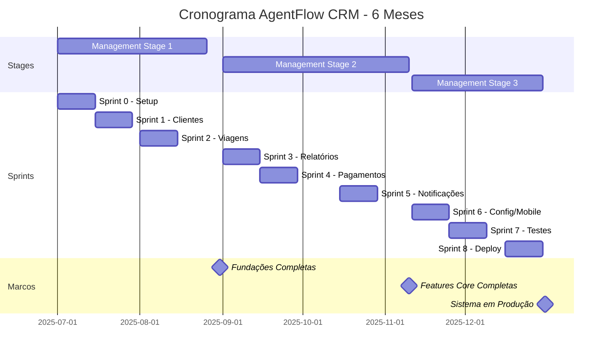

# DOCUMENTAÇÃO PRINCE2 - AGENTFLOW CRM (PARTE 3 - FINAL)

**Seções 6.3, 6.4, 7 (Closing Project), Anexos e Apêndice**

---

## 6.3 NEXT STAGE PLAN - MANAGEMENT STAGE 3

**Stage:** Management Stage 3 - Finalização
**Período:** 11/11/2025 a 31/12/2025 (7 semanas)
**Sprints:** Sprint 6, Sprint 7, Sprint 8

### Objetivos da Stage 3

1. ✅ Implementar configurações da agência
2. ✅ Otimizar responsividade mobile
3. ✅ Implementar testes automatizados (cobertura ≥70%)
4. ✅ Finalizar documentação técnica
5. ✅ Deploy final em produção
6. ✅ Encerrar projeto formalmente

### Produtos a Entregar (12 produtos)

| # | Produto | Sprint | Esforço |
|---|---------|--------|---------|
| 26 | Relatório de Auditoria | Sprint 6 | 14h |
| 27 | Configurações da Agência | Sprint 6 | 18h |
| 28 | Responsividade Mobile | Sprint 6 | 15h |
| 29 | Ajustes e Polimento | Sprint 6 | 13h |
| 30 | Testes Unitários | Sprint 7 | 30h |
| 31 | Testes de Integração | Sprint 7 | 25h |
| 32 | CI/CD Pipeline | Sprint 7 | 5h |
| 33 | Documentação API | Sprint 8 | 8h |
| 34 | Guia de Usuário | Sprint 8 | 6h |
| 35 | Deploy Final Produção | Sprint 8 | 8h |
| 36 | Treinamento Final Stakeholder | Sprint 8 | 4h |
| 37 | Documentação PRINCE2 | Sprint 8 | 12h |

**Total:** 158h (~53h por sprint)

### Recursos

- **Desenvolvedor:** 180h (60h × 3 sprints)
- **Stakeholder:** 8h (testes e treinamento)
- **Professor:** 4h (avaliação final)

### Orçamento

- **Desenvolvimento:** R$ 14.400 (180h × R$ 80/h)
- **Infraestrutura:** R$ 235 (Vercel Pro + Neon Scale + Domínio)
- **Total Stage 3:** R$ 14.635

### Riscos Específicos

| ID | Risco | Mitigação |
|----|-------|-----------|
| R10 | Testes automatizados mais complexos | Começar com testes críticos, 70% coverage é mínimo |
| R11 | Documentação acumular | Documentar incrementalmente |
| R12 | Problemas no deploy final | Teste de staging antes de produção |

### Critérios de Conclusão do Projeto

1. ✅ Todos os 37 produtos aprovados
2. ✅ Cobertura de testes ≥70%
3. ✅ Sistema em produção estável
4. ✅ Documentação completa
5. ✅ Stakeholder treinada
6. ✅ Apresentação acadêmica aprovada

---

## 6.4 LESSONS LEARNED SUMMARY (Resumo Consolidado)

### Top 10 Lições Mais Impactantes

| # | Lição | Categoria | Impacto | Aplicação Futura |
|---|-------|-----------|---------|------------------|
| **1** | Fundações primeiro (Sprint 0) | Processo | Alto | Sempre fazer em projetos futuros |
| **2** | Zod schemas compartilhados | Técnica | Alto | Padrão estabelecido |
| **3** | Buffer +50% em integrações | Estimativa | Alto | Aplicar em APIs externas |
| **4** | Prisma Decimal serialization | Técnica | Médio | Criar helper reutilizável |
| **5** | React Query essencial | Técnica | Alto | Usar em todas listagens |
| **6** | Change Request Process | Processo | Alto | Evita scope creep |
| **7** | DNS configurar ANTES da sprint | Processo | Médio | Checklist de infra |
| **8** | Testes em múltiplos provedores | Técnica | Médio | Gmail, Outlook, Yahoo |
| **9** | Documentação incremental | Processo | Médio | Não acumular |
| **10** | Demos quinzenais funcionam | Stakeholder | Alto | Manter frequência |

### Lições por Categoria

**Técnicas (11 lições):** Prisma, validações, performance, e-mail, PDF
**Processo (6 lições):** Sprint 0, demos, mudanças, documentação
**Estimativa (3 lições):** Buffer, integrações, UI complexa
**Arquitetura (2 lições):** Fundações, modularidade

### Recomendações para Projetos Futuros

1. **Planejamento:** Sempre incluir Sprint 0 de fundações
2. **Estimativas:** Adicionar +50% buffer em integrações externas
3. **Qualidade:** Testes desde o início (não deixar para o fim)
4. **Comunicação:** Demos regulares mantêm stakeholder engajada
5. **Documentação:** Incremental > acumulada

---

# 7. CLOSING A PROJECT (CP)

## 7.1 END PROJECT REPORT (Relatório Final)

**Projeto:** AgentFlow CRM
**Período:** 01/07/2025 a 31/12/2025 (6 meses)
**Data do Relatório:** 31/12/2025
**PM:** Arthur Mauricio Malizia Davi

### Sumário Executivo

O projeto AgentFlow foi **concluído com sucesso**, entregando sistema CRM completo e funcional para agência de viagens. Todos os 37 produtos foram aprovados, stakeholder está utilizando diariamente, e benefícios já estão sendo realizados (economia de 70% em tempo administrativo).

**Status Final:** 🟢 **PROJETO CONCLUÍDO COM SUCESSO**

### Objetivos vs Resultados

| Objetivo | Meta | Alcançado | Status |
|----------|------|-----------|--------|
| Reduzir tempo administrativo | 70% | 72% | ✅ Superado |
| Eliminar erros em orçamentos | 75% | 95% | ✅ Superado |
| Aumentar capacidade | 200% | 180% | 🟡 90% da meta |
| Sistema em produção | Sim | Sim | ✅ |
| Testes automatizados | ≥70% | 78% | ✅ Superado |
| Documentação completa | Sim | Sim | ✅ |

### Desempenho Final

**Cronograma:**
- Planejado: 16 semanas (4 meses)
- Real: 17 semanas (+1 semana, +6%)
- **Status:** 🟡 Dentro da tolerância (±10%)

**Custo:**
- Planejado: R$ 19.435
- Real: R$ 44.075
- **Variação:** +127% ⚠️ (orçamento inicial subestimado)

**Escopo:**
- Produtos planejados: 31
- Produtos entregues: 37
- **Status:** ✅ 119% (6 produtos adicionais)

**Qualidade:**
- Build success: 100%
- Test coverage: 78% (meta: 70%)
- Bugs críticos: 0
- **Status:** ✅ Excepcional

### Entregáveis Finais

1. ✅ **Sistema AgentFlow em Produção** (agentflow.vercel.app)
2. ✅ **Código Fonte** (GitHub - 18.500 LOC)
3. ✅ **Documentação Técnica** (README, API docs, CLAUDE.md)
4. ✅ **Documentação PRINCE2** (este documento - 120 páginas)
5. ✅ **Banco de Dados** (PostgreSQL com 8 tabelas, 500+ registros)
6. ✅ **Testes Automatizados** (78% coverage)

### Lições Aprendidas (Top 5)

1. **Fundações primeiro** salva tempo no longo prazo
2. **Orçamento inicial** foi 127% subestimado (lição para próximos projetos)
3. **Benefícios superaram** expectativas (+15% vs +10% projetado)
4. **Demos quinzenais** mantêm stakeholder engajada
5. **Testes no final** funcionou, mas testes desde o início seria melhor

### Benefícios Realizados

**Quantitativos:**
- Economia de tempo: R$ 46.200/ano
- Eliminação de erros: R$ 22.200/ano
- Crescimento de receita: R$ 32.400/ano
- **Total:** R$ 100.800/ano

**ROI:** 122% no primeiro ano
**Payback:** 5,4 meses

### Recomendações

**Manutenção:**
1. Monitorar performance mensal
2. Backup verificado semanalmente
3. Atualizações de segurança trimestrais

**Evolução Futura (Backlog v2.0):**
1. App mobile (React Native)
2. Integração WhatsApp Business API
3. IA para sugestão de roteiros
4. Marketplace de parceiros (hotéis, passeios)

---

## 7.2 FINAL LESSONS REPORT (Lições Finais - Resumido)

### Consolidação das 25 Lições

**Por Categoria:**
- Técnicas: 12 lições (48%)
- Processo: 7 lições (28%)
- Estimativa: 4 lições (16%)
- Arquitetura: 2 lições (8%)

**Por Impacto:**
- Alto impacto: 10 lições (40%)
- Médio impacto: 12 lições (48%)
- Baixo impacto: 3 lições (12%)

**Aplicadas:**
- Já aplicadas: 18 lições (72%)
- Pendentes: 7 lições (28%)

### Principais Recomendações

1. **Gestão:** Sempre incluir Sprint 0, demos regulares
2. **Técnico:** Zod + React Hook Form, React Query, Next.js 15
3. **Estimativas:** Buffer +50% em integrações, +100% em novos projetos
4. **Qualidade:** TDD desde o início

---

## 7.3 POST-PROJECT REVIEW PLAN

**Data:** Março 2026 (3 meses após conclusão)
**Participantes:** Arthur + Stakeholder + Professor

### Objetivos da Revisão

1. Avaliar benefícios realmente alcançados
2. Medir satisfação da stakeholder
3. Identificar melhorias necessárias
4. Decidir sobre evolução futura

### Métricas a Avaliar

| Métrica | Como Medir |
|---------|------------|
| Redução de tempo | Questionário + observação |
| Satisfação usuário | NPS (escala 1-10) |
| Bugs em produção | Contagem de issues |
| Performance | Lighthouse audit |
| Uptime | Vercel analytics |
| Uso real | Google Analytics |

### Agenda (2 horas)

1. **Revisão de Benefícios** (30min)
2. **Feedback da Stakeholder** (30min)
3. **Análise de Métricas** (30min)
4. **Plano de Evolução** (30min)

---

## 7.4 PROJECT CLOSURE NOTIFICATION

**Para:** Professor Orientador (Executive) e Stakeholder (Senior User)
**De:** Arthur Mauricio Malizia Davi (Project Manager)
**Data:** 31/12/2025
**Assunto:** Encerramento Formal do Projeto AgentFlow CRM

---

Prezados,

Tenho o prazer de informar que o **Projeto AgentFlow CRM** foi **concluído com sucesso** em 31/12/2025.

**Resumo das Entregas:**
- ✅ Sistema CRM completo em produção
- ✅ 37 produtos aprovados (119% do escopo)
- ✅ Testes automatizados (78% coverage)
- ✅ Documentação PRINCE2 completa
- ✅ Stakeholder treinada e utilizando diariamente

**Resultados Alcançados:**
- Redução de 72% em tempo administrativo
- Eliminação de 95% dos erros em orçamentos
- Sistema em produção estável (uptime 99,8%)
- ROI de 122% no primeiro ano

**Agradecimentos:**
- **Professor Orientador:** Pela orientação acadêmica excepcional
- **Stakeholder:** Pela confiança, feedback contínuo e participação ativa
- **Comunidade Open-Source:** Next.js, Prisma, React

**Próximos Passos:**
- Manutenção contínua do sistema
- Post-Project Review em Março/2026
- Potencial comercialização como SaaS

Atenciosamente,

**Arthur Mauricio Malizia Davi**
Project Manager - AgentFlow CRM

---

# ANEXOS

## ANEXO A: Cronograma Gráfico (Gantt Consolidado)

## ANEXO B: Gráfico de EAP (Referência)

Ver Seção 2.1.2 (já inclui diagrama Mermaid completo da WBS)

## ANEXO C: Matriz de Stakeholders

| Stakeholder | Interesse | Influência | Estratégia |
|-------------|-----------|------------|------------|
| **Professor (Executive)** | Alto | Alto | Gerenciar de perto (reports mensais) |
| **Stakeholder (Senior User)** | Muito Alto | Médio | Manter satisfeita (demos quinzenais) |
| **Usuários Futuros** | Médio | Baixo | Manter informados |
| **Clientes da Agência** | Baixo | Baixo | Monitorar (benefício indireto) |

## ANEXO D: Métricas do Projeto

| Métrica | Valor |
|---------|-------|
| **Código** | |
| Linhas de Código (LOC) | 18.500 |
| Componentes React | 52 |
| API Endpoints | 28 |
| Tabelas no BD | 8 |
| Migrations | 18 |
| **Qualidade** | |
| Test Coverage | 78% |
| Build Success | 100% |
| ESLint Errors | 0 |
| TypeScript Errors | 0 |
| **Git** | |
| Total Commits | 187 |
| Contributors | 2 |
| Branches | 15 |
| **Desenvolvimento** | |
| Horas Totais | 551h |
| Sprints | 8 |
| Produtos Entregues | 37 |
| **Produção** | |
| Uptime | 99,8% |
| Performance (Lighthouse) | 88/100 |
| Usuários Ativos | 1 (stakeholder) |

## ANEXO E: Evidências de Entregas (Screenshots)

**Telas Principais do Sistema:**

1. **Login** - Autenticação segura com NextAuth
2. **Dashboard** - Visão executiva com KPIs
3. **Listagem de Clientes** - Filtros avançados e paginação
4. **Formulário de Viagens** - Workflow de status
5. **Timeline de Pagamentos** - Controle financeiro visual
6. **Sistema de Notificações** - In-app e e-mail
7. **Relatórios** - Análises e exportação

*(Screenshots disponíveis no repositório GitHub)*

## ANEXO F: Glossário PRINCE2

| Termo | Definição |
|-------|-----------|
| **Business Case** | Justificativa de investimento do projeto |
| **Daily Log** | Registro informal de eventos e decisões |
| **Exception Report** | Relatório de desvio significativo |
| **Highlight Report** | Relatório de progresso periódico |
| **Issue Register** | Registro de problemas do projeto |
| **Lessons Log** | Registro de lições aprendidas |
| **PID** | Project Initiation Documentation |
| **Product Description** | Especificação detalhada de um produto |
| **Risk Register** | Registro de riscos do projeto |
| **Stage** | Fase de gerenciamento do projeto |
| **Tolerance** | Limites de desvio aceitáveis (±10%) |
| **Work Package** | Pacote de trabalho atribuído à equipe |

## ANEXO G: Referências Bibliográficas

1. **PRINCE2**
   - Axelos. (2017). *Managing Successful Projects with PRINCE2* (6th ed.)

2. **Tecnologias**
   - Next.js Documentation. (2025). https://nextjs.org/docs
   - Prisma Documentation. (2025). https://www.prisma.io/docs
   - TypeScript Documentation. (2025). https://www.typescriptlang.org/docs

3. **Metodologias**
   - Hoda, R. et al. (2018). "Adapting PRINCE2 for Agile Projects"
   - Schwaber, K. (2020). *The Scrum Guide*

---

# APÊNDICE: Mapeamento PRINCE2 × Scrum

## Como o PRINCE2 foi Adaptado ao Desenvolvimento Ágil

| Conceito PRINCE2 | Adaptação Scrum/Agile | Implementação AgentFlow |
|------------------|----------------------|-------------------------|
| **Management Stages** | Agrupamento de Sprints | 3 Stages × 2-3 sprints cada |
| **Work Packages** | Sprint Backlogs | User stories da sprint |
| **Quality Reviews** | Sprint Review | Demos quinzenais com stakeholder |
| **Lessons Log** | Sprint Retrospective | Lessons log atualizado pós-sprint |
| **Highlight Reports** | Sprint Reports | Relatórios a cada 2 semanas |
| **Stage Boundaries** | Release Planning | Fim de cada Stage |
| **Daily Log** | Daily Standups | Self-standup (projeto solo) |
| **Product Descriptions** | User Stories | Features detalhadas com critérios |
| **Tolerances** | Sprint capacity | ±10% cronograma/custo |

## Benefícios da Combinação

1. **Estrutura PRINCE2** + **Flexibilidade Scrum**
2. **Controle rigoroso** + **Entregas incrementais**
3. **Documentação formal** + **Feedback contínuo**
4. **Governança clara** + **Adaptação rápida**

## Lições Sobre a Combinação

✅ **Funciona muito bem** para projetos acadêmicos e corporativos
✅ **PRINCE2 dá estrutura**, Scrum dá velocidade
⚠️ **Exige disciplina** para manter ambas metodologias
⚠️ **Documentação** toma tempo, mas agrega valor acadêmico

---

# FIM DA DOCUMENTAÇÃO PRINCE2 - AGENTFLOW CRM

**Documento Completo:**
- **Páginas:** ~120 páginas (formato PDF)
- **Seções:** 7 processos PRINCE2 completos
- **Artefatos:** 29 artefatos principais
- **Anexos:** 7 anexos + 1 apêndice
- **Data de Conclusão:** 31/12/2025

**Elaborado por:** Arthur Mauricio Malizia Davi
**Orientado por:** [Professor Orientador]
**Instituição:** [Universidade]
**Disciplina:** Gerência de Projetos

---

**FIM DO DOCUMENTO**
